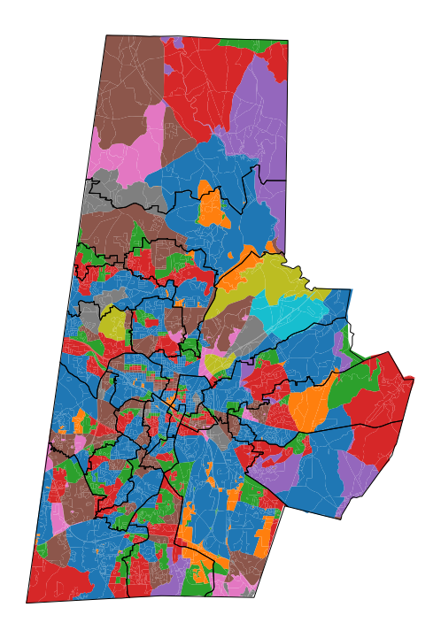
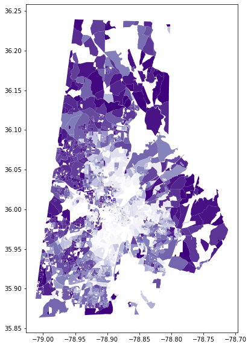
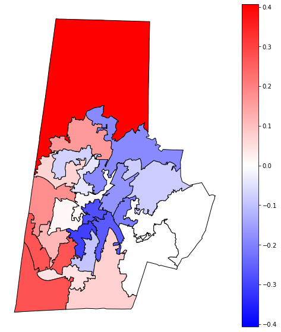
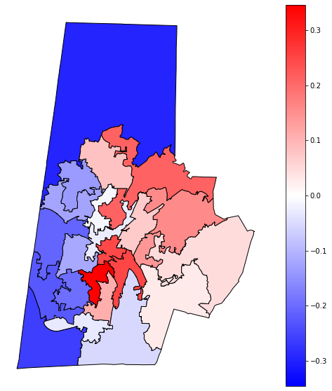
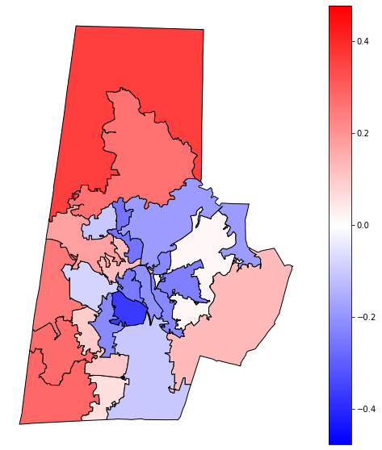
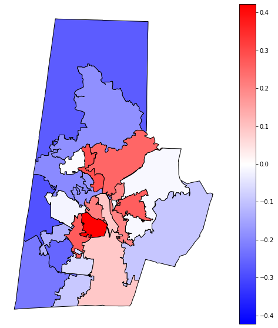

```python
import geopandas as gpd
import os
import pandas as pd
```


```python
os.chdir("/Users/mitch/Desktop/durhamschoolzones-master/Code/mergesplitcodebase/src")
```


    ---------------------------------------------------------------------------

    FileNotFoundError                         Traceback (most recent call last)

    <ipython-input-4-06d081e5de23> in <module>
    ----> 1 os.chdir("/Users/mitch/Desktop/durhamschoolzones-master/Code/mergesplitcodebase/src")
    

    FileNotFoundError: [Errno 2] No such file or directory: '/Users/mitch/Desktop/durhamschoolzones-master/Code/mergesplitcodebase/src'


```python
import sys

import constructor
import districtingGraph
import energy
import initializer
import mergeSplit
import metropolisHastings

from importlib import reload
print('hello')
reload(constructor)
reload(districtingGraph)
reload(initializer)
reload(mergeSplit)
reload(metropolisHastings)

print('initializing run...')
state, args = initializer.setRunParametersFromCommandLine(sys.argv)

proposal, args = mergeSplit.define(args)
info = args

info = initializer.fillMissingInfoFields(info)
state = initializer.determineStateInfo(state, info)
# state = readPlan(state, info, file)
# ####################
# def readPlan(state, info, file)
#     zoneTobg = g(file)
#     for zone in zoneTobg:
#         state.districts[zone] = state['graph'].subgraph(zoneTobf[zone])
#     constructor.assignDistricts(state.districts, state)
#     # checks
#     popCheck = constraints.checkPopulation(state)
#     distCheck = len(districts) == numDist
# ####################
state = constructor.contructPlan(state, info)

reload(energy)
computeEnergy = energy.getEnergyFunction(info)
print(computeEnergy(state, info))

print('run initialized...')

print('starting chain...')
state = metropolisHastings.run(state, proposal, info)
print('finishing chain...')
```


    ---------------------------------------------------------------------------

    ModuleNotFoundError                       Traceback (most recent call last)

    <ipython-input-3-b1a63d3164a1> in <module>
          2 
          3 # import constructor
    ----> 4 import districtingGraph
          5 import energy
          6 import initializer


    ModuleNotFoundError: No module named 'districtingGraph'


```python
import numpy as np
#key is geoid and value is tuple of white racial distribution and black distribution
d = "/Users/mitch/Desktop/durhamschoolzones-master/Code/mergesplitcodebase/data/race_distribution.txt"
race = {} 
filelines = open(d).readlines()
for line in filelines:
    line = line.strip("\n")
    line = line.split(" ")
    race[int(line[0])] = (float(line[1]), float(line[2]))
# print(race)

#node is key and population is value
d = "/Users/mitch/Desktop/durhamschoolzones-master/Code/mergesplitcodebase/data/DurhamCB/durham_blockspop5to9.txt"
pop ={}
filelines = open(d).readlines()
for line in filelines:
    line = line.strip("\n")
    line = line.split('\t')
    pop[int(line[0])] = int(line[1])

#key is node and value is geoid
d = "/Users/mitch/Desktop/durhamschoolzones-master/Code/mergesplitcodebase/data/DurhamCB/durham_blocksgeoID.txt"
geoid = {}
filelines = open(d).readlines()
for line in filelines:
    line = line.strip("\n")
    line = line.split("\t")
    geoid[int(line[0])] = int(line[1])
# print(geoid)

#node is key and district is value
d = "/Users/mitch/Desktop/durhamschoolzones-master/Code/mergesplitcodebase/Output/DurhamCB/gamma0_seed9123114/Samples"
files = [f for f in os.listdir(d) if f[0]!= "."]
rvalues = {}
nodestogeoID = {}
for file in files:
    fnum = int(file.strip(".txt"))
#     print(fnum)
    countyblackpop = 0
    countywhitepop = 0
    totpop = 0
#     print(file)
    filename = ("/Users/mitch/Desktop/durhamschoolzones-master/Code/mergesplitcodebase/Output/DurhamCB/gamma0_seed9123114/Samples/"+str(file))
    lines = open(filename).readlines()
    plan = {}
    for l in lines:
        l = l.strip("\n")
        l = l.split('\t')
        node = l[0]
        dist = l[1]
        plan[node] = dist
    distTot = np.zeros(23)
    distBlack = np.zeros(23)
    distWhite = np.zeros(23)
    for l in lines:
        l = l.strip("\n")
        l = l.split('\t')
        node = l[0]
        dist = l[1]
        dist = int(plan[node])
        geoID = geoid[node]
        popu = int(pop[node])
        blackpop = float(race[geoID][0])*int(popu)
        whitepop = float(race[geoID][1])*int(popu)
        countyblackpop += blackpop
        countywhitepop += whitepop
        totpop += popu
        distTot[dist]+=popu
        distBlack[dist]+=blackpop
        distWhite[dist]+=whitepop
    countyBlackDist = countyblackpop/totpop
    countyWhiteDist = countywhitepop/totpop
    fracBlack = [frac for frac in distBlack/distTot]
    fracWhite = [frac for frac in distWhite/distTot]
    rvalues[fnum] = (sum([(f-countyBlackDist)**2 for f in fracBlack]), 
                     sum([(f-countyWhiteDist)**2 for f in fracWhite]))
print(sorted(rvalues.items()))
# for i in files:
#     bgtoz = {}
#     filelines = open(os.path.join(d,i)).readlines()
#     for line in filelines:
#         splitline = line.rstrip().split("\t")
#         bgtoz[splitline[0]] = int(splitline[1])
# bgtoz
  
```


    ---------------------------------------------------------------------------

    KeyError                                  Traceback (most recent call last)

    <ipython-input-25-c17a01284037> in <module>
         59         dist = l[1]
         60         dist = int(plan[node])
    ---> 61         geoID = geoid[node]
         62         popu = int(pop[node])
         63         blackpop = float(race[geoID][0])*int(popu)


    KeyError: '3969'


```python
os.getcwd()
```


    '/Users/mitch'


```python
d ="/Users/mitch/Downloads/r_values_by_race_2.txt" 
file = open(d).readlines() 
rvaldic = {} 
#district:(black racial distribution, white racial distribution)
for line in file: 
    line = line.strip("\n") 
    line = line.split("\t") 
    rvaldic[int(line[0])] = (float(line[1]), float(line[2])) 
print(sorted(rvaldic.items(), key = lambda x:x[0]))
# print(sorted(rvaldic.items(), key=lambda x: x[1][1], reverse = True))

#plan w/ lowest black r: 473 
#plan w/ lowest white r: 477

#plan w/ highest black r: 1639
#plan w/ highest white r: 1644

extremes = {"lowB": 473, "lowW": 477, "highB": 1639, "highW": 1644}
lowB = {}
f1 = "/Users/mitch/Desktop/gamma0_seed3367894/Samples/473.txt"
lines = open(f1).readlines()
for l in lines:
    l = l.strip("\n")
    l = l.split('\t')
    node = int(l[0])
    zone = int(l[1])
    lowB[node] = zone
# lowB

lowW = {}
f2 = "/Users/mitch/Desktop/gamma0_seed3367894/Samples/477.txt"
lines = open(f2).readlines()
for l in lines:
    l = l.strip("\n")
    l = l.split('\t')
    node = int(l[0])
    zone = int(l[1])
    lowW[node] = zone
#lowW

highB ={}
f3 = "/Users/mitch/Desktop/gamma0_seed3367894/Samples/1639.txt"
lines = open(f3).readlines()
for l in lines:
    l = l.strip("\n")
    l = l.split('\t')
    node = int(l[0])
    zone = int(l[1])
    highB[node] = zone
#highB

highW = {}
f4 = "/Users/mitch/Desktop/gamma0_seed3367894/Samples/1644.txt"
lines = open(f4).readlines()
for l in lines:
    l = l.strip("\n")
    l = l.split('\t')
    node = int(l[0])
    zone = int(l[1])
    highW[node] = zone
# highW

durhamcb = gpd.read_file("/Users/mitch/Desktop/durhamschoolzones-master/Data/Shapefiles/durhamcb")
```

    [(0, (0.9039650521209086, 0.8194047198154651)), (3, (0.9133134200313056, 0.8235781967747701)), (4, (0.9168120166129435, 0.8231627701249391)), (5, (0.9144631203354928, 0.8221205734947789)), (6, (0.9107040799065028, 0.8202345273490314)), (7, (0.9107040799065028, 0.8202345273490314)), (9, (0.9112708749763588, 0.819697059529395)), (10, (0.9165034549746509, 0.8219691236213008)), (12, (0.9165034549746509, 0.8219691236213008)), (13, (0.9143948525813299, 0.8204216594940307)), (15, (0.9146713625635717, 0.8207289909334435)), (16, (0.9130840502933606, 0.822501642808984)), (18, (0.9127212007856867, 0.8225648093753506)), (20, (0.9071281944133441, 0.8161245645351297)), (21, (0.9056799139945878, 0.8135751299430749)), (22, (0.9062906982013957, 0.8211821782658982)), (23, (0.90673951470025, 0.8213948610859068)), (26, (0.912162300635024, 0.8246395253908806)), (28, (0.9100355837665681, 0.8268381984503697)), (29, (0.9148917984931566, 0.8280094850914459)), (32, (0.9134139196509693, 0.8277901205761129)), (34, (0.9126615934227195, 0.8273967705133124)), (35, (0.9117419439097822, 0.8230671108687398)), (36, (0.9047352118973381, 0.8137693576992334)), (37, (0.9115527302671543, 0.8229170596520368)), (38, (0.9114487684100336, 0.823078137112586)), (39, (0.912603776815906, 0.8241652341003691)), (45, (0.913704586497336, 0.8245561287136081)), (46, (0.9186927286894485, 0.8320538445115632)), (47, (0.9136597962208202, 0.8272085701055114)), (48, (0.9077425201406286, 0.8295020401536707)), (51, (0.8869622468520753, 0.7812008775540081)), (52, (0.8865474106603288, 0.78105075747443)), (53, (0.9058494472047773, 0.8282731233245872)), (54, (0.8803370439185813, 0.8097728181077108)), (58, (0.8921822774477286, 0.8186830734866024)), (60, (0.8917536519619591, 0.8141243979614556)), (62, (0.8922802213570648, 0.8149807058824642)), (63, (0.8922297152304058, 0.8150732394519374)), (64, (0.8894118163871623, 0.8140383867784965)), (65, (0.889812824670333, 0.8145252057003667)), (66, (0.8900171528792707, 0.8149295812038149)), (71, (0.8845911413579672, 0.8021750960292657)), (72, (0.8758398991650604, 0.7932598626661803)), (73, (0.8762101561859157, 0.7934654347518334)), (74, (0.8765887982778366, 0.7949238578303465)), (76, (0.8786767171416756, 0.7980896044369455)), (78, (0.8848780795978525, 0.805460143805881)), (80, (0.8736590229648545, 0.8013827802353652)), (84, (0.850243856090135, 0.765359105001635)), (85, (0.8548129842264144, 0.7666560725886676)), (87, (0.8536344877600439, 0.7636022665668837)), (89, (0.8552671314566903, 0.7655932649531081)), (90, (0.8513695519459428, 0.7642002434727635)), (92, (0.8477614734989957, 0.7639805560294244)), (93, (0.8706456867429665, 0.7853781613137413)), (95, (0.8732558843150915, 0.781905701006955)), (96, (0.8497377558374972, 0.7631523592178521)), (97, (0.8563145382313837, 0.7744743978295955)), (99, (0.8566372636505262, 0.7748837490721421)), (101, (0.8398758683910855, 0.7510579406709251)), (102, (0.8219759030059035, 0.7366798924075441)), (103, (0.8197539120393932, 0.7355578494377008)), (104, (0.8180427583251293, 0.731005934280767)), (106, (0.8207284406487784, 0.7283638907593804)), (108, (0.8367021422154476, 0.7538813119930627)), (109, (0.8356095176860526, 0.7570227049459147)), (110, (0.8350456789229953, 0.7569836189609719)), (111, (0.8481179932346684, 0.7696941728444315)), (112, (0.8597357615189443, 0.7843753900571748)), (114, (0.8800685839813864, 0.8168141091341088)), (116, (0.8793370947227994, 0.8170969303869645)), (119, (0.8743450221430056, 0.8078337060234708)), (121, (0.8836280520835125, 0.8261523620147694)), (124, (0.8836280520835126, 0.8261523620147695)), (126, (0.8853443317465509, 0.8280542122427509)), (127, (0.8805336558744917, 0.8130098923169587)), (129, (0.8906454678307177, 0.8185074597783858)), (130, (0.8902475011353492, 0.8170731867058354)), (131, (0.8614323261497561, 0.7781869436632239)), (132, (0.866319400968722, 0.7815774435439481)), (133, (0.8623510528678571, 0.7721161390157304)), (134, (0.8370204355712288, 0.7449528756194094)), (136, (0.8598908309016927, 0.7558067172816814)), (137, (0.8632769313695129, 0.7654237638371216)), (138, (0.8644974190747798, 0.7654342160071148)), (140, (0.8696750338022241, 0.7698147918984131)), (141, (0.8724248467605927, 0.7722513110174961)), (143, (0.8670344632827479, 0.7741838284198487)), (145, (0.8649580375044147, 0.7721081663548743)), (146, (0.8649787511181553, 0.7720110595244778)), (147, (0.8637607660030368, 0.7699244422179219)), (148, (0.8698978638172032, 0.7679477128245052)), (149, (0.8740494372327249, 0.7710260037455476)), (150, (0.8746621450701859, 0.771199645058686)), (152, (0.8820317672991832, 0.7749867867457925)), (153, (0.8852440516369253, 0.7771571706657663)), (156, (0.8859804755682082, 0.7794178489831401)), (157, (0.8853078581199177, 0.7557857760829162)), (160, (0.8809695465269259, 0.7510879790904345)), (161, (0.878383903184873, 0.7485310389232817)), (162, (0.8781116903993493, 0.7544549574008246)), (163, (0.8884058420097987, 0.7557335203120814)), (165, (0.8884076739011402, 0.7557768581608478)), (166, (0.8879472811166871, 0.7555219866298537)), (167, (0.8912904501032349, 0.7695378768373616)), (168, (0.8882194939022109, 0.7495980681523108)), (170, (0.8886027883424382, 0.7444678310675501)), (172, (0.887396223521827, 0.7438577650313519)), (173, (0.8837982465619577, 0.7402245011801302)), (174, (0.8836873392890322, 0.742098785620714)), (175, (0.857246410715316, 0.7162414829665973)), (176, (0.8587366263031678, 0.7162503220224993)), (178, (0.8588976444744975, 0.7181759297863956)), (179, (0.84773786917929, 0.7136946974317715)), (180, (0.847871064439725, 0.7138111614560578)), (182, (0.8446083489002146, 0.7113033717537887)), (183, (0.8581980294440579, 0.7273679824547361)), (184, (0.8492701957974098, 0.7262800055078134)), (186, (0.8602947909009867, 0.7428782945521621)), (187, (0.8603136366389224, 0.7440039493251995)), (188, (0.8563009349893386, 0.7507375896443768)), (190, (0.8538653948864894, 0.7442604159214576)), (191, (0.8572754753047762, 0.7483661543227526)), (192, (0.8517011370940709, 0.7435426108521294)), (194, (0.8606222492133441, 0.7545094635394012)), (196, (0.8396208277135524, 0.7307385552628516)), (199, (0.8414859352896791, 0.7570476605798943)), (202, (0.8444398813497851, 0.7598618865905716)), (204, (0.8467829252558355, 0.7601164992783379)), (206, (0.8520208149992928, 0.7632318928897878)), (211, (0.8918937778349446, 0.7848577095735203)), (212, (0.8895766680926087, 0.7832497293941677)), (215, (0.8901887431532491, 0.7814676796025496)), (216, (0.8836206184358071, 0.776480857864455)), (218, (0.8792077684882782, 0.7616922476952664)), (219, (0.8792077684882782, 0.7616922476952664)), (220, (0.8784084646999744, 0.7598730068361094)), (221, (0.8760094910303966, 0.7645399628787434)), (222, (0.8752816358139167, 0.7628749950889652)), (223, (0.8768904993459258, 0.7631997619206234)), (226, (0.8768739434874049, 0.7646165580701991)), (231, (0.8758651016280722, 0.7663123394384156)), (232, (0.8759066137038363, 0.7663540495835466)), (236, (0.8783773267061052, 0.7608786519492258)), (237, (0.8741859200778124, 0.7584682290227812)), (239, (0.867054211007658, 0.758839537241686)), (240, (0.8682008673837341, 0.7634950176874561)), (242, (0.8681656746067721, 0.7736157987706288)), (243, (0.8724290197726365, 0.7745336475987522)), (244, (0.8707108660910274, 0.7752702341222389)), (245, (0.8936511605497712, 0.7897114880239295)), (246, (0.9311181231836111, 0.8292453219865236)), (248, (0.9324814182634873, 0.8326165608025596)), (249, (0.9398284131941661, 0.8379502731137639)), (250, (0.953669418340702, 0.8351778073310329)), (251, (0.9804246797648437, 0.8980469650629163)), (252, (0.9790624542215026, 0.8977914850766285)), (253, (0.9753990994819397, 0.8942901955243091)), (255, (0.9771078350092601, 0.8837453585508076)), (256, (0.9768989120432972, 0.8830265267832961)), (257, (0.9672242617246467, 0.8737108849922655)), (258, (0.9711504416694525, 0.8758330680504582)), (259, (0.9647806669831767, 0.8597758548807863)), (261, (0.933962618163779, 0.8585341139030368)), (262, (0.9380312749164912, 0.8563575198453381)), (263, (0.9407983075802265, 0.8616164386792691)), (265, (0.9182456826182818, 0.8313647382088001)), (266, (0.9192751231052242, 0.832882956434513)), (267, (0.9048924279239902, 0.8264639697385594)), (272, (0.9042153134460167, 0.8268573358377349)), (273, (0.9107074884761202, 0.8323211606093185)), (275, (0.9085414126622887, 0.8320093919850471)), (276, (0.8996678777522431, 0.8352560446212514)), (278, (0.8996687686288944, 0.8352280701209233)), (282, (0.9115972973531141, 0.8556464615644395)), (284, (0.9062581356530776, 0.8517147362609033)), (285, (0.9037593726465204, 0.8478668490096084)), (286, (0.8895132323818665, 0.8374760923805927)), (288, (0.8912941190857921, 0.8368945368147452)), (290, (0.8841924211164708, 0.8205268708548118)), (292, (0.8846985795218955, 0.8203825932303059)), (295, (0.8846985795218957, 0.8203825932303058)), (296, (0.8786042082339703, 0.8172600917369012)), (297, (0.8946778259491931, 0.829034459548575)), (298, (0.8943638851968831, 0.8292630956528559)), (299, (0.8901253650470297, 0.8246155800887393)), (300, (0.9045364388646283, 0.8379243704539994)), (301, (0.9086705391037428, 0.8395711940839936)), (302, (0.9056469953396843, 0.839352212722838)), (303, (0.9085772831630774, 0.8412955160104204)), (304, (0.9054511862847046, 0.8411616853718744)), (306, (0.930649950705289, 0.860266122018498)), (308, (0.9288778621210203, 0.8583650962480955)), (313, (0.927754087850776, 0.8542717584640984)), (315, (0.9284548003862607, 0.8549421717290141)), (316, (0.9088757052703235, 0.8284047479441335)), (317, (0.9077203334311574, 0.8291548812785887)), (318, (0.9033327934897648, 0.8252979159446148)), (320, (0.9033327934897648, 0.8252979159446148)), (322, (0.9002872835039845, 0.8209116641721741)), (323, (0.9036691387194031, 0.8247642243969688)), (324, (0.869220446580362, 0.7902507713658589)), (325, (0.8397447318148161, 0.7523419491727023)), (328, (0.8472914070948512, 0.760853180868947)), (332, (0.8590970724009928, 0.7660259439974988)), (334, (0.8590970724009928, 0.7660259439974988)), (335, (0.8590232704656687, 0.7659960014566805)), (336, (0.8555444783514186, 0.7636328390067662)), (337, (0.8397552303722907, 0.7495963719112722)), (338, (0.8397552303722908, 0.7495963719112719)), (339, (0.8342413076939574, 0.7451393121981333)), (345, (0.8609368062716954, 0.7764123055152218)), (346, (0.8600739822019167, 0.7751994106483464)), (347, (0.8451917903318044, 0.7547739765600927)), (348, (0.8936772297051307, 0.7717972475625725)), (349, (0.892685457787137, 0.7705811220661667)), (350, (0.8943921197248804, 0.7716153813584481)), (351, (0.8947256176815797, 0.7711616773028872)), (352, (0.8932294683448182, 0.7698794206773013)), (354, (0.9279722091850773, 0.8013253863739278)), (356, (0.9280222156609782, 0.8012401772180465)), (357, (0.9283116783562824, 0.8015495884754837)), (359, (0.9195159276470457, 0.7934354144282025)), (361, (0.9195146420702873, 0.7934247077304434)), (362, (0.9074453690558342, 0.7777473879173438)), (363, (0.9069545063026931, 0.7779628633066734)), (364, (0.9015004685356413, 0.7715422036551142)), (366, (0.9017435979060685, 0.7750459247599052)), (367, (0.8948038030933989, 0.775778739781391)), (368, (0.8969274756674049, 0.7782893403740917)), (370, (0.896927475667405, 0.7782893403740918)), (372, (0.9127880215786105, 0.7984791754777539)), (374, (0.9159720818732228, 0.810093845458617)), (375, (0.8723332452929843, 0.7669154783197288)), (376, (0.8754942397418862, 0.7723887769849066)), (377, (0.8885334109832833, 0.7834743636773227)), (378, (0.8866705048572582, 0.7822520044243995)), (379, (0.883073717736397, 0.7805733926647636)), (381, (0.8880384773425324, 0.7798392848451187)), (382, (0.8883787002279692, 0.7799908102876358)), (383, (0.8728691346236759, 0.771628205076555)), (384, (0.8724808500022447, 0.7714786229966704)), (386, (0.8892425504966935, 0.7902001347855885)), (387, (0.893945114701928, 0.7935703625216486)), (388, (0.887610038990253, 0.7899697445853948)), (390, (0.876613155726662, 0.7739693356474759)), (391, (0.8934952720498219, 0.7835644408775807)), (394, (0.8914683129385178, 0.7813122427165571)), (396, (0.8973509864991905, 0.7841610217204541)), (397, (0.895668175627168, 0.7794868422018573)), (398, (0.9009901357836234, 0.7908152434453829)), (399, (0.892982008624012, 0.7856528539216199)), (400, (0.8892052233872672, 0.7775565804229898)), (402, (0.8597858639670084, 0.749493088136534)), (403, (0.8861914228021401, 0.763264192099806)), (408, (0.8870052513992692, 0.7631114209327305)), (409, (0.8870052513992692, 0.7631114209327305)), (412, (0.8882219722307679, 0.7659404931875837)), (413, (0.8482004068044524, 0.737029239007424)), (417, (0.8507015321553102, 0.7401044250647458)), (418, (0.8475108664901807, 0.7415698236724126)), (419, (0.8566860129406845, 0.7478703747159784)), (421, (0.8350206824139103, 0.7437811792386592)), (422, (0.8281856334688087, 0.7430022872066119)), (425, (0.8236709109751423, 0.7391783421587854)), (426, (0.8127121894483489, 0.7265104411208341)), (427, (0.83208453904555, 0.7377404268396055)), (428, (0.8314421280517409, 0.7376930247209311)), (429, (0.814944454154867, 0.7195154661052635)), (430, (0.815070411230487, 0.7201975283882934)), (432, (0.8149868984252583, 0.7200669356666056)), (434, (0.8188569114807704, 0.7270607469823733)), (439, (0.8092464416360103, 0.7190519362323823)), (440, (0.8142071329860525, 0.7221720173606418)), (441, (0.8345222146032945, 0.7431946466452481)), (442, (0.8332223945870673, 0.7413152826957916)), (444, (0.827129128041692, 0.7370369209222418)), (445, (0.8323505113779416, 0.7382061806250754)), (448, (0.831492893614523, 0.738056607304226)), (450, (0.8334420525566325, 0.739092690987915)), (451, (0.8284642051114331, 0.7341827012800377)), (453, (0.8238155012092936, 0.7290904967967557)), (455, (0.8218612049984039, 0.7239587043654536)), (458, (0.828474559118168, 0.7322280489554217)), (464, (0.8134988780972792, 0.7201741107099168)), (465, (0.8164507084404405, 0.7221797107892528)), (466, (0.8164507084404405, 0.7221797107892528)), (467, (0.8179064174612976, 0.7276034662407955)), (468, (0.8112786649354409, 0.7194031074595049)), (469, (0.7545573078496287, 0.6995042042531797)), (470, (0.7517748402882596, 0.6980856872960984)), (473, (0.7498629754878543, 0.6974661610106722)), (474, (0.7589352505206728, 0.6980431676092888)), (475, (0.7603867150242574, 0.6989599692387712)), (476, (0.7608680682937244, 0.699783345487397)), (477, (0.7645436245150535, 0.6901692407237536)), (478, (0.7974393074343668, 0.7079995225195566)), (479, (0.8094511349099791, 0.7153414894754369)), (481, (0.8146404393816743, 0.7189584930783691)), (485, (0.8147142213579742, 0.7214841111739779)), (489, (0.8147153284078744, 0.7213077267916156)), (490, (0.8262022759010418, 0.7321529911778617)), (495, (0.8367996555660405, 0.7365405466150604)), (496, (0.8367894519788991, 0.7361831337012685)), (497, (0.8357235174139445, 0.7326779187620064)), (498, (0.8459762643018933, 0.7270131995077778)), (499, (0.8459762643018933, 0.7270131995077778)), (506, (0.852871650564321, 0.7398268552159124)), (514, (0.86352240899273, 0.7465113704106389)), (515, (0.8736644287495818, 0.7694959353376853)), (516, (0.8881592427465899, 0.7872912362743555)), (517, (0.8881777393097333, 0.7880022872171935)), (518, (0.9016077169577991, 0.808105604271689)), (519, (0.9008276964067681, 0.8052229917029471)), (520, (0.89598322713787, 0.7999072819758124)), (523, (0.9013079343566643, 0.8105856655271402)), (525, (0.9013079343566643, 0.8105856655271403)), (527, (0.9052043009761354, 0.8192928136267515)), (529, (0.9050558913169029, 0.8192328108660624)), (530, (0.9097614964244968, 0.8252005772439327)), (533, (0.9420159525211413, 0.8798570227853582)), (534, (0.9420241081754676, 0.879721503988538)), (535, (0.909477718878025, 0.8480785546981259)), (537, (0.9093564732367129, 0.849065269346629)), (538, (0.89494449089766, 0.8340676525513306)), (540, (0.8991581764697056, 0.8423556975414659)), (541, (0.8700427557663423, 0.8224066960970442)), (542, (0.8762469622705708, 0.8280304509317509)), (543, (0.8356025697792948, 0.7674909772330266)), (545, (0.8371031908955932, 0.7660864223189299)), (546, (0.8371031908955932, 0.7660864223189299)), (549, (0.8412495178161535, 0.7713208498741584)), (551, (0.8342769727966918, 0.7664030919386222)), (554, (0.8315733246205306, 0.7649048548102991)), (555, (0.8195391619875924, 0.7588704933322321)), (557, (0.8190290324616838, 0.7560257625390544)), (558, (0.8222687363259193, 0.761582489086432)), (561, (0.8235777360081071, 0.7613898850323215)), (562, (0.8093664236522664, 0.7554974120730181)), (563, (0.7836915271239998, 0.7394452090529566)), (564, (0.8575335087765756, 0.7684372050873142)), (565, (0.8612411198323624, 0.7689957990520201)), (566, (0.8609958141745938, 0.7665178472759009)), (567, (0.8614776368817545, 0.7695517827649124)), (568, (0.9274879244399016, 0.8146878369450112)), (571, (0.9288999722593761, 0.8154601702450265)), (572, (0.9315315397083854, 0.8195602469436742)), (573, (0.9315315397083854, 0.8195602469436745)), (574, (0.9587904824657361, 0.8367990834410044)), (577, (0.9552063421551615, 0.8382266803601718)), (578, (0.9515623572856144, 0.83552293164275)), (579, (0.9674142630220203, 0.8614321084947678)), (580, (0.9780616816564482, 0.8698375854537321)), (582, (0.97025378308138, 0.8639068540608358)), (583, (0.9933809367597146, 0.8751493135030562)), (584, (0.9633740342346734, 0.8345883112068878)), (585, (0.9793031666922702, 0.8507866407600411)), (586, (0.9893560512870231, 0.8604806242199792)), (589, (0.9866001206580924, 0.8572844593691511)), (591, (1.003507259353041, 0.8759800757763789)), (592, (0.9897193446655592, 0.8643495860455432)), (596, (0.991834326948929, 0.8646006784762339)), (599, (0.9931708016245855, 0.8661585985420557)), (600, (1.0030491672938102, 0.8791441581198396)), (601, (1.0166863416270138, 0.8908838272877846)), (602, (1.0017494243340297, 0.888637688077595)), (603, (0.9905156310235265, 0.8753830634157492)), (604, (1.0107924308821934, 0.8942885738687038)), (608, (1.0092972696401146, 0.8947043967742359)), (609, (0.9905130377202712, 0.8818136267914604)), (611, (0.990600417839869, 0.8818768143630186)), (613, (0.9847878974040921, 0.8692576796912406)), (614, (0.9903523724584778, 0.8754458973932768)), (618, (0.9900519026437913, 0.8744732680623727)), (619, (0.9937486679365073, 0.8788579293887984)), (620, (0.9607493685280797, 0.8409377741101564)), (622, (0.9745608786603662, 0.8392408222593722)), (625, (0.9780940118846824, 0.8391763613504243)), (626, (0.9764755661232598, 0.8400467587378757)), (627, (1.0058627166733147, 0.8747085493638471)), (628, (0.9988951570361593, 0.8706944208524936)), (630, (0.9974716585716158, 0.8701032174466556)), (632, (0.9802560446461426, 0.8504070747249658)), (634, (0.9715159194628893, 0.8436820475619424)), (635, (0.971311232605122, 0.8439988922347599)), (639, (0.9680458925954771, 0.8372704402767042)), (641, (0.9818999264602744, 0.8340888412322516)), (642, (0.9794236443105402, 0.8256036996071113)), (643, (0.9908628086067874, 0.8488575541401697)), (644, (0.9827033585438163, 0.8463293265862084)), (646, (0.9869500558241329, 0.8481873926125411)), (647, (0.9886119920945329, 0.8496844858897035)), (649, (0.9923248742288044, 0.8513087408321259)), (650, (1.0022001561232567, 0.8667027483801175)), (651, (0.9964083688061891, 0.8651605797403277)), (653, (0.9941996295106632, 0.8602257510081206)), (655, (0.992216988954393, 0.8591156874747395)), (657, (0.9921258441863336, 0.8598676681841751)), (658, (0.9897316746389504, 0.8562706344060524)), (659, (0.9897212012427938, 0.8558401364063215)), (660, (0.9899067651830928, 0.8569694379079781)), (661, (0.9895811053079384, 0.8568462992261834)), (665, (0.9966689999408356, 0.8718958393314117)), (666, (1.0016914229754013, 0.8755169946541386)), (671, (1.0119882341685686, 0.8916649800896752)), (674, (1.0074240773895802, 0.889774599135916)), (676, (1.0003779747310517, 0.8758169545069986)), (677, (0.9952869038805047, 0.8693638281190846)), (680, (0.9952869038805047, 0.8693638281190846)), (681, (0.9950752348589359, 0.8694426036662374)), (686, (0.990780282067258, 0.8656007564060322)), (687, (0.9858923652896157, 0.8635634585441988)), (689, (0.9886102473595527, 0.8679875521778154)), (690, (0.9890749825885268, 0.8683776104271677)), (691, (0.9794364538637464, 0.8871690553164214)), (695, (0.981520937547375, 0.8908917053748368)), (696, (0.9668505461572282, 0.8699794557896765)), (697, (0.9673396537560288, 0.8702696410684668)), (698, (0.9710722128342189, 0.8735092778148972)), (700, (0.9675230754734458, 0.8684684511914167)), (701, (0.9675230754734458, 0.8684684511914165)), (702, (0.9632848313008613, 0.8643746845901935)), (703, (0.9609824991489191, 0.8625813511463228)), (704, (0.9580325862060948, 0.8575685616936563)), (707, (0.9582383529069769, 0.8575118590055636)), (708, (0.9582383529069771, 0.8575118590055636)), (709, (0.9583931789310605, 0.8576239883355168)), (711, (0.9583931789310604, 0.8576239883355168)), (713, (0.9560559325717414, 0.8541915721134216)), (714, (0.9676974390577774, 0.8596652463946408)), (715, (0.9722838277225904, 0.8666319890732352)), (717, (0.9627690417741693, 0.8404621043620435)), (718, (0.9627690417741692, 0.8404621043620434)), (719, (0.960271839992833, 0.8385718198217622)), (720, (0.9770722468145554, 0.8489126529231055)), (722, (0.9783411169051148, 0.8495483201733192)), (726, (0.9811195895925312, 0.8517531366866302)), (727, (0.981119589592531, 0.8517531366866301)), (729, (0.9799885231153442, 0.8526011063671296)), (730, (0.9779202275967032, 0.8524736514253137)), (731, (1.0008429042242046, 0.873622491592309)), (733, (1.000685042320841, 0.8746353258591866)), (734, (0.9963760991261551, 0.8722420276070983)), (735, (0.9942639765463589, 0.8680733406651289)), (736, (0.9881354607834172, 0.8620719352467139)), (737, (0.9875409378960611, 0.861801528829425)), (738, (0.9915259554093183, 0.8695392542380852)), (741, (0.9848280319250311, 0.8585197648617121)), (742, (0.985045537999428, 0.8611811957576302)), (744, (0.9789869568540085, 0.8552919603997632)), (745, (0.9953694175312316, 0.8680895907999826)), (747, (0.9924926588023119, 0.8671129675459526)), (748, (0.9759736503239294, 0.8375186820832234)), (750, (0.9769906618992074, 0.8431833848641413)), (751, (0.9771446758591068, 0.8431737416001519)), (752, (0.9772102910851653, 0.8454027620026621)), (753, (0.974137856284835, 0.8323183137712223)), (754, (0.975242269175881, 0.834726188811877)), (755, (0.9757624950578841, 0.8387485513450335)), (756, (0.9788403280766197, 0.844720553111878)), (757, (0.9783037491105978, 0.8447836183986238)), (760, (0.987840153246654, 0.8472004976003896)), (763, (0.9736706172269992, 0.8331942342230483)), (764, (0.9746379010113585, 0.8352507185715674)), (765, (0.9222134994204803, 0.7707335099941446)), (767, (0.921983015826349, 0.7702762958595277)), (769, (0.9233279471391663, 0.770567457837765)), (770, (0.922595980836327, 0.7705130849439061)), (775, (0.9268028510028511, 0.7775615706977018)), (777, (0.9128033223601943, 0.7661969128346054)), (779, (0.9001814313721656, 0.7410498350489014)), (780, (0.9174331172662651, 0.7559500241866168)), (781, (0.9195036447924717, 0.7556691012767198)), (782, (0.9185896677476726, 0.7536650464347651)), (783, (0.9189575834178136, 0.7520145569849923)), (784, (0.9174991388247884, 0.7513037543237983)), (785, (0.9168770265006537, 0.7505889831225168)), (786, (0.909744007963143, 0.7502520373751277)), (787, (0.9086163015064019, 0.7491166074884037)), (788, (0.9098305013774382, 0.7546499679782832)), (790, (0.9123672208367846, 0.7563697482927065)), (791, (0.883307067331154, 0.7437730964123584)), (793, (0.863358730497755, 0.7272711601241312)), (794, (0.8911806245104387, 0.7544801472576805)), (795, (0.8898381793330629, 0.7462623046704553)), (796, (0.9028095218986641, 0.7553835166116664)), (798, (0.8727152175133392, 0.7373323011169818)), (799, (0.8803742370604903, 0.7412877309644695)), (800, (0.8936778771047656, 0.7445270909854879)), (801, (0.8910775718510849, 0.7426540009828336)), (802, (0.9006057765452317, 0.7620251423417851)), (804, (0.9029255278696348, 0.766597667650388)), (806, (0.8968531174310815, 0.7618466432853453)), (810, (0.8950916414091125, 0.7571484540516713)), (812, (0.9006361504864931, 0.7605137497233639)), (813, (0.9005941257630158, 0.7609638819679256)), (815, (0.8872933129518956, 0.7516766422401563)), (816, (0.889096411424108, 0.7618941756550002)), (819, (0.8946818657437617, 0.7740234766399885)), (824, (0.8664837100808312, 0.7742226326146878)), (825, (0.8815293106718238, 0.7865236007943253)), (828, (0.8820573466328459, 0.7874195654061792)), (829, (0.8910130383913677, 0.7928919525610669)), (830, (0.8937706009117341, 0.7926606875694242)), (831, (0.8946720918933726, 0.7922174587606696)), (832, (0.8946694794477411, 0.7922293722512366)), (835, (0.9065193449863086, 0.8104280594886788)), (836, (0.9083043635996866, 0.8137480266956503)), (837, (0.911388576377726, 0.8143904426962464)), (838, (0.9025784072781237, 0.8037029293939386)), (841, (0.8972906695603768, 0.792180332894163)), (842, (0.895988497288664, 0.7923693251720179)), (843, (0.8948847684265717, 0.7923239099278749)), (844, (0.8966660058540674, 0.7947874652302381)), (846, (0.8960564211996124, 0.7951155640223422)), (847, (0.880866369058524, 0.7801678219958852)), (848, (0.8794408595080103, 0.7782675600492828)), (850, (0.8364877590976424, 0.743038124654315)), (853, (0.8415810909581427, 0.7452577989120543)), (854, (0.8394024019607579, 0.7433079560808262)), (857, (0.8667904020833598, 0.7588214417301338)), (861, (0.8674281043820514, 0.7608380054612232)), (862, (0.8674281043820515, 0.7608380054612232)), (863, (0.8656182001168261, 0.760370982706014)), (864, (0.8523840316786101, 0.7563149486588516)), (865, (0.8499274277079162, 0.7466273701664364)), (867, (0.8471516801967122, 0.7425736718783998)), (869, (0.8485870990063485, 0.7431625180136837)), (871, (0.8434931042005946, 0.7379726253621827)), (873, (0.8461219145172589, 0.743961898819557)), (874, (0.8467680314201003, 0.7441332393306233)), (880, (0.8416249862987106, 0.7379503704418535)), (882, (0.8286205146061832, 0.7340918226596671)), (883, (0.8352589253022332, 0.7498247398307653)), (884, (0.8441312836036484, 0.7566940328706236)), (885, (0.8371453614100344, 0.7521472047156034)), (886, (0.8356490033994, 0.7542829814695435)), (887, (0.8361703374226456, 0.755435697181695)), (888, (0.854348997995775, 0.7909758893921635)), (890, (0.8523642372528579, 0.7891338482215922)), (892, (0.851499762913832, 0.7879264163382096)), (894, (0.8583527774083222, 0.7876514145435469)), (895, (0.8470501569950513, 0.7792653970513986)), (896, (0.8597603218215325, 0.7889153800243653)), (897, (0.8569562135895906, 0.7909762131379638)), (898, (0.8565343346899558, 0.7899715088332946)), (899, (0.8541570865662299, 0.7906878894768489)), (902, (0.8541570865662299, 0.7906878894768489)), (903, (0.854722210416814, 0.7971940991983303)), (905, (0.8547222104168138, 0.7971940991983305)), (906, (0.8567271786604681, 0.8013089828525547)), (907, (0.873343304699281, 0.8067571530102137)), (908, (0.875389195561875, 0.7996844346172868)), (910, (0.8778076970688888, 0.8012834327274143)), (911, (0.8779969050374193, 0.8014482015041773)), (912, (0.8777746591189386, 0.8012656234578543)), (913, (0.869111535047825, 0.7897808855422082)), (914, (0.8669180346568082, 0.7891124746672848)), (917, (0.8722461877759604, 0.8014952140416344)), (919, (0.8792327443871901, 0.8037957977766058)), (921, (0.8937709351282657, 0.830241418879844)), (922, (0.8932278939612694, 0.8299419630483906)), (926, (0.8279683932712544, 0.8012084051659706)), (927, (0.8322719880084082, 0.808784554431481)), (928, (0.8376719629266592, 0.815474453615455)), (929, (0.8340779058209188, 0.8131461616466108)), (931, (0.8339848285586683, 0.8134419494420467)), (932, (0.8355353761350511, 0.8142126095335986)), (935, (0.832367392571216, 0.810555110853056)), (939, (0.8223544034850631, 0.8027912313190597)), (940, (0.8140170286826715, 0.7914604851689284)), (941, (0.8140170286826715, 0.7914604851689284)), (942, (0.814209677850337, 0.7932015643020278)), (945, (0.8148148978615106, 0.7930054555270025)), (948, (0.8269326891574907, 0.8037389089079512)), (949, (0.8269326891574907, 0.8037389089079512)), (951, (0.8277849267241594, 0.8026859290193429)), (952, (0.8126333783071881, 0.7818896643567627)), (955, (0.8126561688437793, 0.7813201289011247)), (956, (0.8126561688437793, 0.7813201289011248)), (957, (0.7970178205142141, 0.7583800870907169)), (961, (0.7976497104178549, 0.7557546335659416)), (963, (0.7977488603325253, 0.7546862190387976)), (964, (0.8007471137984474, 0.7559638549361793)), (965, (0.7924138703207884, 0.7566546183946222)), (967, (0.8202640608588124, 0.7758056030660992)), (968, (0.8195778406767197, 0.7753592023520941)), (969, (0.8193044178499326, 0.7783381851318084)), (974, (0.8317002394461409, 0.7883362843062522)), (975, (0.8338003396669715, 0.782072698316411)), (976, (0.8366682322120711, 0.7852218001563471)), (978, (0.8105686504024062, 0.7587849638611223)), (979, (0.8041429437663888, 0.7592396473437047)), (980, (0.8032026983352978, 0.7582036097353982)), (981, (0.8020462026557065, 0.7579053182503003)), (984, (0.8054428089344206, 0.7622323406828517)), (986, (0.8041706524908273, 0.7623561854454354)), (987, (0.8023565278808706, 0.7608361868994943)), (990, (0.8006515433075381, 0.7594819440164847)), (991, (0.807361340715857, 0.7606352922887857)), (993, (0.810579756247943, 0.764874550940088)), (996, (0.8148373923006159, 0.7669791211661596)), (998, (0.7998232027742536, 0.7633905870772063)), (999, (0.8019549340596567, 0.7731501300202398)), (1000, (0.810181467702175, 0.7847084451441275)), (1001, (0.8147620543546452, 0.7922226362179111)), (1002, (0.8164938100100365, 0.7940268463357054)), (1007, (0.8168356033778793, 0.7953427519383922)), (1008, (0.8183238140340194, 0.7974713290194881)), (1011, (0.8257156969288835, 0.812225555476899)), (1012, (0.8068090420539797, 0.8046741519642778)), (1013, (0.8059391381105565, 0.8070882403061269)), (1014, (0.8056471573901055, 0.8066346469102336)), (1015, (0.8097743752948481, 0.8040701697249505)), (1016, (0.8101127359582938, 0.8036811377033022)), (1017, (0.8131301452226369, 0.7971192294457221)), (1018, (0.8132507215462296, 0.795528482056515)), (1019, (0.812363665085694, 0.7949758756884999)), (1021, (0.8127755427130423, 0.7951580457022684)), (1025, (0.8124386005883968, 0.7953591126113262)), (1026, (0.8087010434600194, 0.7969381530793976)), (1027, (0.848144393768236, 0.8490974005825859)), (1028, (0.8524048225004967, 0.8511703727840703)), (1029, (0.8643886537717899, 0.8886252510043539)), (1030, (0.862334510715129, 0.8873250648300604)), (1031, (0.8473369271527098, 0.8626844166412597)), (1032, (0.8608843533016841, 0.8631587225292303)), (1033, (0.8612896891668964, 0.8639618488241488)), (1035, (0.8541871695254676, 0.8632505498138463)), (1037, (0.8545889003436181, 0.8634716054327911)), (1038, (0.8423197818758994, 0.8644551100663733)), (1040, (0.8347033313493301, 0.8565129400633276)), (1041, (0.8290293523263358, 0.8565753767851996)), (1042, (0.8320833706074595, 0.8576097070697346)), (1043, (0.8278395041593185, 0.8516385696913606)), (1044, (0.8335134831823126, 0.8515761329694884)), (1045, (0.8345440807878084, 0.8564592965604161)), (1046, (0.8451479708327692, 0.8553133743421757)), (1048, (0.845146552293969, 0.8555013394547663)), (1049, (0.8447195174790255, 0.855498766927912)), (1050, (0.8448076947333567, 0.8557243924065017)), (1051, (0.8505483939631404, 0.8654227657221912)), (1052, (0.8589275117077769, 0.8741696191370801)), (1053, (0.8595683556626896, 0.8756670965214193)), (1054, (0.8450201237719206, 0.8591000360386606)), (1059, (0.8439136250658544, 0.8594929134684314)), (1060, (0.8598023423590726, 0.8665183871573989)), (1061, (0.8464514871268496, 0.8523946631114853)), (1063, (0.8464514871268496, 0.8523946631114853)), (1065, (0.8359143950452517, 0.8301928171696634)), (1067, (0.8343048213616228, 0.8259626068531999)), (1069, (0.8295193293897083, 0.823237950142986)), (1071, (0.8474324602288869, 0.8334063782174977)), (1074, (0.8468419469244641, 0.8333210253168691)), (1076, (0.8511579823846213, 0.839133893472375)), (1077, (0.849937225001673, 0.8226442906972826)), (1078, (0.8494781994797447, 0.8212795378900417)), (1082, (0.8240664798394233, 0.8080053354972629)), (1083, (0.8642724650719961, 0.8238816870559508)), (1085, (0.8642810504692421, 0.8236457290892534)), (1089, (0.8724925607357985, 0.828648037928552)), (1091, (0.8430234312537136, 0.7973456935240805)), (1092, (0.8430234312537136, 0.7973456935240805)), (1093, (0.8427667279253414, 0.7968560643216563)), (1094, (0.8439529980716314, 0.7991344673830029)), (1095, (0.843553095176021, 0.7991384525042246)), (1096, (0.8647265510667489, 0.8248470186357131)), (1099, (0.8743555406093645, 0.8312602811627507)), (1100, (0.8738931560063663, 0.8302130855793562)), (1101, (0.8979626086165096, 0.8368336582910806)), (1102, (0.8945997721985651, 0.8311897879501061)), (1103, (0.892426161295081, 0.8289199715617038)), (1104, (0.8930588125702599, 0.8306025310161174)), (1105, (0.8994687137523621, 0.8343791115097909)), (1106, (0.9024699413184237, 0.8384133920117965)), (1107, (0.9110973901384773, 0.8423191434445504)), (1108, (0.9588135971031615, 0.8565048508271084)), (1110, (0.9594937281971396, 0.856959650864561)), (1111, (0.9510978280097634, 0.8457152172769974)), (1112, (0.9625521943983897, 0.8636836481424144)), (1113, (0.9555506336203596, 0.8557748331180584)), (1119, (0.969086263089681, 0.8732560170134978)), (1120, (0.9846679182128104, 0.9073628037122952)), (1124, (0.9865494614940381, 0.9099134725406748)), (1126, (0.9832697527509772, 0.9145392767153431)), (1129, (0.9853668235969392, 0.9179999178504329)), (1130, (0.9852307687926013, 0.9179420994433706)), (1131, (0.9849662089565748, 0.917980801867116)), (1134, (0.987999205438431, 0.9221020575120427)), (1136, (0.986602314005637, 0.9221999533500845)), (1137, (0.9794142577857824, 0.9088487913119568)), (1138, (0.9773480007810749, 0.907860826958624)), (1139, (0.9708528913928675, 0.9109606214751101)), (1140, (0.9656573099557164, 0.8673987733051988)), (1142, (0.9656573099557161, 0.8673987733051988)), (1143, (0.9639692278821533, 0.8638738986623233)), (1144, (0.9573072097804532, 0.8606350297989892)), (1145, (0.9562938642516657, 0.855931881046951)), (1146, (0.9475957279295363, 0.8725284152842947)), (1149, (0.9459890285969121, 0.8523286242998458)), (1151, (0.9466837299587529, 0.8524630085068508)), (1152, (0.9472005366264128, 0.8530689448553492)), (1154, (0.9505306971760951, 0.857108740877508)), (1156, (0.9193670677356502, 0.8535212889638496)), (1157, (0.9103611242717746, 0.8362340351134838)), (1160, (0.904450350591956, 0.8333845874370905)), (1161, (0.8969993088829893, 0.8263276708191213)), (1165, (0.9121087896530885, 0.8428295321025758)), (1166, (0.8957498215093997, 0.8302032315361516)), (1168, (0.8947149247438007, 0.829864447845543)), (1169, (0.895265680488213, 0.8275215634383957)), (1170, (0.8987990830555366, 0.8292863081387791)), (1171, (0.9066186650433137, 0.8372569036181843)), (1172, (0.9047833218548159, 0.8360672593475705)), (1173, (0.9049764169682961, 0.8361334723114903)), (1175, (0.9049764169682961, 0.8361334723114903)), (1179, (0.9044342095539808, 0.8359454591814176)), (1180, (0.9050063082410654, 0.8375324233071553)), (1182, (0.9036306668306205, 0.8368476280502648)), (1183, (0.9043306050207757, 0.8398403814844406)), (1184, (0.9057407313518331, 0.8409848318220913)), (1185, (0.9070116403580526, 0.8415563938176334)), (1186, (0.8819855667455665, 0.8276504407923692)), (1188, (0.8835099409876828, 0.8353802537871343)), (1191, (0.8801164981058001, 0.8307002420358798)), (1192, (0.8806940862981882, 0.8323301986257934)), (1193, (0.8890369188211553, 0.837543270852846)), (1194, (0.8891240139191504, 0.8373994109540989)), (1195, (0.9154159373388288, 0.8466113309301748)), (1196, (0.9293842485756065, 0.8580003086416989)), (1197, (0.9277424447176537, 0.8561718037296452)), (1198, (0.9462185884570554, 0.88043997243744)), (1199, (0.9500985648659065, 0.893530501026954)), (1202, (0.9479418160655267, 0.8917911101072356)), (1203, (0.9399312322500304, 0.8899194155534716)), (1204, (0.9559200882687072, 0.8955721271845426)), (1205, (0.9454640431401805, 0.8759133810222411)), (1206, (0.9460781898132755, 0.8761394745519967)), (1207, (0.9404048046600995, 0.8629800021977359)), (1209, (0.935583371000223, 0.8613493019246836)), (1210, (0.9360720538306163, 0.8622846443008851)), (1211, (0.9360720538306162, 0.8622846443008853)), (1213, (0.9268367988058562, 0.8465206500460546)), (1215, (0.920663973494389, 0.8375543890570875)), (1216, (0.9282169401579714, 0.8414531604497106)), (1217, (0.9105262476839914, 0.823030859589415)), (1219, (0.8983304789890028, 0.8213075716538348)), (1220, (0.9005351221843503, 0.82412548523621)), (1221, (0.9005095354990829, 0.8232351114090062)), (1222, (0.897049243491332, 0.821852571857998)), (1223, (0.9033061787622148, 0.8282648934114225)), (1224, (0.9033466942682096, 0.8291959805895597)), (1226, (0.8925955170054725, 0.8080888219459895)), (1227, (0.8969908703084466, 0.8138872146592453)), (1228, (0.8956633762368766, 0.8133832940852437)), (1230, (0.912364087700315, 0.8288704467601636)), (1231, (0.9041311617614862, 0.8275756285492644)), (1232, (0.9005243028130842, 0.8172162496321506)), (1233, (0.9125366122222728, 0.8188278439606669)), (1234, (0.908302106718403, 0.8176197793099568)), (1235, (0.9090159270685685, 0.8180490881633554)), (1237, (0.9282719370465005, 0.8245640391270523)), (1238, (0.9277536636229151, 0.8253785758336151)), (1239, (0.9261635765609464, 0.823395108894527)), (1241, (0.9240944072652029, 0.8224620758899499)), (1242, (0.9246037926008226, 0.8239996346156717)), (1243, (0.9346512088256032, 0.8264826616391208)), (1244, (0.9346512088256032, 0.8264826616391208)), (1245, (0.9351101094292439, 0.8260018209145588)), (1248, (0.9338672871795777, 0.8227070305627057)), (1251, (0.9244200115665694, 0.8112605561621539)), (1252, (0.9243797553405783, 0.8137350245460747)), (1253, (0.9241537462734473, 0.8132346131905673)), (1254, (0.9190530266366693, 0.812981860695547)), (1255, (0.9184862165907435, 0.8141468481320919)), (1256, (0.9185648729423478, 0.8162438423521526)), (1260, (0.9089669608786894, 0.8105373206664982)), (1261, (0.9114853253644103, 0.8151944519840268)), (1262, (0.9132050642263572, 0.8202699161577337)), (1264, (0.9123679606567283, 0.8177038190099878)), (1267, (0.911513045693836, 0.815202997774446)), (1268, (0.9037729038709298, 0.8098744867754837)), (1269, (0.9037729038709298, 0.8098744867754836)), (1270, (0.8996023760655428, 0.8069749699870912)), (1271, (0.9001964993126339, 0.8067044624260163)), (1272, (0.899561301535707, 0.8063107205647619)), (1273, (0.893980754855761, 0.7976812557883355)), (1274, (0.8944289312284803, 0.7973712388777621)), (1277, (0.8974700615957435, 0.8005620765154212)), (1278, (0.8974700615957435, 0.8005620765154212)), (1281, (0.8889352542635592, 0.7983846832568696)), (1283, (0.8941159091633388, 0.8051318266248914)), (1284, (0.8924799861865503, 0.8035866848612915)), (1286, (0.8834620987379243, 0.796853570555201)), (1290, (0.8843887785279044, 0.7994244471442343)), (1291, (0.8873219977849938, 0.805104082612857)), (1292, (0.8864103232212827, 0.8044220203203927)), (1294, (0.882423533206542, 0.8043069150204792)), (1295, (0.8896490758657822, 0.8044661503657407)), (1297, (0.8893371595149886, 0.8053775164980661)), (1299, (0.889358071961761, 0.8054130638994551)), (1300, (0.8905501404972404, 0.8086102394839723)), (1304, (0.8858201463398914, 0.8041042237867232)), (1305, (0.8853319594583374, 0.8042284056436917)), (1307, (0.9031816770450466, 0.8178902517282021)), (1311, (0.8990029582528964, 0.8155162060724093)), (1312, (0.898990179870921, 0.8159064225769578)), (1313, (0.9060059375015543, 0.8102758899852869)), (1314, (0.9048138689660747, 0.8070787144007698)), (1316, (0.9048138689660747, 0.8070787144007696)), (1317, (0.9077927389907776, 0.8091569737842331)), (1318, (0.9078556653430531, 0.8087075658138576)), (1320, (0.9078556653430531, 0.8087075658138576)), (1321, (0.907855665343053, 0.8087075658138576)), (1324, (0.9110533135032249, 0.8088791137832572)), (1325, (0.9111229608641347, 0.8106341864038639)), (1326, (0.9114950645272266, 0.8092536632844153)), (1327, (0.9119591074350574, 0.8091696169110559)), (1329, (0.9101210417769382, 0.8076094312097699)), (1331, (0.8859129985329228, 0.7943468645709953)), (1334, (0.9032559670156144, 0.811369110512896)), (1336, (0.9024022772573506, 0.8116139239629813)), (1337, (0.9010258643743614, 0.8069147744133641)), (1338, (0.8936145655403728, 0.801807998114912)), (1339, (0.8926161833322835, 0.801592725379136)), (1340, (0.8926161833322838, 0.801592725379136)), (1342, (0.9191509725004935, 0.8182534507829332)), (1343, (0.9203690105397269, 0.8212255557592656)), (1347, (0.9230691174751581, 0.8219523533171704)), (1348, (0.9230691174751581, 0.8219523533171704)), (1349, (0.9148976051289096, 0.8173111415075717)), (1352, (0.8772318868738257, 0.7612939559023854)), (1353, (0.8772318868738257, 0.7612939559023854)), (1355, (0.8782012396867906, 0.761804768954027)), (1356, (0.8727990392811017, 0.7684238448073336)), (1357, (0.8685847897100095, 0.7638728608103751)), (1358, (0.8544709924191385, 0.7640588851744182)), (1360, (0.8592839626440752, 0.7657589492177523)), (1361, (0.8452465235729582, 0.7493212207120157)), (1362, (0.8460218482855353, 0.7507401441267044)), (1363, (0.8462967995924515, 0.7497212208476289)), (1364, (0.8462967995924515, 0.7497212208476288)), (1365, (0.8567064196625949, 0.7592953053214827)), (1368, (0.8602460074305908, 0.7606581096208993)), (1371, (0.860032468901972, 0.7631107445260757)), (1372, (0.8621591112828602, 0.7630865359349593)), (1373, (0.8747450468449843, 0.7718654876427019)), (1376, (0.8976856932348264, 0.796302637049661)), (1378, (0.897685693234826, 0.7963026370496609)), (1381, (0.890688780975549, 0.7886213789832233)), (1384, (0.8975510089433089, 0.793770758924168)), (1386, (0.9041991059536132, 0.8011352376273251)), (1387, (0.9112383225667419, 0.8043696727539497)), (1388, (0.9111535798103098, 0.804672110749794)), (1391, (0.9108581175157524, 0.8008289951357711)), (1394, (0.9037802359163919, 0.7953331305700607)), (1395, (0.9087138185321927, 0.7984746280590967)), (1396, (0.9188270731969442, 0.8075308248024129)), (1398, (0.9190924638770822, 0.807053107551546)), (1399, (0.9112258869642021, 0.7974152273667718)), (1400, (0.9119929194354555, 0.7979739359624037)), (1401, (0.8799206147107368, 0.7890166853626878)), (1404, (0.8676640743847464, 0.7749710236956903)), (1405, (0.8521780753412536, 0.7681506926450093)), (1406, (0.8519382723541642, 0.7681136173391926)), (1408, (0.8319756489101543, 0.7536067088386369)), (1410, (0.8314891878539686, 0.7535023027021376)), (1411, (0.8320438440154161, 0.7538776033487887)), (1413, (0.8307431885650728, 0.7517413655377816)), (1415, (0.8306198638067028, 0.7513162993179353)), (1417, (0.8334999885968173, 0.7510683582338817)), (1418, (0.8334132616103633, 0.7515652522442661)), (1419, (0.8624260479093362, 0.7881274276018873)), (1420, (0.8579648076279904, 0.7890021684983798)), (1421, (0.8577229699243363, 0.788820548570488)), (1422, (0.8587948088136997, 0.7863336705487448)), (1423, (0.8590155472333025, 0.7853261686220233)), (1424, (0.8596746418451056, 0.7877174008397316)), (1425, (0.8597532073256635, 0.7892038673744803)), (1426, (0.859054752891362, 0.7916423635766561)), (1428, (0.8583602958018421, 0.7912009739760161)), (1433, (0.8797249517646205, 0.7956264097930684)), (1434, (0.8788432249817888, 0.7947291706628605)), (1436, (0.8702158428421558, 0.790997630254404)), (1437, (0.8868317478063346, 0.7981442907368763)), (1438, (0.889672642725913, 0.7931088591648403)), (1439, (0.8902612083245007, 0.7857859727964703)), (1440, (0.8898379840199863, 0.785825077651003)), (1443, (0.8885703403186248, 0.7842702572135337)), (1445, (0.8883671668635318, 0.7846519532634236)), (1446, (0.892682558091894, 0.7866192999174018)), (1447, (0.8289881607965417, 0.7606636466889012)), (1448, (0.8270842800063082, 0.7572585380795375)), (1449, (0.8291388920298136, 0.7578748965074145)), (1451, (0.8291388920298136, 0.7578748965074145)), (1452, (0.8282197008249762, 0.7576349330646553)), (1453, (0.8289347013640894, 0.7575176556484376)), (1455, (0.8319915725502866, 0.7607979848505427)), (1456, (0.8323234746353195, 0.7608355495307183)), (1457, (0.8309974235204537, 0.7569101198754258)), (1458, (0.8420544913961096, 0.7659952988600357)), (1459, (0.8115378945018275, 0.7482326025712446)), (1460, (0.8115378945018275, 0.7482326025712444)), (1463, (0.8109684103274464, 0.7538110099247026)), (1465, (0.8149874783366164, 0.7631573895350033)), (1466, (0.8159470408080324, 0.7610064876270072)), (1467, (0.8171328602027602, 0.7617462842970195)), (1468, (0.8213342039032806, 0.7584567852251795)), (1470, (0.821461174934408, 0.7586448685727112)), (1473, (0.817530578642279, 0.7643517925051765)), (1476, (0.8188094563430516, 0.7652878593287901)), (1482, (0.811419627625782, 0.7575017393602885)), (1483, (0.8109165815354099, 0.7614252074234236)), (1485, (0.8142343129518423, 0.7681562975003767)), (1486, (0.8223463007703381, 0.7628329572697482)), (1487, (0.8278591666028361, 0.7686378276323415)), (1489, (0.836322800197705, 0.7802901791399185)), (1492, (0.8155123762931276, 0.7665895802568887)), (1493, (0.8803077139712762, 0.816955310860692)), (1494, (0.8781668084265379, 0.8119826964082006)), (1497, (0.8727280932536677, 0.7995013014332427)), (1498, (0.8709557918923695, 0.7974301641513958)), (1499, (0.9035689211718764, 0.8300393464706097)), (1500, (0.9035689211718764, 0.8300393464706097)), (1502, (0.9028526185306592, 0.829802245857048)), (1503, (0.9203140015971352, 0.8421881799659043)), (1505, (0.9234423629685827, 0.8433794699055936)), (1506, (0.9234399110399375, 0.8437676071882367)), (1508, (0.9511449380696566, 0.8603838018977092)), (1509, (0.8971695380463399, 0.8202761419732786)), (1510, (0.9190498139838398, 0.8341589523647792)), (1511, (0.9195370581244009, 0.8342644901643717)), (1512, (0.919182284634875, 0.8342695398810654)), (1515, (0.9154587682262822, 0.827738529370035)), (1516, (0.9215367594788428, 0.8309421783190459)), (1518, (0.9234360742020216, 0.83331887062021)), (1519, (0.9238833848841427, 0.8341392462520704)), (1521, (0.9048964893045927, 0.8248385000300171)), (1522, (0.9019214725362523, 0.8178139366883704)), (1523, (0.9153915394285879, 0.8313841999520676)), (1524, (0.9147702315281461, 0.8309354380188444)), (1525, (0.9174643181394373, 0.8366875427384957)), (1526, (0.9173393462030774, 0.8367693427778089)), (1529, (0.917227209291382, 0.8369078567216098)), (1530, (0.914241524761387, 0.8339669882537838)), (1532, (0.9344233666629334, 0.8621013601376272)), (1533, (0.9344515699484377, 0.8620729565113362)), (1534, (0.9657780826182517, 0.9089583389514193)), (1535, (0.9597371565879566, 0.9030129316854837)), (1536, (0.9649115090433787, 0.9048353979594952)), (1537, (0.9518765948844521, 0.8898017564034374)), (1539, (0.9573095087704275, 0.8920184817239968)), (1540, (0.9434634583361315, 0.8862252217092701)), (1541, (0.9434760159423236, 0.8861039468565454)), (1542, (0.9615844711859043, 0.8947251041350857)), (1544, (0.9615844711859043, 0.8947251041350857)), (1545, (0.9642127427440702, 0.8953359543826247)), (1547, (0.963432163051555, 0.8937074738038067)), (1548, (0.9638498911221519, 0.89424687969386)), (1550, (0.9455086141615816, 0.8752777605969205)), (1551, (0.9454216146106627, 0.8755698888904772)), (1552, (0.9454499361698043, 0.8717487128122464)), (1553, (0.9455941145884603, 0.8717400063100345)), (1555, (0.9457279662761193, 0.8720590958506584)), (1559, (0.9436153507245496, 0.8722382312636696)), (1560, (0.9341942864596392, 0.8677165019783006)), (1561, (0.9276176768819048, 0.8530656635282997)), (1562, (0.944596729002934, 0.8647184629529757)), (1563, (0.9529445741246535, 0.8621010954489214)), (1564, (0.9530057237878539, 0.8697935262071129)), (1566, (0.9358121124777187, 0.855466205320698)), (1567, (0.9763333935904611, 0.9034541597620408)), (1568, (0.9953522688537363, 0.9260172932482289)), (1569, (0.9960818356057538, 0.9263690051716915)), (1570, (0.9960502159551613, 0.9264221293833401)), (1573, (0.9959351863746243, 0.9275129442047535)), (1577, (0.9853967554474231, 0.9266762857618515)), (1578, (0.9854260981879632, 0.9272289840381621)), (1580, (0.9854260981879632, 0.9272289840381621)), (1581, (0.9807395276592823, 0.9199200126403125)), (1582, (0.9771877576039882, 0.9213441402897303)), (1583, (0.9781366496078363, 0.9202026078718033)), (1585, (0.9783331285874082, 0.9202714713175355)), (1587, (0.9848228272362263, 0.9216090566939736)), (1589, (0.9846673633668064, 0.9215555217937055)), (1593, (0.984384560065015, 0.9212197970463752)), (1594, (0.9854769683054615, 0.9216845364337884)), (1595, (0.9846501687186394, 0.9201577871004739)), (1598, (0.9846501687186394, 0.9201577871004739)), (1599, (0.9805517703332348, 0.9156606836406316)), (1601, (0.9429516606396545, 0.9035996665760644)), (1603, (0.9307421250910437, 0.9015416810598312)), (1604, (0.9436692984110129, 0.9196988074089888)), (1608, (0.9467121059818793, 0.9190983473032808)), (1610, (0.946712105981879, 0.9190983473032807)), (1611, (0.9545583596373169, 0.924287126852833)), (1612, (0.950027784096081, 0.9160731922385317)), (1613, (0.9495529732187017, 0.9153169341064827)), (1615, (0.9520579195669809, 0.9172454037986072)), (1616, (0.9525008716981025, 0.9174047239496399)), (1618, (0.9585661170505452, 0.9165590507830478)), (1619, (0.9587525441143793, 0.9167087615998194)), (1620, (0.9584112837903289, 0.9174128362060537)), (1624, (0.9584112837903289, 0.9174128362060537)), (1629, (0.965630297332272, 0.9183507175508498)), (1630, (0.9678038058036533, 0.9227162888541544)), (1632, (1.002128745950861, 0.9634366090331828)), (1633, (1.0020777118118658, 0.9636313955513645)), (1634, (1.0022800476268963, 0.9638684549528472)), (1635, (1.0140463460760611, 0.9737557774954468)), (1637, (1.0118585294732538, 0.9730267558747004)), (1638, (1.021029061537565, 0.973245216850685)), (1639, (1.0297988677311811, 0.9758886775575599)), (1640, (1.026348110131192, 0.9721739006213116)), (1641, (1.0263128864716706, 0.9672714429456597)), (1642, (1.0164195079443763, 0.9635632344713458)), (1643, (1.0067752248869293, 0.9610638528199534)), (1644, (1.025850184534596, 0.9771238549916458)), (1646, (1.0070501169017003, 0.9602819802142498)), (1647, (0.9746914789407136, 0.9208127673808737)), (1648, (0.974074760611291, 0.9197399753296432)), (1649, (0.9741832050926644, 0.9193523766732222)), (1652, (0.9697258454277149, 0.9153963383272179)), (1653, (0.9727579061992235, 0.9174430705398962)), (1654, (0.9726234703344224, 0.9177735217375921)), (1655, (0.9741470089205664, 0.9189824164414434)), (1656, (0.9734913308596946, 0.9184439460699731)), (1659, (0.9866919027803855, 0.9272165254248625)), (1661, (0.9685289546363667, 0.9166405146253105)), (1662, (0.9832920146510301, 0.9156073843942031)), (1663, (0.9833437975622357, 0.9116948255632467)), (1664, (0.9847943813060248, 0.9137599630551847)), (1665, (0.9845097737943704, 0.9142335348282105)), (1669, (0.9845655821189728, 0.9140382106574958)), (1670, (0.9751350661749315, 0.9062751520011098)), (1671, (0.9512412314402391, 0.8864595935771338)), (1672, (0.9660594166972202, 0.9171065197815091)), (1674, (0.9711386363578994, 0.9247361003780481)), (1677, (0.9711386363578994, 0.9247361003780481)), (1678, (0.9711386363578994, 0.9247361003780479)), (1679, (0.9568139977152192, 0.9071211609725806)), (1680, (0.9606134141773978, 0.9106121210034147)), (1682, (0.9435321464355746, 0.9053838317474852)), (1684, (0.9431962673446921, 0.9038986800008055)), (1686, (0.9398598440051634, 0.8949708547127183)), (1689, (0.9403864835398914, 0.8986656370992399)), (1690, (0.9438474320709463, 0.8980908268651391)), (1692, (0.9354507759877081, 0.8902801146257932)), (1695, (0.9131009246222352, 0.8749973178663112)), (1700, (0.9122570810447936, 0.8774627317915895)), (1702, (0.9122732948941067, 0.8780527790128332)), (1703, (0.9094935216330735, 0.8762724961399577)), (1704, (0.9133146354934092, 0.8797034923917343)), (1705, (0.911079361413242, 0.8793009594968705)), (1710, (0.910842146195683, 0.8809051829689576)), (1712, (0.9021490139029827, 0.8742499917018358)), (1713, (0.9009623426588477, 0.8745199782219483)), (1714, (0.9057157619550542, 0.8638521687648936)), (1715, (0.9099938083817376, 0.8656405078276374)), (1716, (0.9102966763690512, 0.8654276366480295)), (1717, (0.9057067712179261, 0.8609792926930846)), (1718, (0.9066690721425916, 0.8616719493065365)), (1719, (0.9103951368161219, 0.8668063160008803)), (1720, (0.9089454173810082, 0.8655877317506097)), (1721, (0.9136017833145482, 0.8711227562193354)), (1722, (0.9137054382011448, 0.8688497990142087)), (1723, (0.913608252114329, 0.868771423421163)), (1724, (0.9016978153160244, 0.8443786780844316)), (1725, (0.909147581758796, 0.8555547370423093)), (1726, (0.8996532437053925, 0.8389478277554123)), (1727, (0.9024214638111625, 0.8410934463990802)), (1728, (0.9024214638111625, 0.8410934463990802)), (1729, (0.9071825728068958, 0.8446962429005919)), (1730, (0.9174340392302557, 0.8525100975399669)), (1732, (0.9174340392302559, 0.8525100975399668)), (1734, (0.9174340392302558, 0.8525100975399671)), (1735, (0.9060248659656001, 0.8394133783731443)), (1737, (0.9273859530311079, 0.8569082566140572)), (1739, (0.9377825401128224, 0.8641526874283517)), (1740, (0.9182094470503344, 0.8547304519037026)), (1741, (0.9253795356372515, 0.8595137866043091)), (1742, (0.9325059137926744, 0.8746151133986273)), (1743, (0.9288758019455142, 0.8697637586671494)), (1746, (0.9293717101219141, 0.8699899247361116)), (1747, (0.9294486410852603, 0.8731508226060096)), (1748, (0.9276289217533278, 0.8786849122474715)), (1751, (0.9276449445256385, 0.8788983552416222)), (1753, (0.9251539371320318, 0.878515713074905)), (1755, (0.9271813896947966, 0.8876220810346889)), (1756, (0.9306838951497107, 0.8926697440962057)), (1759, (0.9215477551248002, 0.8942757858060113)), (1760, (0.9215477551248004, 0.8942757858060114)), (1763, (0.9201202870972391, 0.8904050091654446)), (1765, (0.920882929808906, 0.8897423030898972)), (1766, (0.92126252161078, 0.8898131480133527)), (1767, (0.921270751357812, 0.8922979572060747)), (1768, (0.9032572213651233, 0.8731972517505789)), (1769, (0.9030597268466206, 0.8734091237394707)), (1772, (0.9235872615591388, 0.8881023258408647)), (1774, (0.9077425097067826, 0.8796518662772428)), (1776, (0.9102517274751841, 0.8846022403320789)), (1778, (0.9250764109789352, 0.9050282780565971)), (1780, (0.9283612059838068, 0.9076218576075852)), (1782, (0.9346709642141984, 0.910703142475698)), (1786, (0.9333612370567577, 0.9104508583717176)), (1787, (0.934011242354003, 0.9105921282620689)), (1789, (0.9300270621077146, 0.9072080691044102)), (1790, (0.9299879963832494, 0.9071888537425655)), (1791, (0.9299879963832494, 0.9071888537425655)), (1792, (0.9353221037414854, 0.9072362873242603)), (1793, (0.9363581913299822, 0.9120220287675318)), (1795, (0.9443521593508235, 0.9130440569231926)), (1796, (0.9392946931576457, 0.8867892017343157)), (1797, (0.9352944851064281, 0.8892588027706186)), (1798, (0.935294485106428, 0.8892588027706189)), (1800, (0.9332060490317705, 0.8890782092373493)), (1802, (0.9269803868377212, 0.8826161430345446)), (1805, (0.9246970496266834, 0.8798690735529723)), (1811, (0.9162709673417454, 0.8693395930386365)), (1812, (0.9222162459751969, 0.8692006921250125)), (1815, (0.9172306291122871, 0.8653116767581525)), (1816, (0.8802357145903361, 0.8284546193758939)), (1817, (0.8781848899117841, 0.8271481219163228)), (1819, (0.8780397495222844, 0.827142170696645)), (1822, (0.8766018113230801, 0.8243577624552065)), (1823, (0.8753581931794084, 0.8228051972012395)), (1826, (0.8830820866287651, 0.8329435483519161)), (1827, (0.883227227018265, 0.8329494995715943)), (1829, (0.883227227018265, 0.8329494995715943)), (1830, (0.8864599445627329, 0.8332802356119486)), (1833, (0.8958570587685756, 0.8597292345135024)), (1835, (0.9107880654164813, 0.8718334250673195)), (1836, (0.9068140925409938, 0.8710098194662159)), (1837, (0.9068140925409935, 0.8710098194662158)), (1838, (0.9068604334056353, 0.870925849737491)), (1839, (0.8976883100485934, 0.8678714835895676)), (1840, (0.9009406810531628, 0.8639477494807831)), (1841, (0.9009406810531627, 0.8639477494807832)), (1842, (0.8982116551443295, 0.8572099237514011)), (1845, (0.905192212717492, 0.8833023222377671)), (1846, (0.9086125336889609, 0.8855479553220915)), (1847, (0.9178954202122718, 0.8904898259421563)), (1848, (0.917122514881889, 0.8899674047979413)), (1849, (0.9166520009360363, 0.8953412531597423)), (1850, (0.9200711422046328, 0.8945883986725118)), (1851, (0.9199050143467435, 0.8960242371496873)), (1853, (0.9204351416455315, 0.8964002188073519)), (1854, (0.8876432688236883, 0.8577927251881615)), (1855, (0.8874004019219625, 0.8570202130917507)), (1856, (0.8881930206025748, 0.8571628147232713)), (1857, (0.8866818404596426, 0.8580197803918123)), (1858, (0.873273506362181, 0.8406466714941097)), (1862, (0.8747147980200228, 0.8418039870165289)), (1863, (0.8480537192342238, 0.8302244780616072)), (1865, (0.8319979951585935, 0.8037489440232682)), (1867, (0.8325588154003702, 0.8051566571861238)), (1870, (0.8319164792038386, 0.8046692723459825)), (1872, (0.833124289776364, 0.8076486358882966)), (1873, (0.8262617401178184, 0.8065310917261359)), (1874, (0.8398773295193991, 0.8130502212906336)), (1877, (0.8283461935336063, 0.7991136615153845)), (1878, (0.8301917985442514, 0.8019302562582554)), (1881, (0.8419629708267354, 0.8074454982213374)), (1882, (0.8415177819558771, 0.807647443039747)), (1883, (0.8406615993538569, 0.8097026394214785)), (1884, (0.8139824364170616, 0.797739913806844)), (1885, (0.8149989665043347, 0.7976587691224085)), (1887, (0.8146785982355096, 0.7975117893631399)), (1888, (0.8170053712830179, 0.7950530862905978)), (1890, (0.8170490553725137, 0.7950429412935112)), (1891, (0.8170280856018043, 0.7951147055770161)), (1892, (0.8234080685077989, 0.8031269069746519)), (1893, (0.8473892474245986, 0.826794198930974)), (1895, (0.8416351768679481, 0.8185241497740927)), (1896, (0.8416351768679481, 0.8185241497740927)), (1898, (0.8418696571795871, 0.816637937055482)), (1899, (0.8434914888010969, 0.8227714222143423)), (1900, (0.8412780978901823, 0.8225486185025672)), (1901, (0.8422599870590292, 0.8248514375898743)), (1902, (0.8371423106325989, 0.8152038246725735)), (1903, (0.8523231101686122, 0.8175891253075322)), (1906, (0.8523231101686122, 0.8175891253075322)), (1907, (0.8517849551730616, 0.8177432297815662)), (1909, (0.8890532679297676, 0.8334575869079216)), (1910, (0.8784082041122879, 0.8200067344775311)), (1911, (0.878975285648446, 0.8200607158783083)), (1913, (0.8791411162741682, 0.8134125007586127)), (1916, (0.8807643672002984, 0.8148463413099643)), (1918, (0.8867247690559701, 0.8188968126294363)), (1919, (0.8880278153075004, 0.8195804599158765)), (1920, (0.8890670134703333, 0.8208998893347835)), (1921, (0.8872683467246982, 0.8193278877595732)), (1923, (0.8870015317885764, 0.822650348360984)), (1924, (0.8796240533265717, 0.8229289731278554)), (1925, (0.8789045673960153, 0.8223887421646933)), (1926, (0.9158560195224513, 0.8284063866197239)), (1929, (0.9142872507982348, 0.8253634903762814)), (1930, (0.9155299639394624, 0.8248247218850884)), (1931, (0.8728321080552034, 0.809069985841698)), (1934, (0.8828592707155357, 0.8153022862576076)), (1937, (0.8596629567858282, 0.7829532933765454)), (1938, (0.8609991926840721, 0.7841270303607041)), (1939, (0.8555422025446179, 0.7706450143965295)), (1940, (0.8690590356569441, 0.7963843939552938)), (1941, (0.8675275021063331, 0.7953814575747403)), (1943, (0.8686196092407339, 0.7932037513355198)), (1944, (0.8688422136220224, 0.7935090988944719)), (1947, (0.8565659468401776, 0.7709227657509238)), (1949, (0.8577382074054003, 0.7712972778340947)), (1950, (0.8573411119648854, 0.7701916382197521)), (1951, (0.8977063643062814, 0.8255907013826824)), (1952, (0.8983985634384931, 0.8265538303182077)), (1953, (0.9050806146701066, 0.8303996828590756)), (1954, (0.9058356271213254, 0.835450167043566)), (1956, (0.9029493397754594, 0.834273508047549)), (1957, (0.9094674755203805, 0.8435411721408185)), (1958, (0.9038123895417407, 0.8431235239113045)), (1959, (0.9050434459031617, 0.8446974895765516)), (1960, (0.9080642266291205, 0.8444443369384249)), (1963, (0.9270303225793042, 0.8696866850558325)), (1964, (0.9273383967240161, 0.8702158289521391)), (1966, (0.9273383967240161, 0.8702158289521391)), (1969, (0.9271993196392168, 0.8710554777387988)), (1971, (0.9115238821856084, 0.8578984825220469)), (1972, (0.9116894815698245, 0.8571062078069533)), (1975, (0.9120726712969446, 0.8562118997786314)), (1976, (0.911607464048334, 0.8561088097425285)), (1978, (0.911607464048334, 0.8561088097425285)), (1979, (0.9172244812169169, 0.8668584757953325)), (1980, (0.9131596532788928, 0.8571545331425371)), (1981, (0.9100057422222608, 0.8508633308698883)), (1983, (0.9100057422222607, 0.8508633308698883)), (1984, (0.9195543866559825, 0.8652926304445747)), (1985, (0.9193076226648289, 0.8684402381891289)), (1986, (0.9228298986037595, 0.8731113299610209)), (1988, (0.9257881437728661, 0.8697539011775223)), (1989, (0.9257369847011686, 0.869805182790046)), (1990, (0.9257369847011686, 0.869805182790046)), (1991, (0.9294064225823053, 0.8724251994549272)), (1992, (0.934724059396426, 0.8788829651688114)), (1993, (0.9366541219285682, 0.883894447160595)), (1994, (0.9555706433714378, 0.903094841633594)), (1995, (0.9333263036078785, 0.8874228939223079))]


```python
durhamcb["highW"] = durhamcb.index.map(lambda ii: highW[ii])
highW_sf = durhamcb.dissolve(by ="highW")
highW_sf["dist"] = highW_sf.index
```


```python

```


    {'0': '0',
     '1': '2',
     '2': '4',
     '3': '1',
     '4': '0',
     '5': '0',
     '6': '0',
     '7': '0',
     '8': '3',
     '9': '0',
     '10': '0',
     '11': '20',
     '12': '0',
     '13': '119',
     '14': '6',
     '15': '0',
     '16': '0',
     '17': '10',
     '18': '0',
     '19': '20',
     '20': '2',
     '21': '2',
     '22': '0',
     '23': '0',
     '24': '2',
     '25': '0',
     '26': '0',
     '27': '0',
     '28': '0',
     '29': '0',
     '30': '0',
     '31': '2',
     '32': '2',
     '33': '2',
     '34': '1',
     '35': '0',
     '36': '0',
     '37': '0',
     '38': '0',
     '39': '0',
     '40': '1',
     '41': '10',
     '42': '0',
     '43': '0',
     '44': '0',
     '45': '0',
     '46': '8',
     '47': '0',
     '48': '2',
     '49': '10',
     '50': '7',
     '51': '1',
     '52': '2',
     '53': '0',
     '54': '1',
     '55': '3',
     '56': '1',
     '57': '0',
     '58': '1',
     '59': '0',
     '60': '0',
     '61': '2',
     '62': '0',
     '63': '9',
     '64': '0',
     '65': '0',
     '66': '11',
     '67': '2',
     '68': '0',
     '69': '0',
     '70': '0',
     '71': '0',
     '72': '0',
     '73': '19',
     '74': '10',
     '75': '0',
     '76': '72',
     '77': '3',
     '78': '7',
     '79': '0',
     '80': '0',
     '81': '16',
     '82': '0',
     '83': '0',
     '84': '0',
     '85': '35',
     '86': '3',
     '87': '13',
     '88': '12',
     '89': '3',
     '90': '4',
     '91': '0',
     '92': '0',
     '93': '0',
     '94': '0',
     '95': '7',
     '96': '0',
     '97': '3',
     '98': '6',
     '99': '0',
     '100': '0',
     '101': '1',
     '102': '0',
     '103': '0',
     '104': '4',
     '105': '0',
     '106': '6',
     '107': '3',
     '108': '25',
     '109': '0',
     '110': '5',
     '111': '2',
     '112': '1',
     '113': '0',
     '114': '3',
     '115': '0',
     '116': '0',
     '117': '0',
     '118': '1',
     '119': '1',
     '120': '1',
     '121': '4',
     '122': '2',
     '123': '0',
     '124': '1',
     '125': '0',
     '126': '5',
     '127': '0',
     '128': '0',
     '129': '1',
     '130': '1',
     '131': '0',
     '132': '0',
     '133': '0',
     '134': '11',
     '135': '18',
     '136': '3',
     '137': '0',
     '138': '0',
     '139': '7',
     '140': '14',
     '141': '0',
     '142': '0',
     '143': '1',
     '144': '3',
     '145': '5',
     '146': '1',
     '147': '2',
     '148': '0',
     '149': '0',
     '150': '0',
     '151': '0',
     '152': '0',
     '153': '0',
     '154': '0',
     '155': '1',
     '156': '2',
     '157': '53',
     '158': '3',
     '159': '0',
     '160': '11',
     '161': '4',
     '162': '0',
     '163': '1',
     '164': '3',
     '165': '0',
     '166': '0',
     '167': '6',
     '168': '2',
     '169': '9',
     '170': '0',
     '171': '3',
     '172': '0',
     '173': '10',
     '174': '0',
     '175': '0',
     '176': '0',
     '177': '5',
     '178': '0',
     '179': '3',
     '180': '1',
     '181': '1',
     '182': '0',
     '183': '0',
     '184': '0',
     '185': '0',
     '186': '9',
     '187': '0',
     '188': '0',
     '189': '0',
     '190': '0',
     '191': '0',
     '192': '0',
     '193': '0',
     '194': '2',
     '195': '2',
     '196': '1',
     '197': '1',
     '198': '0',
     '199': '0',
     '200': '0',
     '201': '0',
     '202': '0',
     '203': '41',
     '204': '3',
     '205': '0',
     '206': '3',
     '207': '2',
     '208': '8',
     '209': '0',
     '210': '0',
     '211': '0',
     '212': '0',
     '213': '0',
     '214': '9',
     '215': '0',
     '216': '0',
     '217': '0',
     '218': '0',
     '219': '0',
     '220': '9',
     '221': '0',
     '222': '1',
     '223': '0',
     '224': '0',
     '225': '4',
     '226': '0',
     '227': '3',
     '228': '3',
     '229': '4',
     '230': '0',
     '231': '1',
     '232': '1',
     '233': '2',
     '234': '6',
     '235': '0',
     '236': '0',
     '237': '0',
     '238': '0',
     '239': '0',
     '240': '0',
     '241': '0',
     '242': '0',
     '243': '0',
     '244': '0',
     '245': '0',
     '246': '0',
     '247': '17',
     '248': '0',
     '249': '0',
     '250': '0',
     '251': '3',
     '252': '0',
     '253': '28',
     '254': '2',
     '255': '3',
     '256': '4',
     '257': '0',
     '258': '0',
     '259': '4',
     '260': '14',
     '261': '0',
     '262': '0',
     '263': '0',
     '264': '0',
     '265': '0',
     '266': '5',
     '267': '0',
     '268': '4',
     '269': '3',
     '270': '2',
     '271': '0',
     '272': '0',
     '273': '1',
     '274': '0',
     '275': '0',
     '276': '3',
     '277': '21',
     '278': '3',
     '279': '0',
     '280': '0',
     '281': '10',
     '282': '5',
     '283': '8',
     '284': '0',
     '285': '2',
     '286': '0',
     '287': '0',
     '288': '0',
     '289': '1',
     '290': '0',
     '291': '19',
     '292': '2',
     '293': '0',
     '294': '1',
     '295': '21',
     '296': '21',
     '297': '0',
     '298': '0',
     '299': '0',
     '300': '0',
     '301': '0',
     '302': '54',
     '303': '4',
     '304': '16',
     '305': '1',
     '306': '0',
     '307': '0',
     '308': '6',
     '309': '6',
     '310': '1',
     '311': '1',
     '312': '0',
     '313': '1',
     '314': '4',
     '315': '0',
     '316': '3',
     '317': '0',
     '318': '0',
     '319': '0',
     '320': '8',
     '321': '8',
     '322': '0',
     '323': '0',
     '324': '0',
     '325': '6',
     '326': '1',
     '327': '0',
     '328': '5',
     '329': '0',
     '330': '6',
     '331': '4',
     '332': '0',
     '333': '1',
     '334': '5',
     '335': '0',
     '336': '5',
     '337': '12',
     '338': '0',
     '339': '0',
     '340': '18',
     '341': '0',
     '342': '0',
     '343': '0',
     '344': '0',
     '345': '0',
     '346': '0',
     '347': '0',
     '348': '1',
     '349': '3',
     '350': '0',
     '351': '0',
     '352': '0',
     '353': '0',
     '354': '0',
     '355': '0',
     '356': '1',
     '357': '4',
     '358': '0',
     '359': '1',
     '360': '4',
     '361': '4',
     '362': '0',
     '363': '6',
     '364': '5',
     '365': '2',
     '366': '0',
     '367': '1',
     '368': '1',
     '369': '3',
     '370': '0',
     '371': '2',
     '372': '4',
     '373': '6',
     '374': '2',
     '375': '2',
     '376': '0',
     '377': '9',
     '378': '0',
     '379': '0',
     '380': '0',
     '381': '1',
     '382': '0',
     '383': '0',
     '384': '0',
     '385': '2',
     '386': '8',
     '387': '2',
     '388': '7',
     '389': '3',
     '390': '2',
     '391': '0',
     '392': '1',
     '393': '0',
     '394': '3',
     '395': '14',
     '396': '0',
     '397': '8',
     '398': '0',
     '399': '1',
     '400': '7',
     '401': '2',
     '402': '0',
     '403': '3',
     '404': '1',
     '405': '0',
     '406': '1',
     '407': '0',
     '408': '0',
     '409': '0',
     '410': '13',
     '411': '9',
     '412': '0',
     '413': '4',
     '414': '1',
     '415': '0',
     '416': '4',
     '417': '8',
     '418': '17',
     '419': '0',
     '420': '0',
     '421': '3',
     '422': '0',
     '423': '1',
     '424': '0',
     '425': '0',
     '426': '0',
     '427': '2',
     '428': '2',
     '429': '0',
     '430': '0',
     '431': '15',
     '432': '1',
     '433': '0',
     '434': '0',
     '435': '2',
     '436': '0',
     '437': '0',
     '438': '1',
     '439': '1',
     '440': '0',
     '441': '0',
     '442': '2',
     '443': '3',
     '444': '0',
     '445': '2',
     '446': '0',
     '447': '3',
     '448': '3',
     '449': '2',
     '450': '3',
     '451': '3',
     '452': '7',
     '453': '19',
     '454': '7',
     '455': '14',
     '456': '11',
     '457': '14',
     '458': '20',
     '459': '0',
     '460': '0',
     '461': '6',
     '462': '0',
     '463': '0',
     '464': '0',
     '465': '0',
     '466': '0',
     '467': '0',
     '468': '0',
     '469': '0',
     '470': '2',
     '471': '1',
     '472': '1',
     '473': '0',
     '474': '0',
     '475': '0',
     '476': '1',
     '477': '0',
     '478': '0',
     '479': '0',
     '480': '0',
     '481': '3',
     '482': '3',
     '483': '3',
     '484': '1',
     '485': '0',
     '486': '14',
     '487': '0',
     '488': '3',
     '489': '6',
     '490': '0',
     '491': '0',
     '492': '0',
     '493': '1',
     '494': '0',
     '495': '0',
     '496': '0',
     '497': '0',
     '498': '0',
     '499': '0',
     '500': '0',
     '501': '2',
     '502': '1',
     '503': '0',
     '504': '0',
     '505': '12',
     '506': '0',
     '507': '0',
     '508': '4',
     '509': '1',
     '510': '0',
     '511': '0',
     '512': '1',
     '513': '5',
     '514': '3',
     '515': '2',
     '516': '3',
     '517': '0',
     '518': '1',
     '519': '2',
     '520': '0',
     '521': '0',
     '522': '55',
     '523': '2',
     '524': '2',
     '525': '0',
     '526': '3',
     '527': '8',
     '528': '0',
     '529': '2',
     '530': '1',
     '531': '0',
     '532': '0',
     '533': '25',
     '534': '0',
     '535': '0',
     '536': '0',
     '537': '0',
     '538': '3',
     '539': '0',
     '540': '37',
     '541': '0',
     '542': '0',
     '543': '0',
     '544': '0',
     '545': '0',
     '546': '3',
     '547': '1',
     '548': '2',
     '549': '3',
     '550': '2',
     '551': '0',
     '552': '3',
     '553': '0',
     '554': '0',
     '555': '2',
     '556': '0',
     '557': '0',
     '558': '0',
     '559': '1',
     '560': '0',
     '561': '1',
     '562': '0',
     '563': '0',
     '564': '3',
     '565': '0',
     '566': '0',
     '567': '0',
     '568': '0',
     '569': '0',
     '570': '6',
     '571': '1',
     '572': '0',
     '573': '3',
     '574': '0',
     '575': '3',
     '576': '0',
     '577': '0',
     '578': '0',
     '579': '0',
     '580': '3',
     '581': '0',
     '582': '36',
     '583': '1',
     '584': '5',
     '585': '1',
     '586': '11',
     '587': '4',
     '588': '4',
     '589': '6',
     '590': '0',
     '591': '0',
     '592': '0',
     '593': '1',
     '594': '0',
     '595': '3',
     '596': '0',
     '597': '0',
     '598': '0',
     '599': '0',
     '600': '0',
     '601': '0',
     '602': '7',
     '603': '0',
     '604': '5',
     '605': '6',
     '606': '0',
     '607': '0',
     '608': '0',
     '609': '4',
     '610': '2',
     '611': '0',
     '612': '0',
     '613': '0',
     '614': '0',
     '615': '0',
     '616': '0',
     '617': '0',
     '618': '0',
     '619': '0',
     '620': '0',
     '621': '0',
     '622': '0',
     '623': '0',
     '624': '0',
     '625': '0',
     '626': '0',
     '627': '6',
     '628': '0',
     '629': '0',
     '630': '0',
     '631': '0',
     '632': '0',
     '633': '0',
     '634': '0',
     '635': '2',
     '636': '3',
     '637': '0',
     '638': '0',
     '639': '0',
     '640': '0',
     '641': '0',
     '642': '0',
     '643': '7',
     '644': '4',
     '645': '5',
     '646': '0',
     '647': '0',
     '648': '0',
     '649': '1',
     '650': '0',
     '651': '3',
     '652': '0',
     '653': '3',
     '654': '2',
     '655': '0',
     '656': '1',
     '657': '24',
     '658': '2',
     '659': '1',
     '660': '0',
     '661': '0',
     '662': '2',
     '663': '1',
     '664': '0',
     '665': '0',
     '666': '2',
     '667': '4',
     '668': '2',
     '669': '0',
     '670': '6',
     '671': '0',
     '672': '0',
     '673': '0',
     '674': '0',
     '675': '1',
     '676': '0',
     '677': '0',
     '678': '0',
     '679': '1',
     '680': '9',
     '681': '1',
     '682': '4',
     '683': '0',
     '684': '0',
     '685': '0',
     '686': '19',
     '687': '2',
     '688': '0',
     '689': '0',
     '690': '0',
     '691': '0',
     '692': '15',
     '693': '5',
     '694': '0',
     '695': '3',
     '696': '2',
     '697': '0',
     '698': '15',
     '699': '4',
     '700': '17',
     '701': '2',
     '702': '59',
     '703': '0',
     '704': '0',
     '705': '0',
     '706': '16',
     '707': '0',
     '708': '0',
     '709': '0',
     '710': '0',
     '711': '3',
     '712': '4',
     '713': '0',
     '714': '0',
     '715': '3',
     '716': '0',
     '717': '1',
     '718': '10',
     '719': '0',
     '720': '0',
     '721': '6',
     '722': '2',
     '723': '0',
     '724': '0',
     '725': '0',
     '726': '0',
     '727': '0',
     '728': '7',
     '729': '0',
     '730': '0',
     '731': '2',
     '732': '2',
     '733': '6',
     '734': '0',
     '735': '3',
     '736': '0',
     '737': '2',
     '738': '3',
     '739': '2',
     '740': '0',
     '741': '14',
     '742': '0',
     '743': '0',
     '744': '5',
     '745': '0',
     '746': '0',
     '747': '0',
     '748': '0',
     '749': '0',
     '750': '1',
     '751': '8',
     '752': '7',
     '753': '0',
     '754': '20',
     '755': '6',
     '756': '0',
     '757': '0',
     '758': '0',
     '759': '0',
     '760': '0',
     '761': '2',
     '762': '62',
     '763': '0',
     '764': '2',
     '765': '0',
     '766': '1',
     '767': '0',
     '768': '8',
     '769': '0',
     '770': '0',
     '771': '0',
     '772': '0',
     '773': '1',
     '774': '0',
     '775': '4',
     '776': '1',
     '777': '5',
     '778': '3',
     '779': '4',
     '780': '6',
     '781': '5',
     '782': '1',
     '783': '0',
     '784': '9',
     '785': '4',
     '786': '22',
     '787': '0',
     '788': '0',
     '789': '0',
     '790': '20',
     '791': '9',
     '792': '46',
     '793': '0',
     '794': '0',
     '795': '3',
     '796': '4',
     '797': '0',
     '798': '11',
     '799': '0',
     '800': '22',
     '801': '0',
     '802': '0',
     '803': '0',
     '804': '0',
     '805': '6',
     '806': '1',
     '807': '5',
     '808': '0',
     '809': '0',
     '810': '53',
     '811': '0',
     '812': '0',
     '813': '2',
     '814': '0',
     '815': '0',
     '816': '0',
     '817': '0',
     '818': '0',
     '819': '0',
     '820': '0',
     '821': '0',
     '822': '0',
     '823': '0',
     '824': '0',
     '825': '0',
     '826': '0',
     '827': '0',
     '828': '33',
     '829': '5',
     '830': '12',
     '831': '6',
     '832': '1',
     '833': '4',
     '834': '0',
     '835': '5',
     '836': '0',
     '837': '0',
     '838': '0',
     '839': '2',
     '840': '1',
     '841': '0',
     '842': '0',
     '843': '0',
     '844': '2',
     '845': '2',
     '846': '3',
     '847': '9',
     '848': '8',
     '849': '9',
     '850': '4',
     '851': '1',
     '852': '0',
     '853': '5',
     '854': '3',
     '855': '0',
     '856': '2',
     '857': '2',
     '858': '0',
     '859': '2',
     '860': '0',
     '861': '2',
     '862': '23',
     '863': '0',
     '864': '2',
     '865': '0',
     '866': '0',
     '867': '1',
     '868': '14',
     '869': '0',
     '870': '3',
     '871': '0',
     '872': '0',
     '873': '0',
     '874': '0',
     '875': '15',
     '876': '0',
     '877': '8',
     '878': '0',
     '879': '1',
     '880': '0',
     '881': '0',
     '882': '7',
     '883': '0',
     '884': '0',
     '885': '0',
     '886': '0',
     '887': '1',
     '888': '0',
     '889': '0',
     '890': '0',
     '891': '0',
     '892': '0',
     '893': '0',
     '894': '0',
     '895': '17',
     '896': '0',
     '897': '0',
     '898': '2',
     '899': '15',
     '900': '3',
     '901': '0',
     '902': '0',
     '903': '0',
     '904': '0',
     '905': '0',
     '906': '1',
     '907': '0',
     '908': '6',
     '909': '6',
     '910': '0',
     '911': '0',
     '912': '0',
     '913': '0',
     '914': '6',
     '915': '0',
     '916': '0',
     '917': '0',
     '918': '0',
     '919': '0',
     '920': '0',
     '921': '1',
     '922': '2',
     '923': '11',
     '924': '3',
     '925': '6',
     '926': '0',
     '927': '2',
     '928': '0',
     '929': '2',
     '930': '0',
     '931': '2',
     '932': '0',
     '933': '3',
     '934': '22',
     '935': '4',
     '936': '5',
     '937': '0',
     '938': '0',
     '939': '7',
     '940': '2',
     '941': '1',
     '942': '0',
     '943': '4',
     '944': '3',
     '945': '0',
     '946': '2',
     '947': '11',
     '948': '0',
     '949': '0',
     '950': '3',
     '951': '32',
     '952': '1',
     '953': '0',
     '954': '15',
     '955': '25',
     '956': '0',
     '957': '36',
     '958': '1',
     '959': '0',
     '960': '3',
     '961': '3',
     '962': '0',
     '963': '5',
     '964': '2',
     '965': '1',
     '966': '0',
     '967': '4',
     '968': '0',
     '969': '0',
     '970': '0',
     '971': '0',
     '972': '22',
     '973': '0',
     '974': '29',
     '975': '3',
     '976': '6',
     '977': '2',
     '978': '1',
     '979': '134',
     '980': '0',
     '981': '0',
     '982': '26',
     '983': '2',
     '984': '0',
     '985': '17',
     '986': '0',
     '987': '0',
     '988': '1',
     '989': '0',
     '990': '0',
     '991': '11',
     '992': '8',
     '993': '0',
     '994': '0',
     '995': '0',
     '996': '0',
     '997': '1',
     '998': '3',
     '999': '0',
     ...}


```python
# durhamcb.index.map(lambda ii: highW[ii])
```


    Int64Index([19, 19, 19, 19, 19, 19, 19, 11, 11, 11,
                ...
                19, 11, 11, 11, 19, 19, 19, 19, 19, 19],
               dtype='int64', length=5029)


```python
durhamcb["highW"] = durhamcb.index.map(lambda ii: highW[ii])
highW_sf = durhamcb.dissolve(by ="highW")
highW_sf["dist"] = highW_sf.index
import matplotlib.pyplot as plt
highW_sf.plot(edgecolor = "black", figsize = (10, 10), column="dist")
plt.axis("off")
```


    (-79.03263744999998, -78.68199155, 35.844384049999995, 36.25835695)


    

    


```python
durhamcb["highB"] = durhamcb.index.map(lambda ii: highB[ii])
highB_sf = durhamcb.dissolve(by ="highB")
highB_sf["dist"] = highB_sf.index
import matplotlib.pyplot as plt
highB_sf.plot(edgecolor = "black", figsize = (10, 10), column="dist")
plt.axis("off")
```


    (-79.03263744999998, -78.68199155, 35.844384049999995, 36.25835695)


    

    


```python
durhamcb["lowW"] = durhamcb.index.map(lambda ii: lowW[ii])
lowW_sf = durhamcb.dissolve(by ="lowW")
lowW_sf["dist"] = lowW_sf.index
import matplotlib.pyplot as plt
lowW_sf.plot(edgecolor = "black", figsize = (10, 10), column="dist")
plt.axis("off")
```


    (-79.03263744999998, -78.68199155, 35.844384049999995, 36.25835695)


    

    


```python
durhamcb["lowB"] = durhamcb.index.map(lambda ii: lowB[ii])
lowB_sf = durhamcb.dissolve(by ="lowB")
lowB_sf["dist"] = lowB_sf.index
import matplotlib.pyplot as plt
lowB_sf.plot(edgecolor = "black", figsize = (10, 10), column="dist")
plt.axis("off")
```


    (-79.03263744999998, -78.68199155, 35.844384049999995, 36.25835695)


    

    


```python
import matplotlib.pyplot as plt
durhamcb= gpd.read_file("/Users/mitch/Desktop/durhamschoolzones-master/Data/Shapefiles/durhamcb")
elemschools= gpd.read_file("/Users/mitch/Desktop/durhamschoolzones-master/Data/Shapefiles/Public_Elementary_School_Base_Assignment_Zones")
base = durhamcb.plot(column="block",figsize=(13,13))
elemschools.plot(ax=base,color=(0,0,0,0),linewidth=1,edgecolor="black")
plt.axis("off")
# col_names = durhamcb.head()
# print(col_names)

# durhamcb
race
#elemschools
```


    {'370630001011000': ('0.13402061855670103', '0.6391752577319587'),
     '370630001011001': ('0.21568627450980393', '0.45098039215686275'),
     '370630001011002': ('0.2894736842105263', '0.2894736842105263'),
     '370630001011003': ('0.10638297872340426', '0.6808510638297872'),
     '370630001011004': ('0.3333333333333333', '0.1568627450980392'),
     '370630001011005': ('0.3728813559322034', '0.3220338983050847'),
     '370630001011006': ('0.47619047619047616', '0.2222222222222222'),
     '370630001011007': ('0.9166666666666666', '0.027777777777777776'),
     '370630001011008': ('0.72', '0.28'),
     '370630001011009': ('0.8135593220338984', '0.01694915254237288'),
     '370630001011010': ('0.45', '0.2125'),
     '370630001011011': ('0.65625', '0.34375'),
     '370630001011012': ('0.7446808510638298', '0.23404255319148937'),
     '370630001011013': ('0.5172413793103449', '0.3448275862068966'),
     '370630001011014': ('0.5666666666666667', '0.23333333333333334'),
     '370630001011015': ('0.4406779661016949', '0.3728813559322034'),
     '370630001011016': ('0.36363636363636365', '0.4090909090909091'),
     '370630001011017': ('0.3709677419354839', '0.46774193548387094'),
     '370630001011018': ('0.75', '0.25'),
     '370630001011019': ('0.9333333333333333', '0.0'),
     '370630001011020': ('0.45714285714285713', '0.45714285714285713'),
     '370630001011021': ('0.6666666666666666', '0.25396825396825395'),
     '370630001011022': ('0.27586206896551724', '0.20689655172413793'),
     '370630001011023': ('0.5882352941176471', '0.4117647058823529'),
     '370630001011024': ('0.8', '0.2'),
     '370630001011025': ('0.5', '0.36666666666666664'),
     '370630001011026': ('0.75', '0.125'),
     '370630001011027': ('0', '0'),
     '370630001011028': ('0', '0'),
     '370630001011029': ('0', '0'),
     '370630001011030': ('0', '0'),
     '370630001011031': ('0', '0'),
     '370630001011032': ('0', '0'),
     '370630001011033': ('0', '0'),
     '370630001012000': ('0.15417106652587118', '0.7180570221752904'),
     '370630001012001': ('0.1881720430107527', '0.5860215053763441'),
     '370630001012002': ('0.23076923076923078', '0.11538461538461539'),
     '370630001012003': ('0.3125', '0.5833333333333334'),
     '370630001012004': ('0.01694915254237288', '0.8983050847457628'),
     '370630001012005': ('0.28', '0.28'),
     '370630001012006': ('0.0', '1.0'),
     '370630001012007': ('0.7894736842105263', '0.13157894736842105'),
     '370630001012008': ('0.5116279069767442', '0.3023255813953488'),
     '370630001012009': ('0.0', '0.0'),
     '370630001012010': ('0.43333333333333335', '0.3'),
     '370630001012011': ('0.5', '0.4791666666666667'),
     '370630001012012': ('0.16981132075471697', '0.7924528301886793'),
     '370630001012013': ('0.25806451612903225', '0.7419354838709677'),
     '370630001012014': ('0.38461538461538464', '0.6153846153846154'),
     '370630001012015': ('0.29411764705882354', '0.7058823529411765'),
     '370630001012016': ('0.00847457627118644', '0.9661016949152542'),
     '370630001012017': ('0', '0'),
     '370630001012018': ('0.6071428571428571', '0.21428571428571427'),
     '370630001012019': ('0.18571428571428572', '0.2714285714285714'),
     '370630001012020': ('0', '0'),
     '370630001012021': ('0.2857142857142857', '0.7142857142857143'),
     '370630001021000': ('0.5391304347826087', '0.30434782608695654'),
     '370630001021001': ('0.72', '0.14'),
     '370630001021002': ('0.2', '0.580952380952381'),
     '370630001021003': ('0.08737864077669903', '0.44660194174757284'),
     '370630001021004': ('0.3353413654618474', '0.32028112449799195'),
     '370630001021005': ('0.45161290322580644', '0.25806451612903225'),
     '370630001021006': ('0.36666666666666664', '0.2'),
     '370630001021007': ('0.18404907975460122', '0.5337423312883436'),
     '370630001021008': ('0.23333333333333334', '0.4266666666666667'),
     '370630001021009': ('0.7945205479452054', '0.136986301369863'),
     '370630001021010': ('0.6585365853658537', '0.34146341463414637'),
     '370630001021011': ('0.7111111111111111', '0.17777777777777778'),
     '370630001021012': ('0', '0'),
     '370630001021013': ('0.5476190476190477', '0.16666666666666666'),
     '370630001021014': ('0.6730769230769231', '0.2692307692307692'),
     '370630001021015': ('0.8813559322033898', '0.05084745762711865'),
     '370630001021016': ('1.0', '0.0'),
     '370630001021017': ('0.3170731707317073', '0.5121951219512195'),
     '370630001021018': ('0.5', '0.5'),
     '370630001021019': ('0', '0'),
     '370630001021020': ('0.7142857142857143', '0.0'),
     '370630001021021': ('0.6511627906976745', '0.27906976744186046'),
     '370630001021022': ('0.7903225806451613', '0.04838709677419355'),
     '370630001021023': ('0.6666666666666666', '0.28888888888888886'),
     '370630001021024': ('0.058823529411764705', '0.9411764705882353'),
     '370630001021025': ('0', '0'),
     '370630001021026': ('0', '0'),
     '370630001021027': ('0', '0'),
     '370630001021028': ('0', '0'),
     '370630001021029': ('0', '0'),
     '370630001022000': ('0.0625', '0.9375'),
     '370630001022001': ('0.5714285714285714', '0.42857142857142855'),
     '370630001022002': ('0.7', '0.2'),
     '370630001022003': ('0.9230769230769231', '0.07692307692307693'),
     '370630001022004': ('0.625', '0.125'),
     '370630001022005': ('0.8571428571428571', '0.10714285714285714'),
     '370630001022006': ('0.42592592592592593', '0.2222222222222222'),
     '370630001022007': ('0.7058823529411765', '0.29411764705882354'),
     '370630001022008': ('1.0', '0.0'),
     '370630001022009': ('0.7083333333333334', '0.2916666666666667'),
     '370630001022010': ('0.4230769230769231', '0.3076923076923077'),
     '370630001022011': ('0.5046728971962616', '0.411214953271028'),
     '370630001022012': ('0.4523809523809524', '0.35714285714285715'),
     '370630001022013': ('0.17647058823529413', '0.8235294117647058'),
     '370630001022014': ('0', '0'),
     '370630001022015': ('0.23595505617977527', '0.5168539325842697'),
     '370630001022016': ('0.2361111111111111', '0.4930555555555556'),
     '370630001022017': ('0.8235294117647058', '0.0'),
     '370630001022018': ('0.18159203980099503', '0.4502487562189055'),
     '370630001022019': ('0.40540540540540543', '0.5945945945945946'),
     '370630001022020': ('0.4', '0.6'),
     '370630001022021': ('0.9310344827586207', '0.0'),
     '370630001022022': ('0.7325581395348837', '0.20930232558139536'),
     '370630001022023': ('0.6829268292682927', '0.21951219512195122'),
     '370630001022024': ('0.7209302325581395', '0.09302325581395349'),
     '370630001022025': ('0.5862068965517241', '0.41379310344827586'),
     '370630001022026': ('0.8541666666666666', '0.125'),
     '370630001022027': ('0.8387096774193549', '0.16129032258064516'),
     '370630001022028': ('0.90625', '0.09375'),
     '370630001022029': ('0.725', '0.25'),
     '370630001022030': ('0.8666666666666667', '0.1'),
     '370630001022031': ('0.8888888888888888', '0.1111111111111111'),
     '370630001022032': ('1.0', '0.0'),
     '370630001022033': ('0.42748091603053434', '0.3816793893129771'),
     '370630001022034': ('0.53125', '0.34375'),
     '370630001022035': ('0.6785714285714286', '0.2857142857142857'),
     '370630001022036': ('0.6666666666666666', '0.1111111111111111'),
     '370630001022037': ('0.8636363636363636', '0.045454545454545456'),
     '370630001022038': ('0', '0'),
     '370630002001000': ('0', '0'),
     '370630002001001': ('0', '0'),
     '370630002001002': ('0', '0'),
     '370630002001003': ('0', '0'),
     '370630002001004': ('0.7936507936507936', '0.14285714285714285'),
     '370630002001005': ('0.16666666666666666', '0.8333333333333334'),
     '370630002001006': ('0', '0'),
     '370630002001007': ('0', '0'),
     '370630002001008': ('0.20823244552058112', '0.6222760290556901'),
     '370630002001009': ('0.2621359223300971', '0.6116504854368932'),
     '370630002001010': ('0.36363636363636365', '0.45454545454545453'),
     '370630002001011': ('0', '0'),
     '370630002001012': ('0', '0'),
     '370630002001013': ('0', '0'),
     '370630002001014': ('0', '0'),
     '370630002001015': ('0.6774193548387096', '0.3225806451612903'),
     '370630002001016': ('0.5192307692307693', '0.4230769230769231'),
     '370630002001017': ('0.5652173913043478', '0.30434782608695654'),
     '370630002001018': ('0.7073170731707317', '0.24390243902439024'),
     '370630002001019': ('0.7916666666666666', '0.14583333333333334'),
     '370630002001020': ('0', '0'),
     '370630002001021': ('0', '0'),
     '370630002001022': ('0.4166666666666667', '0.5833333333333334'),
     '370630002001023': ('0', '0'),
     '370630002001024': ('0.0', '1.0'),
     '370630002001025': ('0.7692307692307693', '0.23076923076923078'),
     '370630002002000': ('0.3076923076923077', '0.38461538461538464'),
     '370630002002001': ('0.14705882352941177', '0.5882352941176471'),
     '370630002002002': ('0.3069306930693069', '0.36633663366336633'),
     '370630002002003': ('0.3114754098360656', '0.6065573770491803'),
     '370630002002004': ('0.17307692307692307', '0.38461538461538464'),
     '370630002002005': ('0.24561403508771928', '0.5614035087719298'),
     '370630002002006': ('0', '0'),
     '370630002002007': ('0.5555555555555556', '0.0'),
     '370630002002008': ('0.8', '0.0'),
     '370630002002009': ('0.4666666666666667', '0.5333333333333333'),
     '370630002002010': ('0.25', '0.75'),
     '370630002002011': ('0', '0'),
     '370630002002012': ('0.1875', '0.6875'),
     '370630002002013': ('0.28735632183908044', '0.6091954022988506'),
     '370630002002014': ('0.2777777777777778', '0.7222222222222222'),
     '370630002002015': ('0.375', '0.5625'),
     '370630002002016': ('0.45614035087719296', '0.43859649122807015'),
     '370630002002017': ('0.48148148148148145', '0.5185185185185185'),
     '370630002002018': ('0.16279069767441862', '0.7441860465116279'),
     '370630002002019': ('0.4648318042813456', '0.3302752293577982'),
     '370630002002020': ('0', '0'),
     '370630002002021': ('0.045454545454545456', '0.6515151515151515'),
     '370630002002022': ('0.14705882352941177', '0.5588235294117647'),
     '370630002003000': ('0', '0'),
     '370630002003001': ('0.0', '0.0'),
     '370630002003002': ('0.8974358974358975', '0.10256410256410256'),
     '370630002003003': ('0.9428571428571428', '0.0'),
     '370630002003004': ('0', '0'),
     '370630002003005': ('0', '0'),
     '370630002003006': ('0.76', '0.12'),
     '370630002003007': ('0.7727272727272727', '0.09090909090909091'),
     '370630002003008': ('0.9622641509433962', '0.0'),
     '370630002003009': ('1.0', '0.0'),
     '370630002003010': ('0.9714285714285714', '0.02857142857142857'),
     '370630002003011': ('0.7317073170731707', '0.17073170731707318'),
     '370630002003012': ('0.17073170731707318', '0.4146341463414634'),
     '370630002003013': ('0.4418604651162791', '0.4186046511627907'),
     '370630002003014': ('0.52', '0.17333333333333334'),
     '370630002003015': ('0.391304347826087', '0.391304347826087'),
     '370630002003016': ('0.8974358974358975', '0.07692307692307693'),
     '370630002003017': ('0.7333333333333333', '0.06666666666666667'),
     '370630002003018': ('0.6666666666666666', '0.3333333333333333'),
     '370630002003019': ('0.38461538461538464', '0.38461538461538464'),
     '370630002003020': ('0.8108108108108109', '0.16216216216216217'),
     '370630002003021': ('0.8596491228070176', '0.08771929824561403'),
     '370630002003022': ('0.6607142857142857', '0.3392857142857143'),
     '370630002003023': ('0.8', '0.2'),
     '370630002003024': ('0', '0'),
     '370630002003025': ('0.7', '0.3'),
     '370630002003026': ('0.6949152542372882', '0.22033898305084745'),
     '370630002003027': ('0.4732142857142857', '0.08928571428571429'),
     '370630002003028': ('0', '0'),
     '370630003011000': ('0', '0'),
     '370630003011001': ('0', '0'),
     '370630003011002': ('0', '0'),
     '370630003011003': ('0', '0'),
     '370630003011004': ('0', '0'),
     '370630003011005': ('0', '0'),
     '370630003011006': ('0.2403846153846154', '0.6314102564102564'),
     '370630003011007': ('0.25806451612903225', '0.3317972350230415'),
     '370630003011008': ('0.6', '0.4'),
     '370630003011009': ('0', '0'),
     '370630003011010': ('0.3181818181818182', '0.6818181818181818'),
     '370630003011011': ('0', '0'),
     '370630003011012': ('0', '0'),
     '370630003011013': ('0', '0'),
     '370630003011014': ('0.5490196078431373', '0.2647058823529412'),
     '370630003011015': ('0.2571428571428571', '0.4857142857142857'),
     '370630003011016': ('0.18461538461538463', '0.5615384615384615'),
     '370630003011017': ('0.4838709677419355', '0.22580645161290322'),
     '370630003011018': ('0.5555555555555556', '0.2222222222222222'),
     '370630003011019': ('0.16883116883116883', '0.7662337662337663'),
     '370630003011020': ('0.5', '0.375'),
     '370630003012000': ('0.575', '0.25'),
     '370630003012001': ('0.14285714285714285', '0.6'),
     '370630003012002': ('0.11764705882352941', '0.5882352941176471'),
     '370630003012003': ('0.3541666666666667', '0.3958333333333333'),
     '370630003012004': ('0.22857142857142856', '0.38571428571428573'),
     '370630003012005': ('0.417910447761194', '0.43283582089552236'),
     '370630003012006': ('0.5535714285714286', '0.30357142857142855'),
     '370630003012007': ('0.2127659574468085', '0.6914893617021277'),
     '370630003012008': ('0.41935483870967744', '0.41935483870967744'),
     '370630003012009': ('0.14705882352941177', '0.7352941176470589'),
     '370630003012010': ('0.25', '0.5833333333333334'),
     '370630003012011': ('0.16666666666666666', '0.5'),
     '370630003012012': ('0.3055555555555556', '0.6388888888888888'),
     '370630003012013': ('0.7017543859649122', '0.05263157894736842'),
     '370630003013000': ('0.7', '0.02857142857142857'),
     '370630003013001': ('0.8333333333333334', '0.125'),
     '370630003013002': ('0.45454545454545453', '0.42424242424242425'),
     '370630003013003': ('0.5555555555555556', '0.3333333333333333'),
     '370630003013004': ('0.45454545454545453', '0.3181818181818182'),
     '370630003013005': ('0.42105263157894735', '0.47368421052631576'),
     '370630003013006': ('0.3875', '0.325'),
     '370630003013007': ('0.49056603773584906', '0.20754716981132076'),
     '370630003013008': ('0.8301886792452831', '0.03773584905660377'),
     '370630003013009': ('0.8823529411764706', '0.0'),
     '370630003013010': ('1.0', '0.0'),
     '370630003013011': ('0.7931034482758621', '0.06896551724137931'),
     '370630003013012': ('0.41304347826086957', '0.32608695652173914'),
     '370630003013013': ('0.8571428571428571', '0.03571428571428571'),
     '370630003013014': ('0.5952380952380952', '0.23809523809523808'),
     '370630003013015': ('0.7333333333333333', '0.06666666666666667'),
     '370630003013016': ('0.9069767441860465', '0.023255813953488372'),
     '370630003013017': ('0.8125', '0.03125'),
     '370630003021000': ('0', '0'),
     '370630003021001': ('0', '0'),
     '370630003021002': ('0.16666666666666666', '0.25'),
     '370630003021003': ('0.7013888888888888', '0.16666666666666666'),
     '370630003021004': ('0.5454545454545454', '0.45454545454545453'),
     '370630003021005': ('0.7575757575757576', '0.18181818181818182'),
     '370630003021006': ('0.42857142857142855', '0.25'),
     '370630003021007': ('0.875', '0.0625'),
     '370630003021008': ('0.8214285714285714', '0.14285714285714285'),
     '370630003021009': ('0.868421052631579', '0.05263157894736842'),
     '370630003021010': ('1.0', '0.0'),
     '370630003021011': ('1.0', '0.0'),
     '370630003021012': ('0.8780487804878049', '0.0975609756097561'),
     '370630003021013': ('1.0', '0.0'),
     '370630003021014': ('0.851063829787234', '0.1276595744680851'),
     '370630003021015': ('0.9107142857142857', '0.07142857142857142'),
     '370630003021016': ('1.0', '0.0'),
     '370630003021017': ('0.8', '0.0'),
     '370630003021018': ('0.7777777777777778', '0.0'),
     '370630003021019': ('0.8478260869565217', '0.0'),
     '370630003021020': ('0.9411764705882353', '0.0'),
     '370630003021021': ('0.7058823529411765', '0.23529411764705882'),
     '370630003022000': ('0.6956521739130435', '0.2318840579710145'),
     '370630003022001': ('0.3380281690140845', '0.323943661971831'),
     '370630003022002': ('0.8070175438596491', '0.08771929824561403'),
     '370630003022003': ('0.7894736842105263', '0.0'),
     '370630003022004': ('0.9130434782608695', '0.0'),
     '370630003022005': ('0.9411764705882353', '0.0'),
     '370630003022006': ('1.0', '0.0'),
     '370630003022007': ('0.7962962962962963', '0.16666666666666666'),
     '370630003022008': ('0.8392857142857143', '0.08928571428571429'),
     '370630003022009': ('0.5647058823529412', '0.2'),
     '370630003022010': ('0.12403100775193798', '0.16279069767441862'),
     '370630003022011': ('0.3188405797101449', '0.2318840579710145'),
     '370630003022012': ('0.3619047619047619', '0.29523809523809524'),
     '370630003022013': ('0.7391304347826086', '0.21739130434782608'),
     '370630003022014': ('0.8181818181818182', '0.12727272727272726'),
     '370630003022015': ('0.7894736842105263', '0.02631578947368421'),
     '370630003023000': ('0.24', '0.68'),
     '370630003023001': ('0.18604651162790697', '0.4186046511627907'),
     '370630003023002': ('0.5857142857142857', '0.24285714285714285'),
     '370630003023003': ('0.9117647058823529', '0.014705882352941176'),
     '370630003023004': ('0.9444444444444444', '0.0'),
     '370630003023005': ('0.875', '0.09375'),
     '370630003023006': ('0.7857142857142857', '0.07142857142857142'),
     '370630003023007': ('0.5714285714285714', '0.14285714285714285'),
     '370630003023008': ('0.896551724137931', '0.10344827586206896'),
     '370630003023009': ('0.8433734939759037', '0.04819277108433735'),
     '370630003023010': ('0.3333333333333333', '0.29333333333333333'),
     '370630003023011': ('0.8448275862068966', '0.05172413793103448'),
     '370630003023012': ('0.9411764705882353', '0.058823529411764705'),
     '370630003023013': ('0.9444444444444444', '0.05555555555555555'),
     '370630003023014': ('0.6888888888888889', '0.044444444444444446'),
     '370630003023015': ('0.8695652173913043', '0.0'),
     '370630003023016': ('0.8048780487804879', '0.0975609756097561'),
     '370630003023017': ('0.2', '0.325'),
     '370630003023018': ('0.22340425531914893', '0.010638297872340425'),
     '370630003023019': ('0.9824561403508771', '0.0'),
     '370630003023020': ('1.0', '0.0'),
     '370630003023021': ('0', '0'),
     '370630003023022': ('0', '0'),
     '370630003023023': ('0.38095238095238093', '0.2761904761904762'),
     '370630003023024': ('0.41509433962264153', '0.4716981132075472'),
     '370630003023025': ('1.0', '0.0'),
     '370630003023026': ('0.7727272727272727', '0.11363636363636363'),
     '370630003023027': ('0.7619047619047619', '0.09523809523809523'),
     '370630003023028': ('1.0', '0.0'),
     '370630003023029': ('0.8947368421052632', '0.0'),
     '370630003023030': ('0.85', '0.1'),
     '370630003023031': ('0.967741935483871', '0.03225806451612903'),
     '370630003023032': ('0.8297872340425532', '0.0851063829787234'),
     '370630003023033': ('1.0', '0.0'),
     '370630004011000': ('0', '0'),
     '370630004011001': ('1.0', '0.0'),
     '370630004011002': ('0', '0'),
     '370630004011003': ('0', '0'),
     '370630004011004': ('0', '0'),
     '370630004011005': ('0', '0'),
     '370630004011006': ('0.7324561403508771', '0.12719298245614036'),
     '370630004011007': ('0', '0'),
     '370630004011008': ('0', '0'),
     '370630004011009': ('0', '0'),
     '370630004011010': ('0', '0'),
     '370630004011011': ('0.6829268292682927', '0.24390243902439024'),
     '370630004011012': ('0.717391304347826', '0.10869565217391304'),
     '370630004011013': ('0.6271186440677966', '0.06779661016949153'),
     '370630004011014': ('0', '0'),
     '370630004011015': ('1.0', '0.0'),
     '370630004011016': ('0.890625', '0.03125'),
     '370630004011017': ('0', '0'),
     '370630004011018': ('0.4067796610169492', '0.3135593220338983'),
     '370630004011019': ('1.0', '0.0'),
     '370630004011020': ('0.4444444444444444', '0.5277777777777778'),
     '370630004011021': ('0.5', '0.35714285714285715'),
     '370630004011022': ('1.0', '0.0'),
     '370630004011023': ('0.9245283018867925', '0.0'),
     '370630004011024': ('0.9333333333333333', '0.0'),
     '370630004011025': ('0.17857142857142858', '0.35714285714285715'),
     '370630004011026': ('0.8958333333333334', '0.0'),
     '370630004011027': ('0.8833333333333333', '0.016666666666666666'),
     '370630004011028': ('0', '0'),
     '370630004012000': ('0.5526315789473685', '0.23684210526315788'),
     '370630004012001': ('0.5', '0.3333333333333333'),
     '370630004012002': ('0.9666666666666667', '0.0'),
     '370630004012003': ('0.8367346938775511', '0.10204081632653061'),
     '370630004012004': ('0.8260869565217391', '0.0'),
     '370630004012005': ('0.9148936170212766', '0.0'),
     '370630004012006': ('0.875', '0.07291666666666667'),
     '370630004012007': ('0.8529411764705882', '0.029411764705882353'),
     '370630004012008': ('0.7777777777777778', '0.1111111111111111'),
     '370630004012009': ('1.0', '0.0'),
     '370630004012010': ('0.9333333333333333', '0.0'),
     '370630004012011': ('0.90625', '0.0625'),
     '370630004012012': ('0.9787234042553191', '0.0'),
     '370630004012013': ('0.8703703703703703', '0.018518518518518517'),
     '370630004012014': ('0.875', '0.0'),
     '370630004012015': ('0.9622641509433962', '0.0'),
     '370630004012016': ('0.9056603773584906', '0.0'),
     '370630004012017': ('0.8958333333333334', '0.0'),
     '370630004012018': ('0.8611111111111112', '0.0'),
     '370630004012019': ('0.9117647058823529', '0.0'),
     '370630004012020': ('0', '0'),
     '370630004012021': ('1.0', '0.0'),
     '370630004012022': ('0.391304347826087', '0.13043478260869565'),
     '370630004013000': ('0', '0'),
     '370630004013001': ('0.9285714285714286', '0.02040816326530612'),
     '370630004013002': ('0.9', '0.1'),
     '370630004013003': ('0', '0'),
     '370630004013004': ('0', '0'),
     '370630004013005': ('0.4117647058823529', '0.29411764705882354'),
     '370630004013006': ('0', '0'),
     '370630004013007': ('0.7333333333333333', '0.13333333333333333'),
     '370630004013008': ('0.8888888888888888', '0.0'),
     '370630004013009': ('0.3333333333333333', '0.3333333333333333'),
     '370630004013010': ('0.6666666666666666', '0.23333333333333334'),
     '370630004013011': ('0', '0'),
     '370630004013012': ('0', '0'),
     '370630004013013': ('0', '0'),
     '370630004013014': ('0.975609756097561', '0.0'),
     '370630004013015': ('0.9375', '0.025'),
     '370630004013016': ('0.9032258064516129', '0.016129032258064516'),
     '370630004013017': ('0.925', '0.025'),
     '370630004013018': ('0', '0'),
     '370630004013019': ('0.9333333333333333', '0.016666666666666666'),
     '370630004013020': ('0.8', '0.010526315789473684'),
     '370630004013021': ('0.6', '0.26666666666666666'),
     '370630004013022': ('0.8333333333333334', '0.16666666666666666'),
     '370630004013023': ('0.9259259259259259', '0.037037037037037035'),
     '370630004013024': ('0.5172413793103449', '0.13793103448275862'),
     '370630004013025': ('0', '0'),
     '370630004013026': ('0', '0'),
     '370630004021000': ('0.5588235294117647', '0.08823529411764706'),
     '370630004021001': ('0.9565217391304348', '0.0'),
     '370630004021002': ('1.0', '0.0'),
     '370630004021003': ('0.9333333333333333', '0.0'),
     '370630004021004': ('0.8245614035087719', '0.06140350877192982'),
     '370630004021005': ('0.7962962962962963', '0.07407407407407407'),
     '370630004021006': ('0.8125', '0.041666666666666664'),
     '370630004021007': ('0.9411764705882353', '0.0392156862745098'),
     '370630004021008': ('0.8490566037735849', '0.05660377358490566'),
     '370630004021009': ('0.7313432835820896', '0.13432835820895522'),
     '370630004021010': ('0.8636363636363636', '0.09090909090909091'),
     '370630004021011': ('0.8055555555555556', '0.19444444444444445'),
     '370630004021012': ('0.7843137254901961', '0.0392156862745098'),
     '370630004021013': ('0.7954545454545454', '0.022727272727272728'),
     '370630004021014': ('0.8048780487804879', '0.0'),
     '370630004021015': ('0', '0'),
     '370630004021016': ('0.35185185185185186', '0.12962962962962962'),
     '370630004021017': ('0.7857142857142857', '0.21428571428571427'),
     '370630004021018': ('0.7142857142857143', '0.11428571428571428'),
     '370630004021019': ('0.45454545454545453', '0.09090909090909091'),
     '370630004021020': ('0', '0'),
     '370630004021021': ('0.12727272727272726', '0.34545454545454546'),
     '370630004021022': ('0', '0'),
     '370630004021023': ('0', '0'),
     '370630004021024': ('0', '0'),
     '370630004021025': ('0', '0'),
     '370630004021026': ('0.5', '0.3333333333333333'),
     '370630004021027': ('0.75', '0.0'),
     '370630004021028': ('0.0', '0.0'),
     '370630004021029': ('0.8775510204081632', '0.02040816326530612'),
     '370630004021030': ('0.5454545454545454', '0.0'),
     '370630004021031': ('0.7647058823529411', '0.23529411764705882'),
     '370630004021032': ('0.7222222222222222', '0.16666666666666666'),
     '370630004021033': ('0.9', '0.06666666666666667'),
     '370630004021034': ('0.8356164383561644', '0.1095890410958904'),
     '370630004021035': ('0.8148148148148148', '0.0'),
     '370630004021036': ('0.9090909090909091', '0.0'),
     '370630004021037': ('0', '0'),
     '370630004021038': ('0.42105263157894735', '0.2631578947368421'),
     '370630004021039': ('0.7105263157894737', '0.05263157894736842'),
     '370630004021040': ('0.8297872340425532', '0.02127659574468085'),
     '370630004021041': ('0', '0'),
     '370630004021042': ('0', '0'),
     '370630004021043': ('0.0', '0.0'),
     '370630004021044': ('0.7860696517412935', '0.03814262023217247'),
     '370630004021045': ('0.6447368421052632', '0.21052631578947367'),
     '370630004021046': ('0.6818181818181818', '0.0'),
     '370630004021047': ('0', '0'),
     '370630004021048': ('0.0', '0.0'),
     '370630004021049': ('0', '0'),
     '370630004021050': ('0', '0'),
     '370630004021051': ('0', '0'),
     '370630004021052': ('0', '0'),
     '370630004021053': ('0', '0'),
     '370630004021054': ('0', '0'),
     '370630004021055': ('0', '0'),
     '370630004021056': ('0.7777777777777778', '0.2222222222222222'),
     '370630005001000': ('0', '0'),
     '370630005001001': ('0', '0'),
     '370630005001002': ('0.0', '1.0'),
     '370630005001003': ('0', '0'),
     '370630005001004': ('0', '0'),
     '370630005001005': ('0', '0'),
     '370630005001006': ('0', '0'),
     '370630005001007': ('0.2967032967032967', '0.6923076923076923'),
     '370630005001008': ('0', '0'),
     '370630005001009': ('0', '0'),
     '370630005001010': ('0', '0'),
     '370630005001011': ('0.9523809523809523', '0.0380952380952381'),
     '370630005001012': ('0', '0'),
     '370630005001013': ('0', '0'),
     '370630005001014': ('0', '0'),
     '370630005001015': ('0', '0'),
     '370630005001016': ('0', '0'),
     '370630005001017': ('0', '0'),
     '370630005001018': ('0.4524271844660194', '0.22718446601941747'),
     '370630005001019': ('0.5168067226890757', '0.2184873949579832'),
     '370630005001020': ('0.7640449438202247', '0.10112359550561797'),
     '370630005001021': ('0', '0'),
     '370630005001022': ('0', '0'),
     '370630005001023': ('0', '0'),
     '370630005001024': ('0.55', '0.1'),
     '370630005001025': ('0.3561643835616438', '0.2191780821917808'),
     '370630005001026': ('0', '0'),
     '370630005001027': ('0.43478260869565216', '0.21739130434782608'),
     '370630005001028': ('0', '0'),
     '370630005002000': ('0', '0'),
     '370630005002001': ('0', '0'),
     '370630005002002': ('0', '0'),
     '370630005002003': ('0', '0'),
     '370630005002004': ('0', '0'),
     '370630005002005': ('0.550561797752809', '0.34269662921348315'),
     '370630005002006': ('0.4731182795698925', '0.3978494623655914'),
     '370630005002007': ('0.6590909090909091', '0.2727272727272727'),
     '370630005002008': ('0.7936507936507936', '0.031746031746031744'),
     '370630005002009': ('0.609375', '0.234375'),
     '370630005002010': ('0.1774193548387097', '0.45161290322580644'),
     '370630005002011': ('0.0', '0.9'),
     '370630005002012': ('0.7142857142857143', '0.2571428571428571'),
     '370630005003000': ('0.2631578947368421', '0.6842105263157895'),
     '370630005003001': ('0.34782608695652173', '0.34782608695652173'),
     '370630005003002': ('0.034482758620689655', '0.5862068965517241'),
     '370630005003003': ('0.13636363636363635', '0.7272727272727273'),
     '370630005003004': ('0.5294117647058824', '0.47058823529411764'),
     '370630005003005': ('0.07317073170731707', '0.5365853658536586'),
     '370630005003006': ('0.2651162790697674', '0.34418604651162793'),
     '370630005003007': ('0.13934426229508196', '0.12295081967213115'),
     '370630005003008': ('0.07333333333333333', '0.44666666666666666'),
     '370630005003009': ('0.16666666666666666', '0.7575757575757576'),
     '370630005003010': ('0.05641025641025641', '0.8'),
     '370630005003011': ('0.18018018018018017', '0.6216216216216216'),
     '370630005003012': ('0.05714285714285714', '0.9428571428571428'),
     '370630005003013': ('0.15384615384615385', '0.8269230769230769'),
     '370630005003014': ('0.2', '0.7428571428571429'),
     '370630005004000': ('0.22727272727272727', '0.5909090909090909'),
     '370630005004001': ('0.030864197530864196', '0.808641975308642'),
     '370630005004002': ('0.0', '0.7735849056603774'),
     '370630005004003': ('0.0', '1.0'),
     '370630005004004': ('0.06896551724137931', '0.8275862068965517'),
     '370630005004005': ('0.04838709677419355', '0.7741935483870968'),
     '370630005004006': ('0.0', '0.890625'),
     '370630005004007': ('0.16666666666666666', '0.5416666666666666'),
     '370630005004008': ('0.20588235294117646', '0.38235294117647056'),
     '370630005004009': ('0.1896551724137931', '0.7931034482758621'),
     '370630005004010': ('0.05405405405405406', '0.8918918918918919'),
     '370630005004011': ('0.3888888888888889', '0.6111111111111112'),
     '370630005004012': ('0.22641509433962265', '0.5849056603773585'),
     '370630005004013': ('0.099601593625498', '0.6852589641434262'),
     '370630005004014': ('0.24', '0.62'),
     '370630006001000': ('0.6756756756756757', '0.10810810810810811'),
     '370630006001001': ('0.3048780487804878', '0.3048780487804878'),
     '370630006001002': ('0.6521739130434783', '0.21739130434782608'),
     '370630006001003': ('0.7741935483870968', '0.16129032258064516'),
     '370630006001004': ('0.4520547945205479', '0.3150684931506849'),
     '370630006001005': ('0.6796116504854369', '0.27184466019417475'),
     '370630006001006': ('0.9090909090909091', '0.09090909090909091'),
     '370630006001007': ('0.8', '0.15555555555555556'),
     '370630006001008': ('0.6352941176470588', '0.10588235294117647'),
     '370630006001009': ('0.7777777777777778', '0.12345679012345678'),
     '370630006001010': ('0.4464751958224543', '0.31592689295039167'),
     '370630006001011': ('0.8571428571428571', '0.14285714285714285'),
     '370630006001012': ('0.1903114186851211', '0.6020761245674741'),
     '370630006001013': ('0.4', '0.4411764705882353'),
     '370630006001014': ('0.5666666666666667', '0.1'),
     '370630006001015': ('0.5806451612903226', '0.41935483870967744'),
     '370630006001016': ('0.5897435897435898', '0.20512820512820512'),
     '370630006001017': ('0.0', '0.8'),
     '370630006001018': ('0.275', '0.540625'),
     '370630006001019': ('0.4679245283018868', '0.4716981132075472'),
     '370630006001020': ('0.3333333333333333', '0.3333333333333333'),
     '370630006001021': ('0.8620689655172413', '0.10344827586206896'),
     '370630006001022': ('1.0', '0.0'),
     '370630006001023': ('0.8382352941176471', '0.10294117647058823'),
     '370630006001024': ('0', '0'),
     '370630006001025': ('0.1111111111111111', '0.7777777777777778'),
     '370630006001026': ('0', '0'),
     '370630006001027': ('1.0', '0.0'),
     '370630006001028': ('0.8309859154929577', '0.08450704225352113'),
     '370630006001029': ('0.7857142857142857', '0.07142857142857142'),
     '370630006002000': ('0.675', '0.1'),
     '370630006002001': ('0.11428571428571428', '0.4714285714285714'),
     '370630006002002': ('0.2751677852348993', '0.21140939597315436'),
     '370630006002003': ('0.39285714285714285', '0.14285714285714285'),
     '370630006002004': ('0.2753623188405797', '0.391304347826087'),
     '370630006002005': ('0.5660377358490566', '0.22641509433962265'),
     '370630006002006': ('0.53125', '0.46875'),
     '370630006002007': ('0.9375', '0.041666666666666664'),
     '370630006002008': ('1.0', '0.0'),
     '370630006002009': ('1.0', '0.0'),
     '370630006002010': ('1.0', '0.0'),
     '370630006002011': ('0.4375', '0.18125'),
     '370630006002012': ('0.5357142857142857', '0.17857142857142858'),
     '370630006002013': ('0.9230769230769231', '0.05128205128205128'),
     '370630006002014': ('0.4155844155844156', '0.14935064935064934'),
     '370630006002015': ('0.46308724832214765', '0.16778523489932887'),
     '370630006002016': ('1.0', '0.0'),
     '370630006002017': ('0.7692307692307693', '0.20512820512820512'),
     '370630006002018': ('0.8717948717948718', '0.05128205128205128'),
     '370630006002019': ('0.9428571428571428', '0.04285714285714286'),
     '370630006002020': ('0.7307692307692307', '0.19230769230769232'),
     '370630006002021': ('0.42857142857142855', '0.42857142857142855'),
     '370630006002022': ('0.30952380952380953', '0.40476190476190477'),
     '370630006002023': ('1.0', '0.0'),
     '370630006002024': ('1.0', '0.0'),
     '370630006003000': ('0.9714285714285714', '0.0'),
     '370630006003001': ('1.0', '0.0'),
     '370630006003002': ('0.3888888888888889', '0.5833333333333334'),
     '370630006003003': ('1.0', '0.0'),
     '370630006003004': ('0', '0'),
     '370630006003005': ('0', '0'),
     '370630006003006': ('0.8285714285714286', '0.11428571428571428'),
     '370630006003007': ('0.8764044943820225', '0.033707865168539325'),
     '370630006003008': ('0.9333333333333333', '0.0'),
     '370630006003009': ('0', '0'),
     '370630006003010': ('1.0', '0.0'),
     '370630006003011': ('0.9178082191780822', '0.0547945205479452'),
     '370630006003012': ('0.0', '0.5'),
     '370630006003013': ('0', '0'),
     '370630006003014': ('0', '0'),
     '370630006003015': ('0', '0'),
     '370630006003016': ('0.8571428571428571', '0.07142857142857142'),
     '370630006003017': ('0.875', '0.0'),
     '370630006003018': ('0.975', '0.025'),
     '370630006003019': ('1.0', '0.0'),
     '370630006003020': ('0.8125', '0.0'),
     '370630007001000': ('1.0', '0.0'),
     '370630007001001': ('0', '0'),
     '370630007001002': ('0', '0'),
     '370630007001003': ('0.5454545454545454', '0.45454545454545453'),
     '370630007001004': ('0', '0'),
     '370630007001005': ('0', '0'),
     '370630007001006': ('0', '0'),
     '370630007001007': ('0', '0'),
     '370630007001008': ('0', '0'),
     '370630007001009': ('0.0', '1.0'),
     '370630007001010': ('0', '0'),
     '370630007001011': ('0', '0'),
     '370630007001012': ('0', '0'),
     '370630007001013': ('0', '0'),
     '370630007001014': ('0', '0'),
     '370630007001015': ('0', '0'),
     '370630007001016': ('0.0', '1.0'),
     '370630007001017': ('0.6', '0.4'),
     '370630007001018': ('0.7727272727272727', '0.1590909090909091'),
     '370630007001019': ('0', '0'),
     '370630007001020': ('0', '0'),
     '370630007001021': ('0', '0'),
     '370630007001022': ('0', '0'),
     '370630007001023': ('0', '0'),
     '370630007001024': ('0', '0'),
     '370630007001025': ('0', '0'),
     '370630007001026': ('0.75', '0.25'),
     '370630007001027': ('0.8260869565217391', '0.08695652173913043'),
     '370630007001028': ('0.6451612903225806', '0.2903225806451613'),
     '370630007001029': ('0.9259259259259259', '0.07407407407407407'),
     '370630007001030': ('0.36363636363636365', '0.6363636363636364'),
     '370630007001031': ('0.5454545454545454', '0.45454545454545453'),
     '370630007001032': ('0.5517241379310345', '0.3103448275862069'),
     '370630007001033': ('1.0', '0.0'),
     '370630007001034': ('0', '0'),
     '370630007001035': ('0.3247232472324723', '0.6309963099630996'),
     '370630007001036': ('0', '0'),
     '370630007001037': ('0.5652173913043478', '0.13043478260869565'),
     '370630007001038': ('0.92', '0.04'),
     '370630007001039': ('0.875', '0.0625'),
     '370630007001040': ('0', '0'),
     '370630007001041': ('0.8461538461538461', '0.15384615384615385'),
     '370630007001042': ('1.0', '0.0'),
     '370630007001043': ('0', '0'),
     '370630007001044': ('0', '0'),
     '370630007001045': ('0', '0'),
     '370630007001046': ('0', '0'),
     '370630007001047': ('0.8333333333333334', '0.16666666666666666'),
     '370630007001048': ('0', '0'),
     '370630007002000': ('0.45', '0.4'),
     '370630007002001': ('0', '0'),
     '370630007002002': ('0.7391304347826086', '0.21739130434782608'),
     '370630007002003': ('0.8787878787878788', '0.12121212121212122'),
     '370630007002004': ('0', '0'),
     '370630007002005': ('0.6909090909090909', '0.12727272727272726'),
     '370630007002006': ('0.8409090909090909', '0.09090909090909091'),
     '370630007002007': ('0.2', '0.0'),
     '370630007002008': ('0.8888888888888888', '0.0'),
     '370630007002009': ('0', '0'),
     '370630007002010': ('0.875', '0.0'),
     '370630007002011': ('1.0', '0.0'),
     '370630007002012': ('0.8108108108108109', '0.05405405405405406'),
     '370630007002013': ('0.7916666666666666', '0.20833333333333334'),
     '370630007002014': ('0.8125', '0.0'),
     '370630007002015': ('0', '0'),
     '370630007002016': ('0.7142857142857143', '0.2857142857142857'),
     '370630007002017': ('0.509090909090909', '0.38181818181818183'),
     '370630007002018': ('0.0', '1.0'),
     '370630007002019': ('0', '0'),
     '370630007002020': ('0', '0'),
     '370630007002021': ('0.0', '1.0'),
     '370630007002022': ('0.8333333333333334', '0.08333333333333333'),
     '370630007002023': ('0', '0'),
     '370630007002024': ('0.9259259259259259', '0.07407407407407407'),
     '370630007002025': ('0.9322033898305084', '0.0'),
     '370630007002026': ('1.0', '0.0'),
     '370630007002027': ('0.9166666666666666', '0.0'),
     '370630007002028': ('0', '0'),
     '370630007002029': ('0.8125', '0.14583333333333334'),
     '370630007002030': ('0.5882352941176471', '0.35294117647058826'),
     '370630007002031': ('1.0', '0.0'),
     '370630007002032': ('0', '0'),
     '370630007002033': ('0.8421052631578947', '0.10526315789473684'),
     '370630007002034': ('0.9433962264150944', '0.0'),
     '370630007002035': ('0.4350282485875706', '0.4915254237288136'),
     '370630007002036': ('1.0', '0.0'),
     '370630007002037': ('0.9583333333333334', '0.0'),
     '370630007002038': ('0.7714285714285715', '0.14285714285714285'),
     '370630007002039': ('0.9583333333333334', '0.0'),
     '370630007003000': ('0', '0'),
     '370630007003001': ('1.0', '0.0'),
     '370630007003002': ('0.875', '0.09375'),
     '370630007003003': ('1.0', '0.0'),
     '370630007003004': ('0', '0'),
     '370630007003005': ('0', '0'),
     '370630007003006': ('0.9512195121951219', '0.024390243902439025'),
     '370630007003007': ('0.9', '0.0'),
     '370630007003008': ('0.8333333333333334', '0.14285714285714285'),
     '370630007003009': ('0.6428571428571429', '0.35714285714285715'),
     '370630007003010': ('0.6153846153846154', '0.2564102564102564'),
     '370630007003011': ('0.7543859649122807', '0.24561403508771928'),
     '370630007003012': ('0.5483870967741935', '0.22580645161290322'),
     '370630007003013': ('0.2698961937716263', '0.6782006920415224'),
     '370630007003014': ('1.0', '0.0'),
     '370630007003015': ('0.07865168539325842', '0.8876404494382022'),
     '370630007003016': ('0.34574468085106386', '0.6329787234042553'),
     '370630007003017': ('0.6666666666666666', '0.2222222222222222'),
     '370630007003018': ('0.813953488372093', '0.09302325581395349'),
     '370630007003019': ('0.896551724137931', '0.0'),
     '370630007003020': ('0.6285714285714286', '0.35714285714285715'),
     '370630009001000': ('0', '0'),
     '370630009001001': ('0.2112676056338028', '0.49295774647887325'),
     '370630009001002': ('0.36065573770491804', '0.4426229508196721'),
     '370630009001003': ('0.23076923076923078', '0.5128205128205128'),
     '370630009001004': ('0.06779661016949153', '0.6779661016949152'),
     '370630009001005': ('0', '0'),
     '370630009001006': ('0.14285714285714285', '0.5934065934065934'),
     '370630009001007': ('0.1393939393939394', '0.44242424242424244'),
     '370630009001008': ('0.14285714285714285', '0.5476190476190477'),
     '370630009001009': ('0.125', '0.609375'),
     '370630009001010': ('0.07692307692307693', '0.38461538461538464'),
     '370630009001011': ('0.45454545454545453', '0.5454545454545454'),
     '370630009001012': ('0.625', '0.375'),
     '370630009001013': ('0.29310344827586204', '0.5862068965517241'),
     '370630009002000': ('0.11811023622047244', '0.8267716535433071'),
     '370630009002001': ('0.06666666666666667', '0.9333333333333333'),
     '370630009002002': ('0.3333333333333333', '0.6666666666666666'),
     '370630009002003': ('0.13513513513513514', '0.7837837837837838'),
     '370630009002004': ('0.0', '1.0'),
     '370630009002005': ('0.06896551724137931', '0.7068965517241379'),
     '370630009002006': ('0.022727272727272728', '0.8409090909090909'),
     '370630009002007': ('0.041666666666666664', '0.875'),
     '370630009002008': ('0.0', '0.8846153846153846'),
     '370630009002009': ('0.0', '1.0'),
     '370630009002010': ('0.0', '1.0'),
     '370630009002011': ('0.0', '0.9761904761904762'),
     '370630009002012': ('0.18181818181818182', '0.8181818181818182'),
     '370630009002013': ('0.08695652173913043', '0.6956521739130435'),
     '370630009002014': ('0.023809523809523808', '0.5238095238095238'),
     '370630009002015': ('0.0', '0.8611111111111112'),
     '370630009002016': ('0.0', '1.0'),
     '370630009002017': ('0.0', '0.45454545454545453'),
     '370630009002018': ('0.03333333333333333', '0.6'),
     '370630009002019': ('0.04', '0.68'),
     '370630009002020': ('0.0', '1.0'),
     '370630009002021': ('0.0', '0.8979591836734694'),
     '370630009002022': ('0.0', '1.0'),
     '370630009002023': ('0.016666666666666666', '0.7333333333333333'),
     '370630009002024': ('0', '0'),
     '370630009002025': ('0', '0'),
     '370630009002026': ('0', '0'),
     '370630010011000': ('0.14634146341463414', '0.6585365853658537'),
     '370630010011001': ('0.4166666666666667', '0.5833333333333334'),
     '370630010011002': ('0.0196078431372549', '0.9803921568627451'),
     '370630010011003': ('0.18421052631578946', '0.6842105263157895'),
     '370630010011004': ('0.039473684210526314', '0.75'),
     '370630010011005': ('0.0', '0.7777777777777778'),
     '370630010011006': ('0.14705882352941177', '0.8529411764705882'),
     '370630010011007': ('0.627906976744186', '0.09302325581395349'),
     '370630010011008': ('0.12162162162162163', '0.5945945945945946'),
     '370630010011009': ('0.25925925925925924', '0.5370370370370371'),
     '370630010011010': ('0.11290322580645161', '0.8225806451612904'),
     '370630010011011': ('0.15789473684210525', '0.5087719298245614'),
     '370630010011012': ('0.07462686567164178', '0.835820895522388'),
     '370630010011013': ('0.21367521367521367', '0.6666666666666666'),
     '370630010011014': ('0.025', '0.925'),
     '370630010011015': ('0.13432835820895522', '0.5223880597014925'),
     '370630010011016': ('0', '0'),
     '370630010012000': ('0.10126582278481013', '0.759493670886076'),
     '370630010012001': ('0.32', '0.5466666666666666'),
     '370630010012002': ('0.2231404958677686', '0.33884297520661155'),
     '370630010012003': ('0.27350427350427353', '0.5897435897435898'),
     '370630010012004': ('0.18571428571428572', '0.6857142857142857'),
     '370630010012005': ('0.11702127659574468', '0.648936170212766'),
     '370630010012006': ('0.17073170731707318', '0.6524390243902439'),
     '370630010012007': ('0.0', '0.8125'),
     '370630010012008': ('0.06060606060606061', '0.9393939393939394'),
     '370630010012009': ('0.0', '1.0'),
     '370630010012010': ('0.15217391304347827', '0.6086956521739131'),
     '370630010012011': ('0.208955223880597', '0.5298507462686567'),
     '370630010012012': ('0.047619047619047616', '0.7261904761904762'),
     '370630010012013': ('0.0', '0.7777777777777778'),
     '370630010012014': ('0.18421052631578946', '0.39473684210526316'),
     '370630010012015': ('0.1794871794871795', '0.5897435897435898'),
     '370630010012016': ('0.5555555555555556', '0.2222222222222222'),
     '370630010013000': ('0.09047619047619047', '0.7619047619047619'),
     '370630010013001': ('0.0', '0.2222222222222222'),
     '370630010013002': ('0.13953488372093023', '0.46511627906976744'),
     '370630010013003': ('0.1875', '0.78125'),
     '370630010013004': ('0.038461538461538464', '0.6153846153846154'),
     '370630010013005': ('0.08', '0.8'),
     '370630010013006': ('0.2653061224489796', '0.4897959183673469'),
     '370630010013007': ('0.10204081632653061', '0.8979591836734694'),
     '370630010013008': ('0.1111111111111111', '0.1111111111111111'),
     '370630010013009': ('0.2', '0.3142857142857143'),
     '370630010013010': ('0.11764705882352941', '0.4117647058823529'),
     '370630010013011': ('0.0', '1.0'),
     '370630010013012': ('0.08333333333333333', '0.7222222222222222'),
     '370630010013013': ('0.5', '0.13636363636363635'),
     '370630010013014': ('0', '0'),
     '370630010013015': ('0.0', '1.0'),
     '370630010013016': ('0.04', '0.64'),
     '370630010013017': ('0.16666666666666666', '0.8333333333333334'),
     '370630010013018': ('0.0', '1.0'),
     '370630010013019': ('0', '0'),
     '370630010013020': ('0.058823529411764705', '0.5490196078431373'),
     '370630010013021': ('0.0', '1.0'),
     '370630010013022': ('0.2', '0.7'),
     '370630010013023': ('0.875', '0.125'),
     '370630010013024': ('0.7142857142857143', '0.2857142857142857'),
     '370630010013025': ('0.0', '0.3076923076923077'),
     '370630010013026': ('0', '0'),
     '370630010013027': ('0.043478260869565216', '0.8695652173913043'),
     '370630010013028': ('0', '0'),
     '370630010013029': ('0', '0'),
     '370630010013030': ('0.035555555555555556', '0.8533333333333334'),
     '370630010013031': ('0.0', '0.8333333333333334'),
     '370630010013032': ('0.14173228346456693', '0.6377952755905512'),
     '370630010013033': ('0', '0'),
     '370630010013034': ('0', '0'),
     '370630010013035': ('0', '0'),
     '370630010013036': ('0', '0'),
     '370630010013037': ('0', '0'),
     '370630010013038': ('0', '0'),
     '370630010013039': ('0.0', '1.0'),
     '370630010013040': ('0', '0'),
     '370630010013041': ('0.19047619047619047', '0.42857142857142855'),
     '370630010013042': ('0.0', '1.0'),
     '370630010013043': ('0', '0'),
     '370630010013044': ('0.0', '1.0'),
     '370630010021000': ('0', '0'),
     '370630010021001': ('1.0', '0.0'),
     '370630010021002': ('0.20297029702970298', '0.45544554455445546'),
     '370630010021003': ('0.15384615384615385', '0.6634615384615384'),
     '370630010021004': ('0.2222222222222222', '0.4722222222222222'),
     '370630010021005': ('0.30952380952380953', '0.38095238095238093'),
     '370630010021006': ('0', '0'),
     '370630010021007': ('0.23214285714285715', '0.5357142857142857'),
     '370630010021008': ('0.09701492537313433', '0.7238805970149254'),
     '370630010021009': ('0.1111111111111111', '0.8194444444444444'),
     '370630010021010': ('0.18055555555555555', '0.8055555555555556'),
     '370630010021011': ('0.125', '0.75'),
     '370630010021012': ('0.2444794952681388', '0.31545741324921134'),
     '370630010021013': ('0', '0'),
     '370630010021014': ('0.1320754716981132', '0.559748427672956'),
     '370630010021015': ('0.25', '0.75'),
     '370630010021016': ('0.18840579710144928', '0.7101449275362319'),
     '370630010021017': ('0.05747126436781609', '0.8045977011494253'),
     '370630010021018': ('0.2537313432835821', '0.43532338308457713'),
     '370630010021019': ('0', '0'),
     '370630010021020': ('0.14084507042253522', '0.4507042253521127'),
     '370630010021021': ('0.2653061224489796', '0.7142857142857143'),
     '370630010021022': ('0.1935483870967742', '0.0'),
     '370630010021023': ('0.08823529411764706', '0.6666666666666666'),
     '370630010021024': ('0.07526881720430108', '0.7741935483870968'),
     '370630010021025': ('0.11428571428571428', '0.6857142857142857'),
     '370630010021026': ('0.0625', '0.9375'),
     '370630010022000': ('0', '0'),
     '370630010022001': ('0', '0'),
     '370630010022002': ('0', '0'),
     '370630010022003': ('0.34523809523809523', '0.30952380952380953'),
     '370630010022004': ('0', '0'),
     '370630010022005': ('0.4', '0.0'),
     '370630010022006': ('0.16981132075471697', '0.4716981132075472'),
     '370630010022007': ('0.0', '1.0'),
     '370630010022008': ('0.24390243902439024', '0.6097560975609756'),
     '370630010022009': ('0', '0'),
     '370630010022010': ('0', '0'),
     '370630010022011': ('0.15384615384615385', '0.6538461538461539'),
     '370630010022012': ('0.25', '0.6117021276595744'),
     '370630010022013': ('0.18565400843881857', '0.7426160337552743'),
     '370630010022014': ('0.0', '0.967741935483871'),
     '370630010022015': ('0.0', '1.0'),
     '370630010022016': ('0.5945945945945946', '0.32432432432432434'),
     '370630010022017': ('0', '0'),
     '370630010022018': ('0.075', '0.925'),
     '370630010022019': ('0', '0'),
     '370630010023000': ('0.23333333333333334', '0.2733333333333333'),
     '370630010023001': ('0.14893617021276595', '0.851063829787234'),
     '370630010023002': ('0.07407407407407407', '0.8518518518518519'),
     '370630010023003': ('0.5135135135135135', '0.2702702702702703'),
     '370630010023004': ('0.21212121212121213', '0.6060606060606061'),
     '370630010023005': ('0.36923076923076925', '0.5076923076923077'),
     '370630010023006': ('0.1875', '0.1875'),
     '370630010023007': ('0.09090909090909091', '0.7272727272727273'),
     '370630010023008': ('0.6956521739130435', '0.30434782608695654'),
     '370630010023009': ('0.08571428571428572', '0.6285714285714286'),
     '370630010023010': ('0.16326530612244897', '0.32653061224489793'),
     '370630010023011': ('0', '0'),
     '370630010023012': ('0.21311475409836064', '0.6885245901639344'),
     '370630010023013': ('0.2537313432835821', '0.6865671641791045'),
     '370630010023014': ('0.4588235294117647', '0.4588235294117647'),
     '370630010023015': ('0.0425531914893617', '0.6808510638297872'),
     '370630010024000': ('0.20588235294117646', '0.28609625668449196'),
     '370630010024001': ('0.66', '0.24'),
     '370630010024002': ('0.0', '0.4473684210526316'),
     '370630010024003': ('0.03225806451612903', '0.5806451612903226'),
     '370630010024004': ('0.1724137931034483', '0.25862068965517243'),
     '370630010024005': ('0.379746835443038', '0.16455696202531644'),
     '370630010024006': ('0.7101449275362319', '0.21739130434782608'),
     '370630010024007': ('0.35526315789473684', '0.3815789473684211'),
     '370630010024008': ('0.3140495867768595', '0.5041322314049587'),
     '370630010024009': ('0.224', '0.64'),
     '370630010024010': ('0.3283582089552239', '0.44776119402985076'),
     '370630010024011': ('0.35555555555555557', '0.5222222222222223'),
     '370630010024012': ('0.30952380952380953', '0.39285714285714285'),
     '370630010024013': ('0.17647058823529413', '0.38235294117647056'),
     '370630011001000': ('0.4583333333333333', '0.2708333333333333'),
     '370630011001001': ('0.0', '0.42857142857142855'),
     '370630011001002': ('0.0', '1.0'),
     '370630011001003': ('0.2727272727272727', '0.7272727272727273'),
     '370630011001004': ('0.0', '1.0'),
     '370630011001005': ('0.0', '0.0'),
     '370630011001006': ('0.0', '0.875'),
     '370630011001007': ('0.2786885245901639', '0.5901639344262295'),
     '370630011001008': ('0.36363636363636365', '0.6363636363636364'),
     '370630011001009': ('0.5294117647058824', '0.29411764705882354'),
     '370630011001010': ('0', '0'),
     '370630011001011': ('0.4', '0.55'),
     '370630011001012': ('0.05405405405405406', '0.8918918918918919'),
     '370630011001013': ('0.3380281690140845', '0.5492957746478874'),
     '370630011001014': ('0.0', '0.9666666666666667'),
     '370630011001015': ('0.03896103896103896', '0.935064935064935'),
     '370630011001016': ('0.1188118811881188', '0.45544554455445546'),
     '370630011001017': ('0.0', '0.6956521739130435'),
     '370630011001018': ('0.0', '0.1388888888888889'),
     '370630011001019': ('0.14814814814814814', '0.3148148148148148'),
     '370630011001020': ('0.2608695652173913', '0.5217391304347826'),
     '370630011001021': ('0.06887052341597796', '0.8815426997245179'),
     '370630011001022': ('0.0', '1.0'),
     '370630011001023': ('0.1875', '0.71875'),
     '370630011001024': ('0.12903225806451613', '0.8064516129032258'),
     '370630011001025': ('0.1935483870967742', '0.8064516129032258'),
     '370630011001026': ('0.022222222222222223', '0.9555555555555556'),
     '370630011001027': ('0.009259259259259259', '0.9629629629629629'),
     '370630011001028': ('0', '0'),
     '370630011001029': ('0.8478260869565217', '0.043478260869565216'),
     '370630011001030': ('0.16666666666666666', '0.8333333333333334'),
     '370630011001031': ('0.32', '0.28'),
     '370630011001032': ('0.12', '0.04'),
     '370630011001033': ('0.1', '0.5'),
     '370630011001034': ('0.0', '1.0'),
     '370630011001035': ('0.0', '0.9655172413793104'),
     '370630011001036': ('0.0', '0.6551724137931034'),
     '370630011001037': ('0.45454545454545453', '0.18181818181818182'),
     '370630011001038': ('0.3157894736842105', '0.6842105263157895'),
     '370630011001039': ('0.23529411764705882', '0.35294117647058826'),
     '370630011001040': ('0.10526315789473684', '0.8947368421052632'),
     '370630011001041': ('0.0846774193548387', '0.4112903225806452'),
     '370630011001042': ('0.2', '0.0'),
     '370630011001043': ('0.125', '0.875'),
     '370630011002000': ('0.2', '0.6363636363636364'),
     '370630011002001': ('0.0', '1.0'),
     '370630011002002': ('0.0', '0.9523809523809523'),
     '370630011002003': ('0.35251798561151076', '0.60431654676259'),
     '370630011002004': ('0.0', '1.0'),
     '370630011002005': ('0', '0'),
     '370630011002006': ('0.0', '1.0'),
     '370630011002007': ('0.1564245810055866', '0.8156424581005587'),
     '370630011002008': ('0', '0'),
     '370630011002009': ('0', '0'),
     '370630011002010': ('0', '0'),
     '370630011002011': ('0.0', '1.0'),
     '370630011002012': ('0', '0'),
     '370630011002013': ('0', '0'),
     '370630011002014': ('0', '0'),
     '370630011002015': ('0', '0'),
     '370630011002016': ('0', '0'),
     '370630011002017': ('0', '0'),
     '370630011002018': ('0', '0'),
     '370630011002019': ('0.0', '1.0'),
     '370630011002020': ('0.0', '1.0'),
     '370630011002021': ('0.0', '0.9629629629629629'),
     '370630011002022': ('0', '0'),
     '370630011002023': ('0.10344827586206896', '0.8620689655172413'),
     '370630011002024': ('0.04', '0.86'),
     '370630011002025': ('0.038461538461538464', '0.6538461538461539'),
     '370630011002026': ('0', '0'),
     '370630011002027': ('0.06521739130434782', '0.9347826086956522'),
     '370630011002028': ('0', '0'),
     '370630011002029': ('0.0', '1.0'),
     '370630011002030': ('0.0', '0.8888888888888888'),
     '370630011002031': ('0.0', '0.3333333333333333'),
     '370630011002032': ('0.125', '0.6125'),
     '370630011002033': ('0.07947019867549669', '0.19205298013245034'),
     '370630011002034': ('0.09090909090909091', '0.18181818181818182'),
     '370630011002035': ('0.06666666666666667', '0.8'),
     '370630011002036': ('0', '0'),
     ...}


    

    


```python
# durhamcb["b529"] = durhamcb.index.map(lambda ii: pop_int[ii]*race[geoid[str(ii)]][0])
durhamcb["w529"] = durhamcb.index.map(lambda ii: pop[ii]*float(race[geoid[ii]][0]))
durhamcb["b529"] = durhamcb.index.map(lambda ii: pop[ii]*float(race[geoid[ii]][1]))
durhamcb["p529"] = durhamcb.index.map(lambda ii: pop[ii])

# race
# geoid
# pop_int = {int(k):int(v) for k,v in pop.items()}
```


```python
durhamcb
```


<div>
<style scoped>
    .dataframe tbody tr th:only-of-type {
        vertical-align: middle;
    }

    .dataframe tbody tr th {
        vertical-align: top;
    }

    .dataframe thead th {
        text-align: right;
    }
</style>
<table border="1" class="dataframe">
  <thead>
    <tr style="text-align: right;">
      <th></th>
      <th>countyID</th>
      <th>tract</th>
      <th>block</th>
      <th>geoID</th>
      <th>county</th>
      <th>pct21</th>
      <th>PL10AA_TOT</th>
      <th>PL10VA_TOT</th>
      <th>PL10VA_AP_</th>
      <th>EL08G_PR_D</th>
      <th>...</th>
      <th>EL16G_GV_R</th>
      <th>EL16G_GV_T</th>
      <th>EL16G_LG_D</th>
      <th>EL16G_LG_R</th>
      <th>EL16G_LG_T</th>
      <th>EL16G_AG_D</th>
      <th>EL16G_AG_R</th>
      <th>EL16G_AG_T</th>
      <th>geometry</th>
      <th>b529</th>
    </tr>
  </thead>
  <tbody>
    <tr>
      <th>0</th>
      <td>063</td>
      <td>001603</td>
      <td>1018</td>
      <td>370630016031018</td>
      <td>DURHAM</td>
      <td>45</td>
      <td>0</td>
      <td>0</td>
      <td>0</td>
      <td>0</td>
      <td>...</td>
      <td>0</td>
      <td>0</td>
      <td>0</td>
      <td>0</td>
      <td>0</td>
      <td>0</td>
      <td>0</td>
      <td>0</td>
      <td>POLYGON ((-78.92311 36.07011, -78.92247 36.070...</td>
      <td>0.000000</td>
    </tr>
    <tr>
      <th>1</th>
      <td>063</td>
      <td>001604</td>
      <td>1028</td>
      <td>370630016041028</td>
      <td>DURHAM</td>
      <td>45</td>
      <td>66</td>
      <td>53</td>
      <td>3</td>
      <td>22</td>
      <td>...</td>
      <td>15</td>
      <td>41</td>
      <td>23</td>
      <td>16</td>
      <td>40</td>
      <td>25</td>
      <td>15</td>
      <td>40</td>
      <td>POLYGON ((-78.93112 36.07878, -78.93093 36.078...</td>
      <td>1.575758</td>
    </tr>
    <tr>
      <th>2</th>
      <td>063</td>
      <td>001604</td>
      <td>3021</td>
      <td>370630016043021</td>
      <td>DURHAM</td>
      <td>44</td>
      <td>68</td>
      <td>47</td>
      <td>31</td>
      <td>21</td>
      <td>...</td>
      <td>17</td>
      <td>45</td>
      <td>24</td>
      <td>19</td>
      <td>44</td>
      <td>26</td>
      <td>17</td>
      <td>43</td>
      <td>POLYGON ((-78.94183 36.08576, -78.94201 36.085...</td>
      <td>0.529412</td>
    </tr>
    <tr>
      <th>3</th>
      <td>063</td>
      <td>001603</td>
      <td>2046</td>
      <td>370630016032046</td>
      <td>DURHAM</td>
      <td>45</td>
      <td>28</td>
      <td>23</td>
      <td>0</td>
      <td>9</td>
      <td>...</td>
      <td>7</td>
      <td>18</td>
      <td>10</td>
      <td>7</td>
      <td>18</td>
      <td>11</td>
      <td>7</td>
      <td>18</td>
      <td>POLYGON ((-78.92013 36.07900, -78.91988 36.078...</td>
      <td>1.000000</td>
    </tr>
    <tr>
      <th>4</th>
      <td>063</td>
      <td>001603</td>
      <td>2022</td>
      <td>370630016032022</td>
      <td>DURHAM</td>
      <td>45</td>
      <td>0</td>
      <td>0</td>
      <td>0</td>
      <td>0</td>
      <td>...</td>
      <td>0</td>
      <td>0</td>
      <td>0</td>
      <td>0</td>
      <td>0</td>
      <td>0</td>
      <td>0</td>
      <td>0</td>
      <td>POLYGON ((-78.91567 36.08588, -78.91565 36.085...</td>
      <td>0.000000</td>
    </tr>
    <tr>
      <th>...</th>
      <td>...</td>
      <td>...</td>
      <td>...</td>
      <td>...</td>
      <td>...</td>
      <td>...</td>
      <td>...</td>
      <td>...</td>
      <td>...</td>
      <td>...</td>
      <td>...</td>
      <td>...</td>
      <td>...</td>
      <td>...</td>
      <td>...</td>
      <td>...</td>
      <td>...</td>
      <td>...</td>
      <td>...</td>
      <td>...</td>
      <td>...</td>
    </tr>
    <tr>
      <th>5024</th>
      <td>063</td>
      <td>002100</td>
      <td>1047</td>
      <td>370630021001047</td>
      <td>DURHAM</td>
      <td>28</td>
      <td>0</td>
      <td>0</td>
      <td>0</td>
      <td>0</td>
      <td>...</td>
      <td>0</td>
      <td>0</td>
      <td>0</td>
      <td>0</td>
      <td>0</td>
      <td>0</td>
      <td>0</td>
      <td>0</td>
      <td>POLYGON ((-78.84736 36.09150, -78.84716 36.091...</td>
      <td>0.000000</td>
    </tr>
    <tr>
      <th>5025</th>
      <td>063</td>
      <td>002100</td>
      <td>1083</td>
      <td>370630021001083</td>
      <td>DURHAM</td>
      <td>28</td>
      <td>0</td>
      <td>0</td>
      <td>0</td>
      <td>0</td>
      <td>...</td>
      <td>0</td>
      <td>0</td>
      <td>0</td>
      <td>0</td>
      <td>0</td>
      <td>0</td>
      <td>0</td>
      <td>0</td>
      <td>POLYGON ((-78.87392 36.12232, -78.87384 36.125...</td>
      <td>0.000000</td>
    </tr>
    <tr>
      <th>5026</th>
      <td>063</td>
      <td>002100</td>
      <td>1093</td>
      <td>370630021001093</td>
      <td>DURHAM</td>
      <td>28</td>
      <td>0</td>
      <td>0</td>
      <td>0</td>
      <td>0</td>
      <td>...</td>
      <td>0</td>
      <td>0</td>
      <td>0</td>
      <td>0</td>
      <td>0</td>
      <td>0</td>
      <td>0</td>
      <td>0</td>
      <td>POLYGON ((-78.87604 36.11424, -78.87629 36.114...</td>
      <td>0.000000</td>
    </tr>
    <tr>
      <th>5027</th>
      <td>063</td>
      <td>002100</td>
      <td>1087</td>
      <td>370630021001087</td>
      <td>DURHAM</td>
      <td>28</td>
      <td>0</td>
      <td>0</td>
      <td>0</td>
      <td>0</td>
      <td>...</td>
      <td>0</td>
      <td>0</td>
      <td>0</td>
      <td>0</td>
      <td>0</td>
      <td>0</td>
      <td>0</td>
      <td>0</td>
      <td>POLYGON ((-78.86383 36.11493, -78.86367 36.114...</td>
      <td>0.000000</td>
    </tr>
    <tr>
      <th>5028</th>
      <td>063</td>
      <td>002100</td>
      <td>1019</td>
      <td>370630021001019</td>
      <td>DURHAM</td>
      <td>28</td>
      <td>0</td>
      <td>0</td>
      <td>0</td>
      <td>0</td>
      <td>...</td>
      <td>0</td>
      <td>0</td>
      <td>0</td>
      <td>0</td>
      <td>0</td>
      <td>0</td>
      <td>0</td>
      <td>0</td>
      <td>POLYGON ((-78.82822 36.13143, -78.82799 36.131...</td>
      <td>0.000000</td>
    </tr>
  </tbody>
</table>
<p>5029 rows × 77 columns</p>
</div>


```python
sum(durhamcb["w529"])/sum(durhamcb["p529"])
```


    0.40942975184650254


```python
sum(durhamcb["b529"])/sum(durhamcb["p529"])
```


    0.425898986883358


```python
lowW_sf
```


<div>
<style scoped>
    .dataframe tbody tr th:only-of-type {
        vertical-align: middle;
    }

    .dataframe tbody tr th {
        vertical-align: top;
    }

    .dataframe thead th {
        text-align: right;
    }
</style>
<table border="1" class="dataframe">
  <thead>
    <tr style="text-align: right;">
      <th></th>
      <th>geometry</th>
      <th>countyID</th>
      <th>tract</th>
      <th>block</th>
      <th>geoID</th>
      <th>county</th>
      <th>pct21</th>
      <th>PL10AA_TOT</th>
      <th>PL10VA_TOT</th>
      <th>PL10VA_AP_</th>
      <th>...</th>
      <th>EL16G_LG_R</th>
      <th>EL16G_LG_T</th>
      <th>EL16G_AG_D</th>
      <th>EL16G_AG_R</th>
      <th>EL16G_AG_T</th>
      <th>highW</th>
      <th>w529</th>
      <th>b529</th>
      <th>p529</th>
      <th>dist</th>
    </tr>
    <tr>
      <th>lowW</th>
      <th></th>
      <th></th>
      <th></th>
      <th></th>
      <th></th>
      <th></th>
      <th></th>
      <th></th>
      <th></th>
      <th></th>
      <th></th>
      <th></th>
      <th></th>
      <th></th>
      <th></th>
      <th></th>
      <th></th>
      <th></th>
      <th></th>
      <th></th>
      <th></th>
    </tr>
  </thead>
  <tbody>
    <tr>
      <th>0</th>
      <td>POLYGON ((-78.83090 35.88456, -78.83100 35.884...</td>
      <td>063</td>
      <td>001809</td>
      <td>1021</td>
      <td>370630018091021</td>
      <td>DURHAM</td>
      <td>31</td>
      <td>11</td>
      <td>9</td>
      <td>0</td>
      <td>...</td>
      <td>2</td>
      <td>7</td>
      <td>5</td>
      <td>2</td>
      <td>7</td>
      <td>21</td>
      <td>0.000000</td>
      <td>0.000000</td>
      <td>0</td>
      <td>0</td>
    </tr>
    <tr>
      <th>1</th>
      <td>POLYGON ((-78.97618 35.96593, -78.97615 35.965...</td>
      <td>063</td>
      <td>002017</td>
      <td>1022</td>
      <td>370630020171022</td>
      <td>DURHAM</td>
      <td>43</td>
      <td>187</td>
      <td>119</td>
      <td>12</td>
      <td>...</td>
      <td>27</td>
      <td>107</td>
      <td>82</td>
      <td>24</td>
      <td>106</td>
      <td>20</td>
      <td>12.406417</td>
      <td>2.032086</td>
      <td>20</td>
      <td>1</td>
    </tr>
    <tr>
      <th>2</th>
      <td>POLYGON ((-78.95505 35.92527, -78.95514 35.925...</td>
      <td>063</td>
      <td>002008</td>
      <td>2003</td>
      <td>370630020082003</td>
      <td>DURHAM</td>
      <td>39</td>
      <td>62</td>
      <td>45</td>
      <td>5</td>
      <td>...</td>
      <td>17</td>
      <td>51</td>
      <td>36</td>
      <td>15</td>
      <td>51</td>
      <td>2</td>
      <td>5.645161</td>
      <td>0.790323</td>
      <td>7</td>
      <td>2</td>
    </tr>
    <tr>
      <th>3</th>
      <td>POLYGON ((-78.88087 35.93055, -78.88090 35.930...</td>
      <td>063</td>
      <td>002026</td>
      <td>2000</td>
      <td>370630020262000</td>
      <td>DURHAM</td>
      <td>47</td>
      <td>3</td>
      <td>3</td>
      <td>3</td>
      <td>...</td>
      <td>0</td>
      <td>1</td>
      <td>1</td>
      <td>0</td>
      <td>1</td>
      <td>21</td>
      <td>0.000000</td>
      <td>0.000000</td>
      <td>0</td>
      <td>3</td>
    </tr>
    <tr>
      <th>4</th>
      <td>POLYGON ((-78.95942 35.96374, -78.95972 35.963...</td>
      <td>063</td>
      <td>002015</td>
      <td>1002</td>
      <td>370630020151002</td>
      <td>DURHAM</td>
      <td>36</td>
      <td>1360</td>
      <td>975</td>
      <td>342</td>
      <td>...</td>
      <td>39</td>
      <td>280</td>
      <td>244</td>
      <td>36</td>
      <td>280</td>
      <td>12</td>
      <td>27.650000</td>
      <td>38.237500</td>
      <td>119</td>
      <td>4</td>
    </tr>
    <tr>
      <th>5</th>
      <td>POLYGON ((-78.95332 36.06844, -78.95325 36.068...</td>
      <td>063</td>
      <td>001604</td>
      <td>1028</td>
      <td>370630016041028</td>
      <td>DURHAM</td>
      <td>45</td>
      <td>66</td>
      <td>53</td>
      <td>3</td>
      <td>...</td>
      <td>16</td>
      <td>40</td>
      <td>25</td>
      <td>15</td>
      <td>40</td>
      <td>19</td>
      <td>1.575758</td>
      <td>0.181818</td>
      <td>2</td>
      <td>5</td>
    </tr>
    <tr>
      <th>6</th>
      <td>POLYGON ((-78.89906 35.98920, -78.89865 35.989...</td>
      <td>063</td>
      <td>000301</td>
      <td>2004</td>
      <td>370630003012004</td>
      <td>DURHAM</td>
      <td>02</td>
      <td>70</td>
      <td>53</td>
      <td>19</td>
      <td>...</td>
      <td>5</td>
      <td>48</td>
      <td>42</td>
      <td>5</td>
      <td>47</td>
      <td>16</td>
      <td>0.457143</td>
      <td>0.771429</td>
      <td>2</td>
      <td>6</td>
    </tr>
    <tr>
      <th>7</th>
      <td>POLYGON ((-78.90304 36.01292, -78.90435 36.012...</td>
      <td>063</td>
      <td>000301</td>
      <td>1003</td>
      <td>370630003011003</td>
      <td>DURHAM</td>
      <td>21</td>
      <td>0</td>
      <td>0</td>
      <td>0</td>
      <td>...</td>
      <td>0</td>
      <td>0</td>
      <td>0</td>
      <td>0</td>
      <td>0</td>
      <td>14</td>
      <td>0.000000</td>
      <td>0.000000</td>
      <td>0</td>
      <td>7</td>
    </tr>
    <tr>
      <th>8</th>
      <td>POLYGON ((-78.90684 35.97680, -78.90698 35.976...</td>
      <td>063</td>
      <td>002200</td>
      <td>1054</td>
      <td>370630022001054</td>
      <td>DURHAM</td>
      <td>17</td>
      <td>0</td>
      <td>0</td>
      <td>0</td>
      <td>...</td>
      <td>0</td>
      <td>0</td>
      <td>0</td>
      <td>0</td>
      <td>0</td>
      <td>18</td>
      <td>0.000000</td>
      <td>0.000000</td>
      <td>0</td>
      <td>8</td>
    </tr>
    <tr>
      <th>9</th>
      <td>POLYGON ((-78.94726 35.91249, -78.94750 35.912...</td>
      <td>063</td>
      <td>002017</td>
      <td>3018</td>
      <td>370630020173018</td>
      <td>DURHAM</td>
      <td>43</td>
      <td>36</td>
      <td>25</td>
      <td>2</td>
      <td>...</td>
      <td>6</td>
      <td>25</td>
      <td>19</td>
      <td>6</td>
      <td>25</td>
      <td>20</td>
      <td>4.500000</td>
      <td>0.333333</td>
      <td>6</td>
      <td>9</td>
    </tr>
    <tr>
      <th>10</th>
      <td>POLYGON ((-78.89102 35.91504, -78.89194 35.909...</td>
      <td>063</td>
      <td>002009</td>
      <td>1008</td>
      <td>370630020091008</td>
      <td>DURHAM</td>
      <td>47</td>
      <td>313</td>
      <td>246</td>
      <td>226</td>
      <td>...</td>
      <td>7</td>
      <td>201</td>
      <td>192</td>
      <td>7</td>
      <td>199</td>
      <td>13</td>
      <td>0.702875</td>
      <td>17.827476</td>
      <td>20</td>
      <td>10</td>
    </tr>
    <tr>
      <th>11</th>
      <td>POLYGON ((-78.84973 35.86736, -78.85016 35.867...</td>
      <td>063</td>
      <td>002020</td>
      <td>2047</td>
      <td>370630020202047</td>
      <td>DURHAM</td>
      <td>35.3</td>
      <td>4</td>
      <td>2</td>
      <td>0</td>
      <td>...</td>
      <td>0</td>
      <td>0</td>
      <td>0</td>
      <td>0</td>
      <td>0</td>
      <td>1</td>
      <td>0.000000</td>
      <td>0.000000</td>
      <td>0</td>
      <td>11</td>
    </tr>
    <tr>
      <th>12</th>
      <td>POLYGON ((-78.83359 35.97348, -78.83401 35.973...</td>
      <td>063</td>
      <td>001802</td>
      <td>3003</td>
      <td>370630018023003</td>
      <td>DURHAM</td>
      <td>52</td>
      <td>62</td>
      <td>51</td>
      <td>24</td>
      <td>...</td>
      <td>3</td>
      <td>30</td>
      <td>26</td>
      <td>3</td>
      <td>29</td>
      <td>22</td>
      <td>1.258065</td>
      <td>1.403226</td>
      <td>3</td>
      <td>12</td>
    </tr>
    <tr>
      <th>13</th>
      <td>POLYGON ((-78.91029 35.92987, -78.91045 35.929...</td>
      <td>063</td>
      <td>002009</td>
      <td>3007</td>
      <td>370630020093007</td>
      <td>DURHAM</td>
      <td>41</td>
      <td>46</td>
      <td>33</td>
      <td>33</td>
      <td>...</td>
      <td>0</td>
      <td>21</td>
      <td>22</td>
      <td>0</td>
      <td>22</td>
      <td>7</td>
      <td>0.000000</td>
      <td>3.000000</td>
      <td>3</td>
      <td>13</td>
    </tr>
    <tr>
      <th>14</th>
      <td>POLYGON ((-78.98513 36.03930, -78.98538 36.039...</td>
      <td>063</td>
      <td>001604</td>
      <td>3015</td>
      <td>370630016043015</td>
      <td>DURHAM</td>
      <td>44</td>
      <td>0</td>
      <td>0</td>
      <td>0</td>
      <td>...</td>
      <td>0</td>
      <td>0</td>
      <td>0</td>
      <td>0</td>
      <td>0</td>
      <td>11</td>
      <td>0.000000</td>
      <td>0.000000</td>
      <td>0</td>
      <td>14</td>
    </tr>
    <tr>
      <th>15</th>
      <td>POLYGON ((-78.94951 36.02180, -78.94969 36.021...</td>
      <td>063</td>
      <td>001707</td>
      <td>2014</td>
      <td>370630017072014</td>
      <td>DURHAM</td>
      <td>50</td>
      <td>0</td>
      <td>0</td>
      <td>0</td>
      <td>...</td>
      <td>0</td>
      <td>0</td>
      <td>0</td>
      <td>0</td>
      <td>0</td>
      <td>14</td>
      <td>0.000000</td>
      <td>0.000000</td>
      <td>0</td>
      <td>15</td>
    </tr>
    <tr>
      <th>16</th>
      <td>POLYGON ((-78.91145 35.89048, -78.91150 35.890...</td>
      <td>063</td>
      <td>002027</td>
      <td>3001</td>
      <td>370630020273001</td>
      <td>DURHAM</td>
      <td>54</td>
      <td>165</td>
      <td>139</td>
      <td>93</td>
      <td>...</td>
      <td>7</td>
      <td>41</td>
      <td>35</td>
      <td>7</td>
      <td>42</td>
      <td>1</td>
      <td>0.872727</td>
      <td>3.890909</td>
      <td>6</td>
      <td>16</td>
    </tr>
    <tr>
      <th>17</th>
      <td>POLYGON ((-78.75710 35.92306, -78.75714 35.922...</td>
      <td>063</td>
      <td>001808</td>
      <td>1029</td>
      <td>370630018081029</td>
      <td>DURHAM</td>
      <td>30-1</td>
      <td>120</td>
      <td>88</td>
      <td>14</td>
      <td>...</td>
      <td>7</td>
      <td>27</td>
      <td>20</td>
      <td>7</td>
      <td>27</td>
      <td>0</td>
      <td>6.416667</td>
      <td>1.250000</td>
      <td>10</td>
      <td>17</td>
    </tr>
    <tr>
      <th>18</th>
      <td>POLYGON ((-78.88864 36.01422, -78.88897 36.014...</td>
      <td>063</td>
      <td>001601</td>
      <td>1041</td>
      <td>370630016011041</td>
      <td>DURHAM</td>
      <td>45</td>
      <td>5</td>
      <td>5</td>
      <td>0</td>
      <td>...</td>
      <td>2</td>
      <td>5</td>
      <td>4</td>
      <td>2</td>
      <td>6</td>
      <td>19</td>
      <td>0.000000</td>
      <td>0.000000</td>
      <td>0</td>
      <td>18</td>
    </tr>
    <tr>
      <th>19</th>
      <td>POLYGON ((-78.97356 35.86529, -78.97358 35.865...</td>
      <td>063</td>
      <td>002020</td>
      <td>1011</td>
      <td>370630020201011</td>
      <td>DURHAM</td>
      <td>53-1</td>
      <td>0</td>
      <td>0</td>
      <td>0</td>
      <td>...</td>
      <td>0</td>
      <td>0</td>
      <td>0</td>
      <td>0</td>
      <td>0</td>
      <td>15</td>
      <td>0.000000</td>
      <td>0.000000</td>
      <td>0</td>
      <td>19</td>
    </tr>
    <tr>
      <th>20</th>
      <td>POLYGON ((-78.85923 35.98860, -78.85931 35.988...</td>
      <td>063</td>
      <td>001002</td>
      <td>1001</td>
      <td>370630010021001</td>
      <td>DURHAM</td>
      <td>19</td>
      <td>5</td>
      <td>4</td>
      <td>0</td>
      <td>...</td>
      <td>0</td>
      <td>2</td>
      <td>2</td>
      <td>0</td>
      <td>2</td>
      <td>3</td>
      <td>0.000000</td>
      <td>0.000000</td>
      <td>0</td>
      <td>20</td>
    </tr>
    <tr>
      <th>21</th>
      <td>POLYGON ((-78.82191 35.99378, -78.81929 35.993...</td>
      <td>063</td>
      <td>001806</td>
      <td>2013</td>
      <td>370630018062013</td>
      <td>DURHAM</td>
      <td>30-2</td>
      <td>51</td>
      <td>34</td>
      <td>0</td>
      <td>...</td>
      <td>3</td>
      <td>20</td>
      <td>16</td>
      <td>3</td>
      <td>19</td>
      <td>0</td>
      <td>1.705882</td>
      <td>0.000000</td>
      <td>3</td>
      <td>21</td>
    </tr>
    <tr>
      <th>22</th>
      <td>POLYGON ((-78.94302 36.03358, -78.94312 36.033...</td>
      <td>063</td>
      <td>001603</td>
      <td>1018</td>
      <td>370630016031018</td>
      <td>DURHAM</td>
      <td>45</td>
      <td>0</td>
      <td>0</td>
      <td>0</td>
      <td>...</td>
      <td>0</td>
      <td>0</td>
      <td>0</td>
      <td>0</td>
      <td>0</td>
      <td>19</td>
      <td>0.000000</td>
      <td>0.000000</td>
      <td>0</td>
      <td>22</td>
    </tr>
  </tbody>
</table>
<p>23 rows × 81 columns</p>
</div>


```python
highW_sf
```


<div>
<style scoped>
    .dataframe tbody tr th:only-of-type {
        vertical-align: middle;
    }

    .dataframe tbody tr th {
        vertical-align: top;
    }

    .dataframe thead th {
        text-align: right;
    }
</style>
<table border="1" class="dataframe">
  <thead>
    <tr style="text-align: right;">
      <th></th>
      <th>geometry</th>
      <th>countyID</th>
      <th>tract</th>
      <th>block</th>
      <th>geoID</th>
      <th>county</th>
      <th>pct21</th>
      <th>PL10AA_TOT</th>
      <th>PL10VA_TOT</th>
      <th>PL10VA_AP_</th>
      <th>...</th>
      <th>EL16G_AG_R</th>
      <th>EL16G_AG_T</th>
      <th>w529</th>
      <th>b529</th>
      <th>p529</th>
      <th>lowW</th>
      <th>lowB</th>
      <th>wf</th>
      <th>bf</th>
      <th>dist</th>
    </tr>
    <tr>
      <th>highW</th>
      <th></th>
      <th></th>
      <th></th>
      <th></th>
      <th></th>
      <th></th>
      <th></th>
      <th></th>
      <th></th>
      <th></th>
      <th></th>
      <th></th>
      <th></th>
      <th></th>
      <th></th>
      <th></th>
      <th></th>
      <th></th>
      <th></th>
      <th></th>
      <th></th>
    </tr>
  </thead>
  <tbody>
    <tr>
      <th>0</th>
      <td>POLYGON ((-78.82989 35.95286, -78.83002 35.952...</td>
      <td>063</td>
      <td>001808</td>
      <td>1029</td>
      <td>370630018081029</td>
      <td>DURHAM</td>
      <td>30-1</td>
      <td>120</td>
      <td>88</td>
      <td>14</td>
      <td>...</td>
      <td>7</td>
      <td>27</td>
      <td>6.416667</td>
      <td>1.250000</td>
      <td>10</td>
      <td>17</td>
      <td>17</td>
      <td>0.641667</td>
      <td>0.125000</td>
      <td>0</td>
    </tr>
    <tr>
      <th>1</th>
      <td>POLYGON ((-78.93506 35.86683, -78.93563 35.866...</td>
      <td>063</td>
      <td>002020</td>
      <td>2047</td>
      <td>370630020202047</td>
      <td>DURHAM</td>
      <td>35.3</td>
      <td>4</td>
      <td>2</td>
      <td>0</td>
      <td>...</td>
      <td>0</td>
      <td>0</td>
      <td>0.000000</td>
      <td>0.000000</td>
      <td>0</td>
      <td>11</td>
      <td>11</td>
      <td>0.657718</td>
      <td>0.295302</td>
      <td>1</td>
    </tr>
    <tr>
      <th>2</th>
      <td>POLYGON ((-78.98147 35.90191, -78.98193 35.901...</td>
      <td>063</td>
      <td>002008</td>
      <td>2003</td>
      <td>370630020082003</td>
      <td>DURHAM</td>
      <td>39</td>
      <td>62</td>
      <td>45</td>
      <td>5</td>
      <td>...</td>
      <td>15</td>
      <td>51</td>
      <td>5.645161</td>
      <td>0.790323</td>
      <td>7</td>
      <td>2</td>
      <td>9</td>
      <td>0.806452</td>
      <td>0.112903</td>
      <td>2</td>
    </tr>
    <tr>
      <th>3</th>
      <td>POLYGON ((-78.85961 35.96681, -78.85965 35.966...</td>
      <td>063</td>
      <td>001002</td>
      <td>1001</td>
      <td>370630010021001</td>
      <td>DURHAM</td>
      <td>19</td>
      <td>5</td>
      <td>4</td>
      <td>0</td>
      <td>...</td>
      <td>0</td>
      <td>2</td>
      <td>0.000000</td>
      <td>0.000000</td>
      <td>0</td>
      <td>20</td>
      <td>20</td>
      <td>0.228155</td>
      <td>0.466019</td>
      <td>3</td>
    </tr>
    <tr>
      <th>4</th>
      <td>POLYGON ((-78.93151 36.03771, -78.93271 36.037...</td>
      <td>063</td>
      <td>001711</td>
      <td>1015</td>
      <td>370630017111015</td>
      <td>DURHAM</td>
      <td>24</td>
      <td>0</td>
      <td>0</td>
      <td>0</td>
      <td>...</td>
      <td>0</td>
      <td>0</td>
      <td>0.000000</td>
      <td>0.000000</td>
      <td>0</td>
      <td>22</td>
      <td>5</td>
      <td>0.396739</td>
      <td>0.505435</td>
      <td>4</td>
    </tr>
    <tr>
      <th>5</th>
      <td>POLYGON ((-78.76106 36.01453, -78.76066 36.015...</td>
      <td>063</td>
      <td>001709</td>
      <td>1000</td>
      <td>370630017091000</td>
      <td>DURHAM</td>
      <td>29</td>
      <td>3</td>
      <td>2</td>
      <td>0</td>
      <td>...</td>
      <td>1</td>
      <td>2</td>
      <td>0.333333</td>
      <td>0.000000</td>
      <td>1</td>
      <td>18</td>
      <td>18</td>
      <td>0.333333</td>
      <td>0.000000</td>
      <td>5</td>
    </tr>
    <tr>
      <th>6</th>
      <td>POLYGON ((-78.92585 35.96930, -78.92589 35.969...</td>
      <td>063</td>
      <td>002017</td>
      <td>2028</td>
      <td>370630020172028</td>
      <td>DURHAM</td>
      <td>43</td>
      <td>6</td>
      <td>4</td>
      <td>0</td>
      <td>...</td>
      <td>1</td>
      <td>4</td>
      <td>0.000000</td>
      <td>0.000000</td>
      <td>0</td>
      <td>4</td>
      <td>4</td>
      <td>0.363636</td>
      <td>0.636364</td>
      <td>6</td>
    </tr>
    <tr>
      <th>7</th>
      <td>POLYGON ((-78.91045 35.92949, -78.91060 35.929...</td>
      <td>063</td>
      <td>002009</td>
      <td>3007</td>
      <td>370630020093007</td>
      <td>DURHAM</td>
      <td>41</td>
      <td>46</td>
      <td>33</td>
      <td>33</td>
      <td>...</td>
      <td>0</td>
      <td>22</td>
      <td>0.000000</td>
      <td>3.000000</td>
      <td>3</td>
      <td>13</td>
      <td>13</td>
      <td>0.000000</td>
      <td>1.000000</td>
      <td>7</td>
    </tr>
    <tr>
      <th>8</th>
      <td>POLYGON ((-78.84192 35.98206, -78.84199 35.982...</td>
      <td>063</td>
      <td>001806</td>
      <td>2029</td>
      <td>370630018062029</td>
      <td>DURHAM</td>
      <td>30-2</td>
      <td>0</td>
      <td>0</td>
      <td>0</td>
      <td>...</td>
      <td>0</td>
      <td>0</td>
      <td>0.000000</td>
      <td>0.000000</td>
      <td>0</td>
      <td>21</td>
      <td>21</td>
      <td>0.085106</td>
      <td>0.794326</td>
      <td>8</td>
    </tr>
    <tr>
      <th>9</th>
      <td>POLYGON ((-78.83564 35.89577, -78.83614 35.892...</td>
      <td>063</td>
      <td>001809</td>
      <td>2022</td>
      <td>370630018092022</td>
      <td>DURHAM</td>
      <td>31</td>
      <td>208</td>
      <td>121</td>
      <td>109</td>
      <td>...</td>
      <td>16</td>
      <td>59</td>
      <td>3.028846</td>
      <td>29.951923</td>
      <td>35</td>
      <td>0</td>
      <td>0</td>
      <td>0.086538</td>
      <td>0.855769</td>
      <td>9</td>
    </tr>
    <tr>
      <th>10</th>
      <td>POLYGON ((-78.89799 35.90705, -78.89554 35.906...</td>
      <td>063</td>
      <td>002027</td>
      <td>2029</td>
      <td>370630020272029</td>
      <td>DURHAM</td>
      <td>54</td>
      <td>49</td>
      <td>34</td>
      <td>7</td>
      <td>...</td>
      <td>3</td>
      <td>21</td>
      <td>1.142857</td>
      <td>0.448980</td>
      <td>2</td>
      <td>16</td>
      <td>16</td>
      <td>0.571429</td>
      <td>0.224490</td>
      <td>10</td>
    </tr>
    <tr>
      <th>11</th>
      <td>POLYGON ((-78.97841 36.05627, -78.97841 36.056...</td>
      <td>063</td>
      <td>001604</td>
      <td>3015</td>
      <td>370630016043015</td>
      <td>DURHAM</td>
      <td>44</td>
      <td>0</td>
      <td>0</td>
      <td>0</td>
      <td>...</td>
      <td>0</td>
      <td>0</td>
      <td>0.000000</td>
      <td>0.000000</td>
      <td>0</td>
      <td>14</td>
      <td>14</td>
      <td>0.619048</td>
      <td>0.380952</td>
      <td>11</td>
    </tr>
    <tr>
      <th>12</th>
      <td>POLYGON ((-78.93899 35.93040, -78.93893 35.930...</td>
      <td>063</td>
      <td>002015</td>
      <td>1002</td>
      <td>370630020151002</td>
      <td>DURHAM</td>
      <td>36</td>
      <td>1360</td>
      <td>975</td>
      <td>342</td>
      <td>...</td>
      <td>36</td>
      <td>280</td>
      <td>27.650000</td>
      <td>38.237500</td>
      <td>119</td>
      <td>4</td>
      <td>4</td>
      <td>0.232353</td>
      <td>0.321324</td>
      <td>12</td>
    </tr>
    <tr>
      <th>13</th>
      <td>POLYGON ((-78.89427 35.95869, -78.89430 35.957...</td>
      <td>063</td>
      <td>002009</td>
      <td>1008</td>
      <td>370630020091008</td>
      <td>DURHAM</td>
      <td>47</td>
      <td>313</td>
      <td>246</td>
      <td>226</td>
      <td>...</td>
      <td>7</td>
      <td>199</td>
      <td>0.702875</td>
      <td>17.827476</td>
      <td>20</td>
      <td>10</td>
      <td>10</td>
      <td>0.035144</td>
      <td>0.891374</td>
      <td>13</td>
    </tr>
    <tr>
      <th>14</th>
      <td>POLYGON ((-78.90028 36.01285, -78.90180 36.012...</td>
      <td>063</td>
      <td>000301</td>
      <td>1003</td>
      <td>370630003011003</td>
      <td>DURHAM</td>
      <td>21</td>
      <td>0</td>
      <td>0</td>
      <td>0</td>
      <td>...</td>
      <td>0</td>
      <td>0</td>
      <td>0.000000</td>
      <td>0.000000</td>
      <td>0</td>
      <td>7</td>
      <td>7</td>
      <td>0.549020</td>
      <td>0.264706</td>
      <td>14</td>
    </tr>
    <tr>
      <th>15</th>
      <td>POLYGON ((-78.97356 35.86529, -78.97358 35.865...</td>
      <td>063</td>
      <td>002020</td>
      <td>1011</td>
      <td>370630020201011</td>
      <td>DURHAM</td>
      <td>53-1</td>
      <td>0</td>
      <td>0</td>
      <td>0</td>
      <td>...</td>
      <td>0</td>
      <td>0</td>
      <td>0.000000</td>
      <td>0.000000</td>
      <td>0</td>
      <td>19</td>
      <td>19</td>
      <td>0.846154</td>
      <td>0.015385</td>
      <td>15</td>
    </tr>
    <tr>
      <th>16</th>
      <td>POLYGON ((-78.90418 35.99697, -78.90479 35.996...</td>
      <td>063</td>
      <td>000301</td>
      <td>2004</td>
      <td>370630003012004</td>
      <td>DURHAM</td>
      <td>02</td>
      <td>70</td>
      <td>53</td>
      <td>19</td>
      <td>...</td>
      <td>5</td>
      <td>47</td>
      <td>0.457143</td>
      <td>0.771429</td>
      <td>2</td>
      <td>6</td>
      <td>6</td>
      <td>0.228571</td>
      <td>0.385714</td>
      <td>16</td>
    </tr>
    <tr>
      <th>17</th>
      <td>POLYGON ((-78.89001 36.01768, -78.88999 36.018...</td>
      <td>063</td>
      <td>000101</td>
      <td>1000</td>
      <td>370630001011000</td>
      <td>DURHAM</td>
      <td>22</td>
      <td>97</td>
      <td>73</td>
      <td>48</td>
      <td>...</td>
      <td>2</td>
      <td>33</td>
      <td>0.804124</td>
      <td>3.835052</td>
      <td>6</td>
      <td>18</td>
      <td>18</td>
      <td>0.134021</td>
      <td>0.639175</td>
      <td>17</td>
    </tr>
    <tr>
      <th>18</th>
      <td>POLYGON ((-78.86922 35.97656, -78.86906 35.976...</td>
      <td>063</td>
      <td>002200</td>
      <td>1054</td>
      <td>370630022001054</td>
      <td>DURHAM</td>
      <td>17</td>
      <td>0</td>
      <td>0</td>
      <td>0</td>
      <td>...</td>
      <td>0</td>
      <td>0</td>
      <td>0.000000</td>
      <td>0.000000</td>
      <td>0</td>
      <td>8</td>
      <td>8</td>
      <td>0.139535</td>
      <td>0.465116</td>
      <td>18</td>
    </tr>
    <tr>
      <th>19</th>
      <td>POLYGON ((-78.92583 36.06000, -78.92574 36.059...</td>
      <td>063</td>
      <td>001603</td>
      <td>1018</td>
      <td>370630016031018</td>
      <td>DURHAM</td>
      <td>45</td>
      <td>0</td>
      <td>0</td>
      <td>0</td>
      <td>...</td>
      <td>0</td>
      <td>0</td>
      <td>0.000000</td>
      <td>0.000000</td>
      <td>0</td>
      <td>22</td>
      <td>5</td>
      <td>0.787879</td>
      <td>0.090909</td>
      <td>19</td>
    </tr>
    <tr>
      <th>20</th>
      <td>POLYGON ((-78.97377 35.95699, -78.97299 35.955...</td>
      <td>063</td>
      <td>002017</td>
      <td>1022</td>
      <td>370630020171022</td>
      <td>DURHAM</td>
      <td>43</td>
      <td>187</td>
      <td>119</td>
      <td>12</td>
      <td>...</td>
      <td>24</td>
      <td>106</td>
      <td>12.406417</td>
      <td>2.032086</td>
      <td>20</td>
      <td>1</td>
      <td>1</td>
      <td>0.620321</td>
      <td>0.101604</td>
      <td>20</td>
    </tr>
    <tr>
      <th>21</th>
      <td>POLYGON ((-78.84973 35.86736, -78.85016 35.867...</td>
      <td>063</td>
      <td>002026</td>
      <td>2003</td>
      <td>370630020262003</td>
      <td>DURHAM</td>
      <td>47</td>
      <td>24</td>
      <td>20</td>
      <td>12</td>
      <td>...</td>
      <td>1</td>
      <td>18</td>
      <td>0.666667</td>
      <td>1.333333</td>
      <td>2</td>
      <td>10</td>
      <td>10</td>
      <td>0.333333</td>
      <td>0.666667</td>
      <td>21</td>
    </tr>
    <tr>
      <th>22</th>
      <td>POLYGON ((-78.83849 35.95090, -78.83891 35.950...</td>
      <td>063</td>
      <td>001801</td>
      <td>1015</td>
      <td>370630018011015</td>
      <td>DURHAM</td>
      <td>19</td>
      <td>725</td>
      <td>502</td>
      <td>355</td>
      <td>...</td>
      <td>42</td>
      <td>392</td>
      <td>13.009655</td>
      <td>50.052414</td>
      <td>72</td>
      <td>20</td>
      <td>20</td>
      <td>0.180690</td>
      <td>0.695172</td>
      <td>22</td>
    </tr>
  </tbody>
</table>
<p>23 rows × 84 columns</p>
</div>


```python
uw = max(abs(min(lowW_sf["wfc_dev"])), max(lowW_sf["wfc_dev"]))
ub = max(abs(min(lowB_sf["bfc_dev"])), max(lowB_sf["bfc_dev"]))
uw1 = max(abs(min(highW_sf["wfc_dev"])), max(highW_sf["wfc_dev"]))
ub1 = max(abs(min(highB_sf["bfc_dev"])), max(highB_sf["bfc_dev"]))
```


```python

```


```python
durhamcb["wf"] = durhamcb["w529"]/durhamcb["p529"]
durhamcb["bf"] = durhamcb["b529"]/durhamcb["p529"]
```


```python
durhamcb
```


<div>
<style scoped>
    .dataframe tbody tr th:only-of-type {
        vertical-align: middle;
    }

    .dataframe tbody tr th {
        vertical-align: top;
    }

    .dataframe thead th {
        text-align: right;
    }
</style>
<table border="1" class="dataframe">
  <thead>
    <tr style="text-align: right;">
      <th></th>
      <th>countyID</th>
      <th>tract</th>
      <th>block</th>
      <th>geoID</th>
      <th>county</th>
      <th>pct21</th>
      <th>PL10AA_TOT</th>
      <th>PL10VA_TOT</th>
      <th>PL10VA_AP_</th>
      <th>EL08G_PR_D</th>
      <th>...</th>
      <th>EL16G_AG_R</th>
      <th>EL16G_AG_T</th>
      <th>geometry</th>
      <th>b529</th>
      <th>p529</th>
      <th>lowB</th>
      <th>bf</th>
      <th>w529</th>
      <th>highW</th>
      <th>wf</th>
    </tr>
  </thead>
  <tbody>
    <tr>
      <th>0</th>
      <td>063</td>
      <td>001603</td>
      <td>1018</td>
      <td>370630016031018</td>
      <td>DURHAM</td>
      <td>45</td>
      <td>0</td>
      <td>0</td>
      <td>0</td>
      <td>0</td>
      <td>...</td>
      <td>0</td>
      <td>0</td>
      <td>POLYGON ((-78.92311 36.07011, -78.92247 36.070...</td>
      <td>0.000000</td>
      <td>0</td>
      <td>5</td>
      <td>NaN</td>
      <td>0.000000</td>
      <td>19</td>
      <td>NaN</td>
    </tr>
    <tr>
      <th>1</th>
      <td>063</td>
      <td>001604</td>
      <td>1028</td>
      <td>370630016041028</td>
      <td>DURHAM</td>
      <td>45</td>
      <td>66</td>
      <td>53</td>
      <td>3</td>
      <td>22</td>
      <td>...</td>
      <td>15</td>
      <td>40</td>
      <td>POLYGON ((-78.93112 36.07878, -78.93093 36.078...</td>
      <td>1.575758</td>
      <td>2</td>
      <td>5</td>
      <td>0.787879</td>
      <td>1.575758</td>
      <td>19</td>
      <td>0.787879</td>
    </tr>
    <tr>
      <th>2</th>
      <td>063</td>
      <td>001604</td>
      <td>3021</td>
      <td>370630016043021</td>
      <td>DURHAM</td>
      <td>44</td>
      <td>68</td>
      <td>47</td>
      <td>31</td>
      <td>21</td>
      <td>...</td>
      <td>17</td>
      <td>43</td>
      <td>POLYGON ((-78.94183 36.08576, -78.94201 36.085...</td>
      <td>0.529412</td>
      <td>4</td>
      <td>5</td>
      <td>0.132353</td>
      <td>0.529412</td>
      <td>19</td>
      <td>0.132353</td>
    </tr>
    <tr>
      <th>3</th>
      <td>063</td>
      <td>001603</td>
      <td>2046</td>
      <td>370630016032046</td>
      <td>DURHAM</td>
      <td>45</td>
      <td>28</td>
      <td>23</td>
      <td>0</td>
      <td>9</td>
      <td>...</td>
      <td>7</td>
      <td>18</td>
      <td>POLYGON ((-78.92013 36.07900, -78.91988 36.078...</td>
      <td>1.000000</td>
      <td>1</td>
      <td>5</td>
      <td>1.000000</td>
      <td>1.000000</td>
      <td>19</td>
      <td>1.000000</td>
    </tr>
    <tr>
      <th>4</th>
      <td>063</td>
      <td>001603</td>
      <td>2022</td>
      <td>370630016032022</td>
      <td>DURHAM</td>
      <td>45</td>
      <td>0</td>
      <td>0</td>
      <td>0</td>
      <td>0</td>
      <td>...</td>
      <td>0</td>
      <td>0</td>
      <td>POLYGON ((-78.91567 36.08588, -78.91565 36.085...</td>
      <td>0.000000</td>
      <td>0</td>
      <td>22</td>
      <td>NaN</td>
      <td>0.000000</td>
      <td>19</td>
      <td>NaN</td>
    </tr>
    <tr>
      <th>...</th>
      <td>...</td>
      <td>...</td>
      <td>...</td>
      <td>...</td>
      <td>...</td>
      <td>...</td>
      <td>...</td>
      <td>...</td>
      <td>...</td>
      <td>...</td>
      <td>...</td>
      <td>...</td>
      <td>...</td>
      <td>...</td>
      <td>...</td>
      <td>...</td>
      <td>...</td>
      <td>...</td>
      <td>...</td>
      <td>...</td>
      <td>...</td>
    </tr>
    <tr>
      <th>5024</th>
      <td>063</td>
      <td>002100</td>
      <td>1047</td>
      <td>370630021001047</td>
      <td>DURHAM</td>
      <td>28</td>
      <td>0</td>
      <td>0</td>
      <td>0</td>
      <td>0</td>
      <td>...</td>
      <td>0</td>
      <td>0</td>
      <td>POLYGON ((-78.84736 36.09150, -78.84716 36.091...</td>
      <td>0.000000</td>
      <td>0</td>
      <td>14</td>
      <td>NaN</td>
      <td>0.000000</td>
      <td>19</td>
      <td>NaN</td>
    </tr>
    <tr>
      <th>5025</th>
      <td>063</td>
      <td>002100</td>
      <td>1083</td>
      <td>370630021001083</td>
      <td>DURHAM</td>
      <td>28</td>
      <td>0</td>
      <td>0</td>
      <td>0</td>
      <td>0</td>
      <td>...</td>
      <td>0</td>
      <td>0</td>
      <td>POLYGON ((-78.87392 36.12232, -78.87384 36.125...</td>
      <td>0.000000</td>
      <td>0</td>
      <td>14</td>
      <td>NaN</td>
      <td>0.000000</td>
      <td>19</td>
      <td>NaN</td>
    </tr>
    <tr>
      <th>5026</th>
      <td>063</td>
      <td>002100</td>
      <td>1093</td>
      <td>370630021001093</td>
      <td>DURHAM</td>
      <td>28</td>
      <td>0</td>
      <td>0</td>
      <td>0</td>
      <td>0</td>
      <td>...</td>
      <td>0</td>
      <td>0</td>
      <td>POLYGON ((-78.87604 36.11424, -78.87629 36.114...</td>
      <td>0.000000</td>
      <td>0</td>
      <td>14</td>
      <td>NaN</td>
      <td>0.000000</td>
      <td>19</td>
      <td>NaN</td>
    </tr>
    <tr>
      <th>5027</th>
      <td>063</td>
      <td>002100</td>
      <td>1087</td>
      <td>370630021001087</td>
      <td>DURHAM</td>
      <td>28</td>
      <td>0</td>
      <td>0</td>
      <td>0</td>
      <td>0</td>
      <td>...</td>
      <td>0</td>
      <td>0</td>
      <td>POLYGON ((-78.86383 36.11493, -78.86367 36.114...</td>
      <td>0.000000</td>
      <td>0</td>
      <td>14</td>
      <td>NaN</td>
      <td>0.000000</td>
      <td>19</td>
      <td>NaN</td>
    </tr>
    <tr>
      <th>5028</th>
      <td>063</td>
      <td>002100</td>
      <td>1019</td>
      <td>370630021001019</td>
      <td>DURHAM</td>
      <td>28</td>
      <td>0</td>
      <td>0</td>
      <td>0</td>
      <td>0</td>
      <td>...</td>
      <td>0</td>
      <td>0</td>
      <td>POLYGON ((-78.82822 36.13143, -78.82799 36.131...</td>
      <td>0.000000</td>
      <td>0</td>
      <td>14</td>
      <td>NaN</td>
      <td>0.000000</td>
      <td>19</td>
      <td>NaN</td>
    </tr>
  </tbody>
</table>
<p>5029 rows × 83 columns</p>
</div>


```python
durhamcb.plot(column="bf", cmap="Purples", figsize = (10,10))
```


    <AxesSubplot:>


    

    


```python
import matplotlib.cm as cm
import matplotlib as mpl

durhamcb["lowW"] = durhamcb.index.map(lambda ii: lowW[ii])
lowW_sf = durhamcb.dissolve(by ="lowW", aggfunc='sum')
lowW_sf["dist"] = lowW_sf.index
lowW_sf["wfc_dev"] = lowW_sf["w529"]/lowW_sf["p529"]-0.40942975184650254
# import matplotlib.pyplot as plt
base = lowW_sf.plot(edgecolor = "black", figsize = (10, 10), column="wfc_dev", cmap="bwr", vmin=-uw, vmax=uw)
plt.axis("off")
norm = mpl.colors.Normalize(vmin=-uw, vmax=uw)
plt.colorbar(cm.ScalarMappable(norm=norm, cmap="bwr"), ax = base)#, cmap="bwr", vmin=-ub, vmax=ub)
```


    <matplotlib.colorbar.Colorbar at 0x7f9892b73ee0>


    

    


```python
lowB_sf
```


```python
durhamcb["lowB"] = durhamcb.index.map(lambda ii: lowB[ii])
lowB_sf = durhamcb.dissolve(by ="lowB", aggfunc='sum')
lowB_sf["dist"] = lowB_sf.index
lowB_sf["bfc_dev"] = lowB_sf["b529"]/lowB_sf["p529"]-0.425898986883358
# import matplotlib.pyplot as plt
base = lowB_sf.plot(edgecolor = "black", figsize = (10, 10), column="bfc_dev", cmap="bwr", vmin=-ub, vmax=ub)
plt.axis("off")
norm = mpl.colors.Normalize(vmin=-ub, vmax=ub)
plt.colorbar(cm.ScalarMappable(norm=norm, cmap="bwr"), ax = base)#, cmap="bwr", vmin=-ub, vmax=ub)
```


    <matplotlib.colorbar.Colorbar at 0x7f9879c525b0>


    

    


```python
durhamcb["highW"] = durhamcb.index.map(lambda ii: highW[ii])
highW_sf = durhamcb.dissolve(by ="highW", aggfunc='sum')
highW_sf["dist"] = highW_sf.index
highW_sf["wfc_dev"] = highW_sf["w529"]/highW_sf["p529"]-0.40942975184650254
# import matplotlib.pyplot as plt
base = highW_sf.plot(edgecolor = "black", figsize = (10, 10), column="wfc_dev", cmap="bwr", vmin=-uw1, vmax=uw1)
plt.axis("off")
norm = mpl.colors.Normalize(vmin=-uw1, vmax=uw1)
plt.colorbar(cm.ScalarMappable(norm=norm, cmap="bwr"), ax = base)#, cmap="bwr", vmin=-ub, vmax=ub)
```


    <matplotlib.colorbar.Colorbar at 0x7f987dc80460>


    

    


```python
durhamcb["highB"] = durhamcb.index.map(lambda ii: highB[ii])
highB_sf = durhamcb.dissolve(by ="highB", aggfunc='sum')
highB_sf["dist"] = highB_sf.index
highB_sf["bfc_dev"] = highB_sf["b529"]/highB_sf["p529"]-0.425898986883358
# import matplotlib.pyplot as plt
base = highB_sf.plot(edgecolor = "black", figsize = (10, 10), column="bfc_dev", cmap="bwr", vmin=-ub1, vmax=ub1)
plt.axis("off")
norm = mpl.colors.Normalize(vmin=-ub1, vmax=ub1)
plt.colorbar(cm.ScalarMappable(norm=norm, cmap="bwr"), ax = base)#, cmap="bwr", vmin=-ub, vmax=ub)
```


    <matplotlib.colorbar.Colorbar at 0x7f987bc309d0>


    

    

